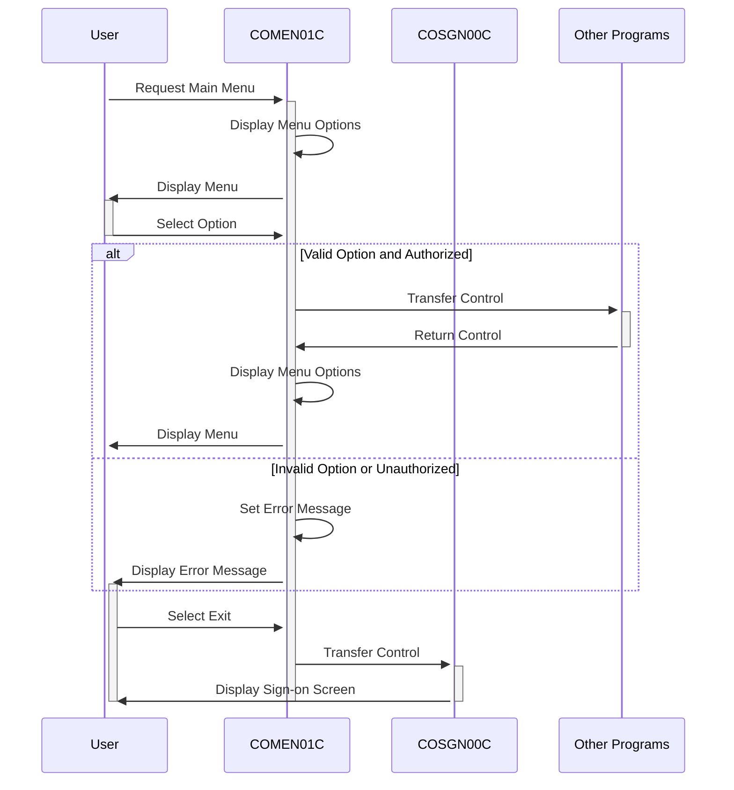

Generated at: 2nd October of 2024

**Title Document:** CardDemo Application - Main Menu Program Specification

**Summary Description:**
The `COMEN01C` program is the main menu for regular users of the CardDemo application. It presents a menu of options, captures user input, validates the input, and then transfers control to the appropriate program based on the selected option.

**User Stories:**
As a regular user, I want to be presented with a menu of options so that I can easily navigate the CardDemo application and perform actions related to my account.

**Related Epic:**
6 - User Management and Security

**Technical Requirements:**

- Display Menu Options: This method dynamically builds and displays the menu options based on the user type.
  - Input: User type from `CDEMO-USRTYP-USER`.
  - Process: Iterates through the `CDEMO-MENU-OPT-COUNT` options. Builds a menu string with option number and name from `CDEMO-MENU-OPT-NUM` and `CDEMO-MENU-OPT-NAME`. The menu string is displayed on the screen based on the option index.
  - Output: Display of menu options on the screen.
- Process User Input: This method processes the user's menu selection, validating the input and transferring control to the selected program.
  - Input: User input from `OPTIONI` of `COMEN1AI`.
  - Validations:
    - Checks if the input is numeric.
    - Checks if the input is within the range of available options.
    - Checks if the user is authorized to access the selected option based on user type from `CDEMO-USRTYP-USER` and `CDEMO-MENU-OPT-USRTYPE`.
  - Process: If valid, transfers control to the corresponding program specified in `CDEMO-MENU-OPT-PGMNAME`.
  - Output: Transfer control to the selected program or display an error message.
- Return to Sign-on Screen: This method returns the user to the sign-on screen.
  - Input: None.
  - Process: Transfers control to the program `COSGN00C`.
  - Output: Transfer control to the sign-on screen.
- Send Menu Screen: This method displays the main menu screen to the user.
  - Input: Data for header information from `COTTL01Y` and `CSDAT01Y`. Error message from `WS-MESSAGE`.
  - Process: Populates the screen header with title, program name, date, and time. Displays the built menu options. Displays any error messages.
  - Output: Display of the main menu screen.
- Receive Menu Screen: This method receives user input from the menu screen.
  - Input: User input from the screen.
  - Process: Captures the user's selected option and any response codes from the screen.
  - Output: User input stored in `COMEN1AI`.
- Populate Header Info: This method populates the header information of the menu screen.
  - Input: Date and time from `CSDAT01Y`.
  - Process: Retrieves the current date and time. Formats the date and time for display.
  - Output: Populated header information on the screen.

**Related Models**

- `CDEMO-MENU-OPT`: Describe the properties of a menu option.
  - `CDEMO-MENU-OPT-NUM` `String`: The number displayed for the menu option.
  - `CDEMO-MENU-OPT-NAME` `String`: The descriptive name of the menu option.
  - `CDEMO-MENU-OPT-PGMNAME` `String`: The program name associated with the menu option.
  - `CDEMO-MENU-OPT-USRTYPE` `String`: The user type allowed to access the menu option.

**Configurations:**

- `COMEN01C.cbl`
  - `WS-USRSEC-FILE`: `"USRSEC  "`
	- Description: File name for the user security file.
- `COMEN02Y.cpy`
  - `CDEMO-MENU-OPT`: `6`
	- Description: Number of menu options.
- `COTTL01Y.cpy`
  - `CCDA-TITLE01`: `"CREDIT CARD DEMO APPLICATION"`
	- Description: Main application title.
  - `CCDA-TITLE02`: `"MAIN MENU"`
	- Description: Title for the main menu screen.
- `CSMSG01Y.cpy`
  - `CCDA-MSG-INVALID-KEY`: `"Invalid Key Pressed"`
	- Description: Message displayed when an invalid key is pressed.

**Code Improvements:**
- Error Handling: Implement a more robust error handling mechanism, including logging errors to a file and displaying more user-friendly error messages.
- Documentation: Add more comments to the code to explain the logic and purpose of each section.
- Performance: Consider optimizing the loop that builds the menu options to improve performance, especially if there are a large number of options.
- User Experience: Enhance the user interface by providing more descriptive menu options and using clearer language in error messages.

**Security Improvements:**
- User Authentication: Ensure that user authentication is performed before accessing the main menu.
- Authorization: Implement role-based access control to restrict access to menu options based on user roles.
- Input Validation: Sanitize user input to prevent injection attacks.
- Logging: Log all user actions and system events for auditing purposes.

**Conceptual Diagram:**

--Made by "Smart Engineering" (by Compass.UOL)--