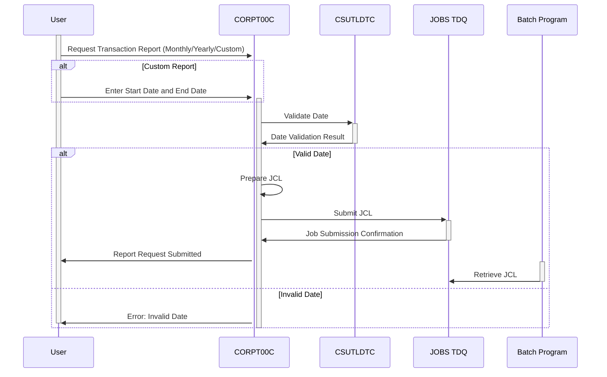

Generated at: 2nd October of 2024

**Title Document: CardDemo Transaction Report Submission - Program Specification**

**Summary Description:**
This specification details the `CORPT00C` program within the CardDemo application, designed to facilitate the submission of batch jobs for generating transaction reports. Users can choose from three report types: Monthly, Yearly, or Custom, specifying a date range for the latter. The program validates user inputs, prepares job instructions (JCL), and submits the job to a queue for asynchronous processing by a batch program. Upon successful submission, the user receives a confirmation message.

**User Stories:**
As a business analyst, I need to generate comprehensive reports of credit card transactions for specific periods (monthly, yearly, or custom date ranges) to analyze trends and patterns in customer behavior.

**Related Epic:**
5 - Reporting and Analytics

**Technical Requirements:**

- **User Interface Handling:** This method interacts with CICS to display screens, receive user input, and send responses.
  - Input: User input from the screen (`CORPT0A`)
  - Output: Screen updates with data, messages, and prompts (`CORPT0AO`)
- **Process User Input:** This method processes the user's input, validates data, and prepares for job submission.
  - Input: User selections for report type, start date, and end date.
  - Validation:
    - Checks if a report type (Monthly, Yearly, or Custom) is selected.
    - Validates the format and logical order of start and end dates if a custom report is chosen.
    - Uses `CSUTLDTC` to verify if the entered dates are valid calendar dates.
  - Result: Sets error flags and messages if validation fails.
- **Job Submission Preparation:**  This method constructs the JCL for the batch job based on user selections.
  - Input: Report type, start date, and end date.
  - Processing:
    - Populates the `JOB-DATA` structure with JCL statements.
    - Inserts the report parameters (start and end dates) into the JCL.
  - Result: A complete JCL string ready for submission to the batch queue.
- **Job Submission to Queue:** This method submits the prepared JCL to the `JOBS` TDQ for batch processing.
  - Input: `JCL-RECORD` containing the constructed JCL.
  - Processing:
    - Uses `CICS WRITEQ TD` command to write the JCL to the `JOBS` queue.
    - Checks for successful submission using response codes (`WS-RESP-CD` and `WS-REAS-CD`).
  - Result: Success or failure message based on the TDQ write operation.
- **Navigation and Confirmation:** This method handles navigation to previous screens and displays confirmation messages.
  - Input: User action (Enter key or PF3 key).
  - Processing:
    - Determines the target program based on user input.
    - Sets necessary data in the communication area (`CARDDEMO-COMMAREA`) for program transfer.
    - Issues `CICS XCTL` command to transfer control to the target program.
  - Result: Transfers control to the specified program.
- **Screen Data Population:** This method populates the header information on the screen.
  - Input: None
  - Processing:
    - Retrieves the current date and time using `FUNCTION CURRENT-DATE`.
    - Formats the date and time for display.
    - Moves the formatted data to the output screen data structure (`CORPT0AO`).
  - Result: Updates the screen header with the current date and time.
- **Field Initialization:** This method initializes and clears data fields.
  - Input: None
  - Processing:
    - Sets initial values for various fields, including report type indicators, date fields, and error flags.
  - Result: Resets the input fields and program variables to their default states.

**Related Models**

- **`CORPT0AI`**
  - `MONTHLYI` `{String}`: Indicator for monthly report selection.
  - `YEARLYI` `{String}`: Indicator for yearly report selection.
  - `CUSTOMI` `{String}`: Indicator for custom report selection.
  - `SDTMMI` `{String}`: Start date month for custom report.
  - `SDTDDI` `{String}`: Start date day for custom report.
  - `SDTYYYYI` `{String}`: Start date year for custom report.
  - `EDTMMI` `{String}`: End date month for custom report.
  - `EDTDDI` `{String}`: End date day for custom report.
  - `EDTYYYYI` `{String}`: End date year for custom report.
  - `CONFIRMI` `{String}`: User confirmation input (Y/N).
- **`CORPT0AO`**
  - `TITLE01O` `{String}`: Screen title 1.
  - `TITLE02O` `{String}`: Screen title 2.
  - `TRNNAMEO` `{String}`: Transaction name.
  - `PGMNAMEO` `{String}`: Program name.
  - `CURDATEO` `{String}`: Current date in MM/DD/YY format.
  - `CURTIMEO` `{String}`: Current time in HH:MM:SS format.
  - `ERRMSGO` `{String}`: Error message.
- **`JOB-DATA`**
  - `JOB-LINES` `{String[1000]}`: Array containing lines of JCL.
- **`CSUTLDTC-PARM`**
  - `CSUTLDTC-DATE` `{String}`: Date to be validated.
  - `CSUTLDTC-DATE-FORMAT` `{String}`: Input date format.
  - `CSUTLDTC-RESULT` `{String}`: Result of date validation.

**Configurations:**

- Constant Values
  - `WS-TRANSACT-FILE`: `"TRANSACT"`
	- Description: File name for the transaction file.
  - `WS-DATE-FORMAT`: `"YYYY-MM-DD"`
	- Description: Format for date input.
- `COTTL01Y.cpy`
  - `CCDA-TITLE01`: `"CREDIT CARD DEMO APPLICATION"`
	- Description: Main application title.
  - `CCDA-TITLE17`: `"TRANSACTION REPORT"`
	- Description: Title for the transaction report screen.
  - `CCDA-PGMNAME09`: `"CORPT00C"`
	- Description: Program name for transaction report submission.
  - `CCDA-MSG-INVALID-KEY`: `"Invalid Key Pressed"`
	- Description: Message displayed for invalid key presses.
- `CORPT00.cpy`
  - `TRNNAMEA`: `"Transaction Report"`
	- Description: Transaction name for report submission.
  - `TITLE01A`: `"Card Demo - Submit Transaction Report"`
	- Description: Screen title for report submission.
  - `TITLE02A`: `"Choose Report Criteria"`
	- Description: Instruction for report criteria selection.
  - `INFOMSGA`: `"Confirm Job Submission (Y/N)?"`
	- Description: Confirmation message for job submission.

**Code Improvements:**

- **Error Handling:** Improve error handling by providing more specific error messages to the user. For instance, when validating dates, indicate the exact reason for invalidity (e.g., invalid format, start date after end date).
- **Modularization:** Break down the `PROCESS-ENTER-KEY` paragraph into smaller, more focused modules for each report type. This improves code readability and maintainability.
- **Date Validation Library:** Consider using a dedicated date validation library or utility instead of relying solely on `CSUTLDTC`. This could offer more robust validation capabilities.
- **Comments:** Add more in-line comments to explain the logic and purpose of different code sections, especially within complex validation routines.

**Security Improvements:**

- **Input Sanitization:** Sanitize user inputs to prevent injection attacks. For example, use appropriate data validation techniques to ensure that the entered dates are in the expected format and do not contain malicious characters.
- **Authorization:** Implement role-based access control to restrict access to the transaction report generation functionality to authorized users only.
- **Logging:** Log all report requests, including user ID, timestamp, report parameters, and job submission details. This helps in auditing and tracking report generation activities.

**Conceptual Diagram:**

--Made by "Smart Engineering" (by Compass.UOL)--