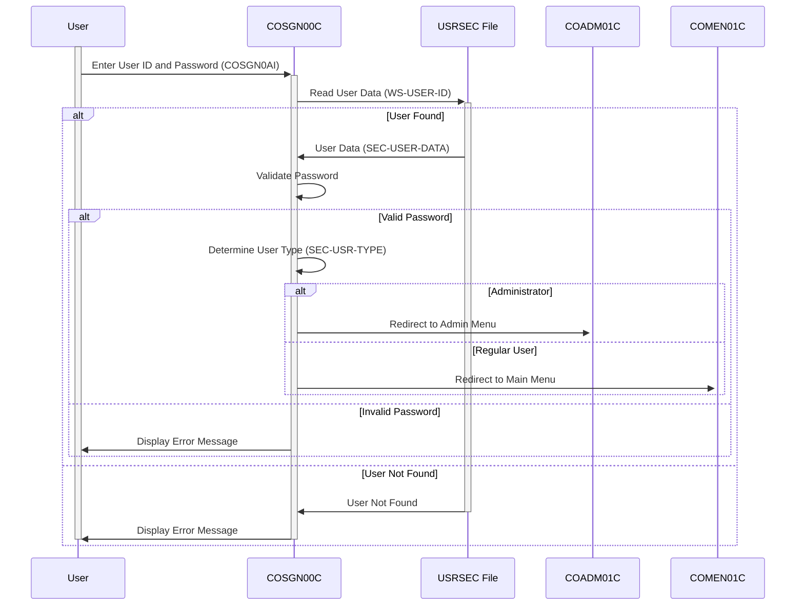

Generated at: 2nd October of 2024

**Title Document: CardDemo Application - Sign-on Module Specification**

**Summary Description:**
This document outlines the specifications for the Sign-on module (`COSGN00C`) within the CardDemo application, a COBOL-based system designed for credit card management. The module ensures secure user authentication, validating user credentials against stored data. Upon successful verification, it grants users access to the application based on their defined roles, directing them to the appropriate functionalities.

**User Stories:**
As a CardDemo system administrator, I need to ensure that only authorized users with valid credentials can access the system to protect sensitive customer and financial data.

**Related Epic:** 6 - User Management and Security

**Technical Requirements:**
- **Display Sign-on Screen:** This function displays the initial sign-on screen to the user.
  - Input: None
  - Output: Displays the sign-on screen (`COSGN0A`) with fields for `User ID` and `Password`.
- **Capture User Input:**  This function captures the `User ID` and `Password` entered by the user.
  - Input:  User input from the sign-on screen (`COSGN0AI`).
  - Validations:
    - Check if `User ID` is not spaces or low-values.
    - Check if `Password` is not spaces or low-values.
  - Output:  `WS-USER-ID` - Captured User ID, `WS-USER-PWD` - Captured Password.
- **Read User Data:** This function reads user data from the `USRSEC` file based on the provided User ID.
  - Input: `WS-USER-ID` - The User ID entered by the user.
  - Output: `SEC-USER-DATA` - User record from `USRSEC` file (if found) or appropriate response codes.
  - Result `WS-RESP-CD`:
    - `0` - Record found.
    - `13` - Record not found.
    - Other - VSAM I/O error.
- **Authenticate User:** This function verifies if the entered `Password` matches the stored `Password` for the user.
  - Input: `WS-USER-PWD` - Entered Password, `SEC-USR-PWD` - Stored Password from `SEC-USER-DATA`.
  - Validation:
    - Compare `WS-USER-PWD` with `SEC-USR-PWD`.
  - Output:  Success or failure indication based on password matching.
- **Determine User Type:** This function retrieves the user type from the user record.
  - Input:  `SEC-USER-DATA` - User record read from the `USRSEC` file.
  - Output: `CDEMO-USER-TYPE` - User type (e.g., 'ADMIN' or 'USER').
- **Redirect User:** This function redirects the user to the appropriate menu based on their user type.
  - Input:  `CDEMO-USER-TYPE` -  Determined user type.
  - Output: Transfers control to either `COADM01C` (Admin Menu) or `COMEN01C` (Main Menu).

**Related Models**
- `SEC-USER-DATA`: Represents the user record.
  - `SEC-USR-PWD` `Alphanumeric (PIC X(08))`: Encrypted password for the user.
  - `SEC-USR-TYPE` `Alphanumeric (PIC X(01))`: User type ('A' for Administrator, 'U' for Regular User).

**Configurations:**
- **Constant Values**
  - `WS-USRSEC-FILE`: `USRSEC`
	- Description:  Filename for the user security file.
- **COSGN00.cpy**
  - `COSGN0A`: Screen definition for the sign-on screen.
  - `COSGN0AI`: Input data structure for the sign-on screen.
  - `COSGN0AO`: Output data structure for the sign-on screen.
- **CSUSR01Y.cpy**
  - `SEC-USER-DATA`: Data structure for user information.
- **COCOM01Y.cpy**
  - `CARDDEMO-COMMAREA`: Communication area data structure.

**Code Improvements:**
- **Password Encryption:**  Implement a more robust password hashing algorithm instead of plain text storage.
- **Error Handling:** Provide more specific error messages to the user for easier troubleshooting.
- **Configuration:** Externalize configurable parameters like the maximum number of sign-on attempts.
- **Logging:** Implement audit logging for all sign-on attempts, including timestamps and success/failure status.

**Security Improvements:**
- **Password Complexity:** Enforce strong password policies requiring users to set complex passwords.
- **Session Management:** Implement secure session management techniques to protect user sessions.
- **Multi-Factor Authentication (MFA):** Consider implementing MFA for an added layer of security.

**Conceptual Diagram:**

--Made by "Smart Engineering" (by Compass.UOL)--