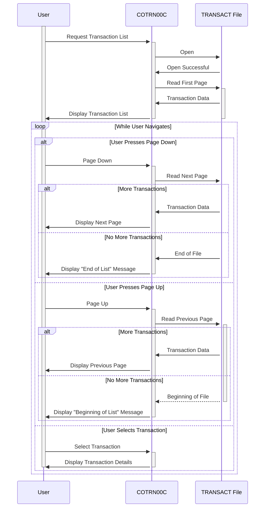

Generated at: 2nd October of 2024

**Title Document:** CardDemo Transaction Listing Module - Technical Specification

**Summary Description:**
This document provides a comprehensive technical overview of the CardDemo Transaction Listing module, which enables users to view their credit card transaction history in a paginated format. It details the program's functionality, user interactions, data handling, and system dependencies.

**User Stories:**
As a CardDemo user, I want to be able to view a list of my recent credit card transactions so I can track my spending and identify any potential errors or fraudulent activity.

**Related Epic:**
4 - Transaction Processing

**Technical Requirements:**

- **Transaction List Initialization:** This procedure initializes the transaction listing process by setting up necessary variables and flags. It also handles the initial display of the transaction list screen.
  - Initialize Variables:  Sets initial values for program variables like `WS-PGMNAME`, `WS-TRANID`, `WS-MESSAGE`, `WS-TRANSACT-FILE`, `WS-ERR-FLG`, `WS-TRANSACT-EOF`, `WS-SEND-ERASE-FLG`, etc.
  - Set Default Values: Sets default values for specific fields in the communication area (`CARDDEMO-COMMAREA`).
  - Display Initial Screen: Sends the initial transaction list screen (`COTRN0A`) to the user, displaying the first page of transactions.
  - Result: The initial transaction list screen is displayed to the user. 
- **Transaction Selection:** This procedure processes user input when the Enter key is pressed, determining if a transaction has been selected for further details.
  - Get User Input: Retrieves user input from the screen, including any selected transaction.
  - Validate Selection: If a transaction is selected, its ID is moved to `CDEMO-CT00-TRN-SELECTED`.
  - Transfer Control: If the selection is valid, transfers control to the transaction details program (`COTRN01C`).
  - Display Error Message: If the selection is invalid, displays an error message.
  - Result: Either the transaction details screen for the selected transaction is displayed, or an error message is shown.
- **Page Up Navigation:** This procedure handles the "Page Up" (PF7 key) functionality, navigating to the previous page of transactions.
  - Get Previous Transaction ID: If available, retrieves the transaction ID of the first transaction on the current page.
  - Navigate to Previous Page: If not already on the first page, retrieves and displays the previous page of transactions.
  - Display Message: If already on the first page, displays a message indicating this to the user.
  - Result: The previous page of transactions is displayed, or a message indicating the user is already at the beginning of the list is shown.
- **Page Down Navigation:** This procedure handles the "Page Down" (PF8 key) functionality, navigating to the next page of transactions.
  - Get Next Transaction ID: If available, retrieves the transaction ID of the last transaction on the current page.
  - Navigate to Next Page: If more transactions are available, retrieves and displays the next page.
  - Display Message: If already on the last page, displays a message to the user.
  - Result: The next page of transactions is displayed, or a message indicating the user is already at the end of the list is shown.
- **Display Next Page:** This procedure retrieves and displays the next page of transactions.
  - Start Browse: Opens the `TRANSACT` file for browsing, starting from the current transaction ID.
  - Read Transactions: Reads transaction records sequentially from the file, populating screen fields with transaction data (ID, date, description, amount).
  - Check for End of File: If the end of the file is reached, sets the `TRANSACT-EOF` flag to indicate no more transactions are available.
  - Update Page Number: Increments the page number if more transactions are available.
  - Display Screen: Sends the updated transaction list screen to the user's terminal.
  - Result: The next page of transactions is displayed, or a message is shown if the end of the file has been reached.
- **Display Previous Page:** This procedure retrieves and displays the previous page of transactions.
  - Start Browse: Opens the `TRANSACT` file for browsing, starting from the current transaction ID.
  - Read Transactions: Reads transaction records sequentially in reverse order from the file, populating screen fields with transaction data.
  - Check for Beginning of File: If the beginning of the file is reached, sets the `TRANSACT-EOF` flag.
  - Update Page Number: Decrements the page number if not already on the first page.
  - Display Screen: Sends the updated transaction list screen to the user.
  - Result: The previous page of transactions is displayed, or a message is shown if the beginning of the file has been reached.
- **Populate Transaction Data:** This procedure fills the transaction display fields on the screen with data from a single transaction record.
  - Format Transaction Data: Formats the transaction amount, date, and other fields for display.
  - Populate Screen Fields: Moves the formatted transaction data into the appropriate fields on the transaction list screen.
  - Result: The screen fields for a single transaction are populated with formatted data.
- **Initialize Transaction Data:** This procedure clears the transaction display fields on the screen, preparing for the display of a new set of transaction records.
  - Clear Screen Fields: Sets the transaction display fields on the screen to spaces or default values.
  - Result: The transaction display fields on the screen are cleared.
- **Return to Previous Screen:** This procedure handles the navigation back to the previous screen in the application.
  - Set Transfer Parameters: Sets the program name and transaction ID for the previous screen.
  - Transfer Control: Issues a CICS `XCTL` command to transfer control to the previous screen.
  - Result: Control is returned to the previous screen in the application.
- **Send Transaction List Screen:** This procedure sends the transaction list screen (`COTRN0A`) to the user, displaying the retrieved transaction data.
  - Populate Header Information: Populates the header of the screen with information like the program name, transaction ID, current date, and time.
  - Display Screen: Issues a CICS `SEND` command to display the transaction list screen to the user.
  - Result: The transaction list screen is sent to the user's terminal.
- **Receive Transaction List Screen:** This procedure receives user input from the transaction list screen, including user selections and function key presses.
  - Receive User Input: Issues a CICS `RECEIVE` command to retrieve user input from the transaction list screen.
  - Result: User input, including function key presses and data entered in input fields, is received from the screen.
- **Populate Header Information:**  This procedure populates the header section of the transaction list screen with program and date/time information.
  - Get Current Date/Time: Retrieves the current date and time from the system.
  - Format Date/Time: Formats the date and time values for display.
  - Populate Screen Fields: Moves the formatted date, time, program name, and transaction ID to the appropriate header fields on the screen.
  - Result: The header section of the transaction list screen is populated with the program name, transaction ID, current date, and time.
- **Start Browse Transaction File:** This procedure initiates a browse operation on the `TRANSACT` file, setting up the file for sequential reading.
  - Start Browse: Issues a CICS `STARTBR` command to open the `TRANSACT` file for browsing, starting from the specified transaction ID.
  - Handle Response: Checks the response code from the `STARTBR` command and sets the `TRANSACT-EOF` flag if the end of the file is reached. Displays an error message if the browse operation fails.
  - Result: The `TRANSACT` file is opened for browsing, or an error message is displayed if the operation fails.
- **Read Next Transaction Record:** This procedure reads the next transaction record from the `TRANSACT` file.
  - Read Next Record: Issues a CICS `READNEXT` command to read the next transaction record from the file.
  - Handle Response: Checks the response code from the `READNEXT` command and sets the `TRANSACT-EOF` flag if the end of the file is reached. Displays an error message if the read operation fails.
  - Result: The next transaction record is read from the file, or an error message is displayed if the operation fails.
- **Read Previous Transaction Record:** This procedure reads the previous transaction record from the `TRANSACT` file.
  - Read Previous Record: Issues a CICS `READPREV` command to read the previous transaction record from the file.
  - Handle Response: Checks the response code from the `READPREV` command and sets the `TRANSACT-EOF` flag if the beginning of the file is reached. Displays an error message if the read operation fails.
  - Result: The previous transaction record is read from the file, or an error message is displayed if the operation fails.
- **End Browse Transaction File:** This procedure terminates the browse operation on the `TRANSACT` file.
  - End Browse: Issues a CICS `ENDBR` command to close the `TRANSACT` file and end the browse operation.
  - Result: The browse operation on the `TRANSACT` file is terminated.

**Related Models**

- `TRAN-RECORD`
  - `TRAN-ID` `PIC X(16)`: Unique identifier for the transaction.
  - `TRAN-AMT` `PIC S9(09)V99 COMP-3`: Transaction amount.
  - `TRAN-ORIG-TS` `PIC X(16)`: Transaction timestamp.
  - `TRAN-DESC` `PIC X(64)`: Transaction description.

**Configurations:**

- Constant Values
  - `TRANS-PER-PAGE`: `10`
	- Description: Number of transactions to be displayed per page.
  - `WS-TRANSACT-FILE`: `"TRANSACT"`
	- Description:  Name of the VSAM file containing transaction data.
  - `WS-TRANID`: `"CT00"`
	- Description: Transaction ID for `COTRN00C`.
  - `WS-PGMNAME`: `"COTRN00C"`
	- Description:  Program name.

**Code Improvements:**

- **Error Handling:** Implement a more robust error handling mechanism. Instead of simply setting a flag and displaying a generic message, consider using specific error codes and messages for different types of errors. This will make it easier to diagnose and resolve issues.
- **Data Validation:** Add validation checks for user input, especially for the transaction ID field. This can prevent invalid data from being processed and causing errors.
- **Code Structure:** Refactor the code to improve its readability and maintainability. Consider breaking down large paragraphs into smaller, more focused procedures.
- **Comments:** Add more comments to explain the logic and purpose of different sections of the code.

**Security Improvements:**

- **Authentication and Authorization:** Ensure that the application has proper authentication and authorization mechanisms in place. Only authorized users should be able to access transaction data.
- **Data Encryption:** Consider encrypting sensitive data, such as transaction amounts and account numbers, both in storage and during transmission.
- **Audit Logging:** Implement audit logging to track user actions and system events related to transaction data. This can help in detecting and investigating security breaches.

**Conceptual Diagram:**

--Made by "Smart Engineering" (by Compass.UOL)--