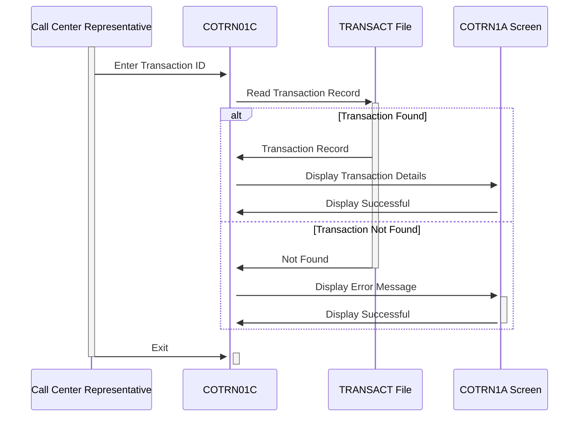

Generated at: 2nd October of 2024

**Title Document:** CardDemo Transaction Details Retrieval - Program Specification

**Summary Description:**
This document outlines the specifications for the `COTRN01C` program, part of the CardDemo application. This program enables users, typically call center representatives, to view detailed information about specific credit card transactions using a unique transaction ID.

**User Stories:**
As a call center representative, I need to be able to quickly access the details of a specific transaction so I can efficiently address customer inquiries and verify transaction information.

**Related Epic:**
4 - Transaction Processing

**Technical Requirements:**
This program retrieves and displays details for a specific transaction identified by a unique transaction ID.

- **Transaction Details Retrieval**: This function retrieves and displays the details of a specific transaction based on the provided transaction ID.
  - Input: `TRAN-ID` `{Alphanumeric}`, a unique identifier for the transaction.
  - Process:
    - The program reads the `TRANSACT` file using `TRAN-ID` as the key.
    - If the `TRAN-ID` is found, the corresponding transaction record is retrieved.
    - If the `TRAN-ID` is not found or an error occurs during the read operation, an error message is displayed.
  - Output: Displays the details of the retrieved transaction, including:
    - `TRAN-ID` `{Alphanumeric}`: The transaction ID.
    - `TRAN-CARD-NUM` `{Numeric}`: The credit card number associated with the transaction.
    - `TRAN-TYPE-CD` `{Alphanumeric}`: The type of transaction.
    - `TRAN-CAT-CD` `{Alphanumeric}`: The category of the transaction.
    - `TRAN-SOURCE` `{Alphanumeric}`: The source of the transaction.
    - `TRAN-AMT` `{Numeric}`: The transaction amount.
    - `TRAN-DESC` `{Alphanumeric}`: A description of the transaction.
    - `TRAN-ORIG-TS` `{Timestamp}`: The timestamp when the transaction originated.
    - `TRAN-PROC-TS` `{Timestamp}`: The timestamp when the transaction was processed.
    - `TRAN-MERCHANT-ID` `{Alphanumeric}`: A unique identifier for the merchant.
    - `TRAN-MERCHANT-NAME` `{Alphanumeric}`: The name of the merchant.
    - `TRAN-MERCHANT-CITY` `{Alphanumeric}`: The city of the merchant.
    - `TRAN-MERCHANT-ZIP` `{Alphanumeric}`: The zip code of the merchant. 

**Related Models**

- `TRAN-RECORD`
  - `TRAN-ID` `{Alphanumeric}`: Unique identifier for each transaction
  - `TRAN-CARD-NUM` `{Numeric}`: Credit card number associated with the transaction
  - `TRAN-TYPE-CD` `{Alphanumeric}`: Type of transaction (e.g., purchase, refund)
  - `TRAN-CAT-CD` `{Alphanumeric}`: Category of transaction (e.g., groceries, fuel)
  - `TRAN-SOURCE` `{Alphanumeric}`: Source of the transaction (e.g., online, in-store)
  - `TRAN-AMT` `{Numeric}`: Transaction amount
  - `TRAN-DESC` `{Alphanumeric}`: Description of the transaction
  - `TRAN-ORIG-TS` `{Timestamp}`: Timestamp of the transaction origination
  - `TRAN-PROC-TS` `{Timestamp}`: Timestamp of the transaction processing
  - `TRAN-MERCHANT-ID` `{Alphanumeric}`: Unique identifier for the merchant
  - `TRAN-MERCHANT-NAME` `{Alphanumeric}`: Name of the merchant
  - `TRAN-MERCHANT-CITY` `{Alphanumeric}`: City of the merchant
  - `TRAN-MERCHANT-ZIP` `{Alphanumeric}`: Zip code of the merchant

**Configurations:**

- Constant Values
  - `WS-TRANSACT-FILE`: `"TRANSACT"`
	- Description: The name of the database file containing transaction details.
  - `WS-TRANID`: `"CT01"`
	- Description: The transaction code for the program.
- `COTRN01C.cbl`
  - `PGMSIZE`: `"512K"`
	- Description: Program size configuration.

**Code Improvements:**

- Implement a more robust error handling mechanism. Instead of just displaying an error message, consider logging the error details for debugging purposes.
- Add more specific error messages to provide users with more context and guidance.
- Optimize the database read operation by using appropriate indexing techniques.
- Consider adding a feature to allow users to search for transactions based on other criteria, such as date range or card number.
- Implement input validation to prevent invalid data from being entered.

**Security Improvements:**

- Implement access control to restrict unauthorized users from accessing the transaction details.
- Encrypt the `TRANSACT` file to protect sensitive information.
- Log all user actions to create an audit trail for security and compliance purposes.

**Conceptual Diagram:**

--Made by "Smart Engineering" (by Compass.UOL)--