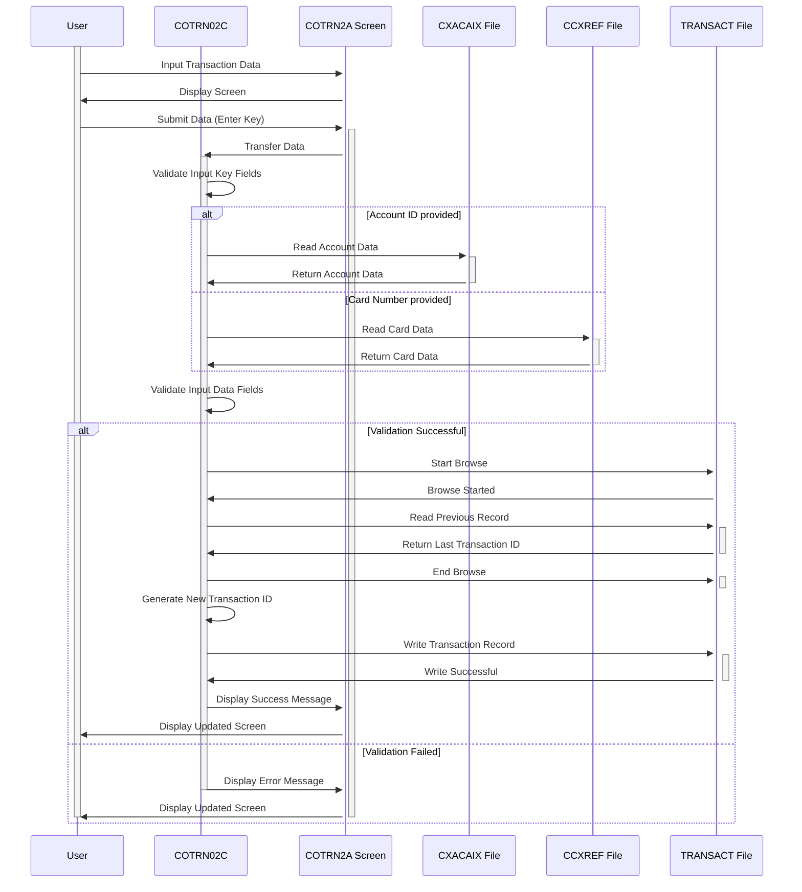

Generated at: 2nd October of 2024

**Title Document: CardDemo - Add New Transaction Program Specification**

**Summary Description:**
The `COTRN02C` program is a CICS COBOL program that allows authorized users to add new transaction records to the `TRANSACT` file in the CardDemo application. It involves validating user input, interacting with various data files (`TRANSACT`, `ACCTDAT`, `CCXREF`, `CXACAIX`), and managing transactions using CICS commands.

**User Stories:**
As a data analyst, I need to be able to add new transactions to the system accurately and efficiently so that I can track and analyze credit card activity.

**Related Epic:**
4 - Transaction Processing

**Technical Requirements:**
- **Process Enter Key**: This function is triggered when the user presses the Enter key on the screen. It orchestrates the validation and addition of a new transaction record based on user input.
  - Input: User input from the transaction addition screen (`COTRN2A`).
  - Validation: 
    - Verify if the confirmation field (`CONFIRMI`) is 'Y' or 'y'.
    - Validate account ID and card number (`VALIDATE-INPUT-KEY-FIELDS`).
    - Validate all other data fields (`VALIDATE-INPUT-DATA-FIELDS`).
  - Conditional Processing: 
    - If confirmation is 'Y' or 'y', add the transaction (`ADD-TRANSACTION`).
    - If confirmation is 'N' or 'n', ' ', or low-values, prompt the user to confirm the transaction addition.
    - If confirmation is any other value, display an error message.
  - Output: Updated screen data (`COTRN2AO`) and a new transaction record in the `TRANSACT` file if the transaction is confirmed and successfully added.
- **Validate Input Key Fields**: This function validates the account ID (`ACTIDINI`) and card number (`CARDNINI`) entered by the user.
  - Input: Account ID and card number from the screen input (`COTRN2AI`).
  - Validation: 
    - Check if at least one of the fields is not empty.
    - Check if the entered value is numeric.
    - Read and validate the account ID against the `CXACAIX` file (`READ-CXACAIX-FILE`).
    - Read and validate the card number against the `CCXREF` file (`READ-CCXREF-FILE`).
  - Output: Validated account ID and card number, and error messages if validation fails.
- **Validate Input Data Fields**: This function validates all data fields other than the account ID and card number.
  - Input: Transaction data fields from the screen input (`COTRN2AI`).
  - Validation: 
    - Check for empty or low-value fields.
    - Verify numeric fields for correct format and data type.
    - Validate date fields (`TORIGDTI`, `TPROCDTI`) using the `CSUTLDTC` utility for the `YYYY-MM-DD` format.
    - Validate the transaction amount (`TRNAMTI`) format (`-99999999.99`).
  - Output: Validated transaction data fields and error messages if validation fails.
- **Add Transaction**: This function adds a new transaction record to the `TRANSACT` file.
  - Input: Validated transaction data from the screen input (`COTRN2AI`).
  - Processing: 
    - Generate a unique transaction ID by reading the last transaction ID from the `TRANSACT` file and incrementing it (`STARTBR-TRANSACT-FILE`, `READPREV-TRANSACT-FILE`, `ENDBR-TRANSACT-FILE`).
    - Populate a new `TRAN-RECORD` with the validated transaction data.
    - Write the new `TRAN-RECORD` to the `TRANSACT` file (`WRITE-TRANSACT-FILE`).
  - Output: A new transaction record in the `TRANSACT` file.
- **Copy Last Transaction Data**: This function copies data from the last added transaction to the current screen, simplifying data entry for similar transactions.
  - Input: Account ID and card number from the screen input (`COTRN2AI`).
  - Processing: 
    - Validate the input key fields (`VALIDATE-INPUT-KEY-FIELDS`).
    - Read the last transaction record from the `TRANSACT` file (`STARTBR-TRANSACT-FILE`, `READPREV-TRANSACT-FILE`, `ENDBR-TRANSACT-FILE`).
    - Populate the screen fields (`COTRN2AI`) with the data from the last transaction record.
  - Output: Updated screen data (`COTRN2AI`) with the last transaction details.
- **Return to Previous Screen**: This function navigates the user back to the previous screen in the application flow.
  - Input: `CDEMO-FROM-PROGRAM` from the communication area (`CARDDEMO-COMMAREA`).
  - Processing: 
    - Determine the program to return to based on the `CDEMO-FROM-PROGRAM`. If it's empty, default to `COSGN00C`.
    - Set the `CDEMO-TO-PROGRAM`, `CDEMO-FROM-TRANID`, and `CDEMO-FROM-PROGRAM` in the communication area.
    - Transfer control to the determined program using the `XCTL` command.
  - Output: Navigation to the previous screen.
- **Send Transaction Add Screen**: This function sends the transaction addition screen (`COTRN2A`) to the user's terminal.
  - Input: Screen data (`COTRN2AO`), including header information and any error messages.
  - Processing: 
    - Populate header information (`POPULATE-HEADER-INFO`).
    - Send the screen using the `SEND` command with `ERASE` and `CURSOR` options.
  - Output: The transaction addition screen displayed on the user's terminal.
- **Receive Transaction Add Screen**: This function receives user input from the transaction addition screen.
  - Input: User input from the transaction addition screen (`COTRN2A`).
  - Processing: Receive the screen input using the `RECEIVE` command.
  - Output: User input data stored in the `COTRN2AI` structure.
- **Populate Header Info**: This function populates the header information on the screen, including the title, transaction ID, program name, current date, and time.
  - Input: System date and time.
  - Processing: 
    - Retrieve the current date and time.
    - Format the date and time for display.
    - Populate the header fields in the screen output structure (`COTRN2AO`).
  - Output: Updated screen data (`COTRN2AO`) with header information.
- **Read CXACAIX File**: This function reads data from the `CXACAIX` file based on the provided account ID.
  - Input: Account ID (`XREF-ACCT-ID`).
  - Processing: 
    - Read the `CXACAIX` file using the account ID as the key (`READ` command).
    - Handle different response codes:
      - `DFHRESP(NORMAL)`: Continue processing.
      - `DFHRESP(NOTFND)`: Display an error message indicating the account ID was not found.
      - Other response codes: Display an error message indicating an issue with the file access.
  - Output: `CARD-XREF-RECORD` if the account ID is found, otherwise an error message.
- **Read CCXREF File**: This function reads data from the `CCXREF` file based on the provided card number.
  - Input: Card number (`XREF-CARD-NUM`).
  - Processing: 
    - Read the `CCXREF` file using the card number as the key (`READ` command).
    - Handle different response codes:
      - `DFHRESP(NORMAL)`: Continue processing.
      - `DFHRESP(NOTFND)`: Display an error message indicating the card number was not found.
      - Other response codes: Display an error message indicating an issue with the file access.
  - Output: `CARD-XREF-RECORD` if the card number is found, otherwise an error message.
- **Start Browse Transaction File**: This function initiates a browse operation on the `TRANSACT` file to retrieve the last transaction ID.
  - Input: None.
  - Processing: Start a browse operation on the `TRANSACT` file using the `STARTBR` command with `TRAN-ID` as the key.
  - Output: A browse operation handle for the `TRANSACT` file.
- **Read Previous Transaction File**: This function reads the previous record during the browse operation on the `TRANSACT` file.
  - Input: Browse operation handle for the `TRANSACT` file.
  - Processing: 
    - Read the previous record using the `READPREV` command.
    - Handle different response codes:
      - `DFHRESP(NORMAL)`: Continue processing.
      - `DFHRESP(ENDFILE)`: Set `TRAN-ID` to zeros, indicating no previous transactions.
      - Other response codes: Display an error message indicating an issue with the file access.
  - Output: `TRAN-RECORD` if a previous record is found, otherwise zeros in `TRAN-ID`.
- **End Browse Transaction File**: This function ends the browse operation on the `TRANSACT` file.
  - Input: Browse operation handle for the `TRANSACT` file.
  - Processing: End the browse operation using the `ENDBR` command.
  - Output: None.
- **Write Transaction File**: This function writes a new transaction record to the `TRANSACT` file.
  - Input: New transaction record (`TRAN-RECORD`).
  - Processing: 
    - Write the `TRAN-RECORD` to the `TRANSACT` file using the `WRITE` command with `TRAN-ID` as the key.
    - Handle different response codes:
      - `DFHRESP(NORMAL)`: Display a success message.
      - `DFHRESP(DUPKEY)` or `DFHRESP(DUPREC)`: Display an error message indicating a duplicate transaction ID.
      - Other response codes: Display an error message indicating an issue with the file access.
  - Output: A new transaction record in the `TRANSACT` file if the write is successful, otherwise an error message.
- **Clear Current Screen**: This function clears all input fields on the current screen.
  - Input: None.
  - Processing: 
    - Set all input fields in the screen output structure (`COTRN2AO`) to spaces.
    - Send the updated screen data (`COTRN2AO`) to the user's terminal.
  - Output: A cleared transaction addition screen.
- **Initialize All Fields**: This function initializes all data fields on the screen to their default values or spaces.
  - Input: None.
  - Processing: 
    - Set all input fields in the screen input structure (`COTRN2AI`) to their default values or spaces.
    - Clear the error message (`WS-MESSAGE`).
  - Output: Initialized screen input data (`COTRN2AI`).

**Related Models**
- `TRAN-RECORD`
  - `TRAN-ID` `PIC 9(16)`: Unique identifier for each transaction.
  - `TRAN-TYPE-CD` `PIC 9(02)`: Code representing the type of transaction.
  - `TRAN-CAT-CD` `PIC 9(04)`: Code representing the category of the transaction.
  - `TRAN-SOURCE` `PIC X(10)`: Source of the transaction.
  - `TRAN-DESC` `PIC X(60)`: Description of the transaction.
  - `TRAN-AMT` `PIC S9(9)V99`: Amount of the transaction.
  - `TRAN-CARD-NUM` `PIC 9(19)`: Credit card number associated with the transaction.
  - `TRAN-MERCHANT-ID` `PIC 9(15)`: Unique identifier for the merchant.
  - `TRAN-MERCHANT-NAME` `PIC X(30)`: Name of the merchant.
  - `TRAN-MERCHANT-CITY` `PIC X(20)`: City of the merchant.
  - `TRAN-MERCHANT-ZIP` `PIC X(09)`: Zip code of the merchant.
  - `TRAN-ORIG-TS` `PIC X(19)`: Timestamp indicating when the transaction was initiated.
  - `TRAN-PROC-TS` `PIC X(19)`: Timestamp indicating when the transaction was processed.
- `CARD-XREF-RECORD`
  - `XREF-CARD-NUM` `PIC 9(19)`: The credit card number.
  - `XREF-CUST-ID` `PIC 9(09)`: The customer ID associated with the card.
  - `XREF-ACCT-ID` `PIC 9(09)`: The account ID associated with the card.

**Configurations:**
- Constant Values
  - `WS-TRANSACT-FILE`: `"TRANSACT"`
	- Description: File name for the `TRANSACT` data file.
  - `WS-ACCTDAT-FILE`: `"ACCTDAT"`
	- Description: File name for the `ACCTDAT` data file.
  - `WS-CCXREF-FILE`: `"CCXREF"`
	- Description: File name for the `CCXREF` data file.
  - `WS-CXACAIX-FILE`: `"CXACAIX"`
	- Description: File name for the `CXACAIX` data file.
  - `WS-DATE-FORMAT`: `"YYYY-MM-DD"`
	- Description: Date format for the transaction.
- COUSR01C.cbl
  - `USRTYPE`: `"R"`
	- Description: Default user type.
- CBTRN02C.cbl
  - `REJECT-REASON-XREF-NOT-FOUND`: `"01"`
	- Description: Reject reason code for cross-reference not found.
  - `REJECT-REASON-ACCT-NOT-FOUND`: `"02"`
	- Description: Reject reason code for account not found.
  - `REJECT-REASON-ACCT-EXPIRED`: `"03"`
	- Description: Reject reason code for account expired.
  - `REJECT-REASON-ACCT-OVERLIMIT`: `"04"`
	- Description: Reject reason code for account overlimit.

**Code Improvements:**
- **Consolidate Error Handling**: Implement a centralized error handling routine to reduce code duplication and improve maintainability.
- **Enhance Data Validation**: Implement more robust data validation checks, such as range checks for numeric fields and pattern matching for text fields, to ensure data integrity.
- **Improve User Feedback**: Provide more informative error messages to the user, specifying the exact nature of the error and how to correct it.
- **Code Modularity**: Break down large paragraphs into smaller, more manageable sections with meaningful names to improve code readability and organization.
- **Documentation**: Add comments to explain the purpose and logic of each section of code, making it easier for others to understand and maintain.

**Security Improvements:**
- **Authentication and Authorization**: Implement robust authentication mechanisms to verify user identity and authorization checks to ensure only authorized users can add transactions.
- **Input Sanitization**: Sanitize user input to prevent injection attacks, such as SQL injection or cross-site scripting (XSS).
- **Logging and Auditing**: Log all transaction additions, including user ID, timestamp, and transaction details, to create an audit trail for security and accountability.
- **Secure Communication**: Use secure protocols, such as HTTPS, for any communication between the client and server to protect sensitive data during transmission.

**Conceptual Diagram:**

--Made by "Smart Engineering" (by Compass.UOL)--