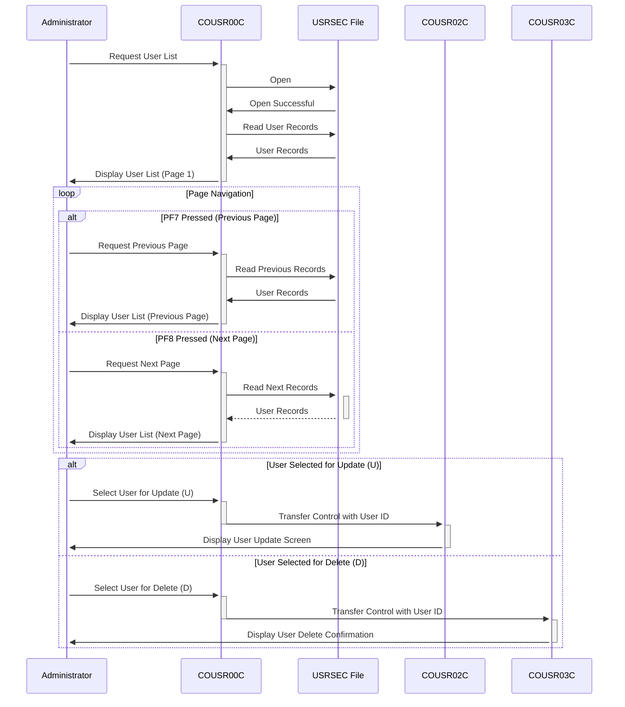

Generated at: 2nd October of 2024

**Title Document: CardDemo Application - User List Functionality Specification**

**Summary Description:**
The CardDemo application's User List functionality allows administrators to view and manage user accounts within the system. It provides a paginated list of users, enabling navigation through records and selection of specific users for update or deletion actions.

**User Stories:**
As a system administrator, I need to be able to view a list of all users in the system, so I can manage user accounts effectively.

**Related Epic:**
6 - User Management and Security

**Technical Requirements:**
- **User List Display:** This method displays a paginated list of user records retrieved from the `USRSEC` file.
  - Input: User ID (optional) for initial record positioning.
  - Processing: Retrieves user records from the `USRSEC` file, starting from the specified User ID or from the beginning if no ID is provided. It populates the display fields with user data, including User ID, Name, and Type.
  - Output: Displays a page of user records (up to 10 records) with options for update (U) or delete (D) actions.
- **Page Navigation:** This method enables navigation through the paginated list of users.
  - Input: User action (PF7 for previous page, PF8 for next page).
  - Processing: Based on the user action, it fetches the appropriate page of user records from the `USRSEC` file. It adjusts the `CDEMO-CU00-PAGE-NUM` to track the current page.
  - Output: Displays the requested page of user records.
- **User Action Processing:** This method processes the user's selection for update or delete actions.
  - Input: User selection (U/D) and the corresponding User ID.
  - Processing: Validates the user selection and, if valid, transfers control to the appropriate program (COUSR02C for update, COUSR03C for delete) along with the selected User ID.
  - Output: Redirects the user to the selected program (COUSR02C or COUSR03C) with the selected user's information.

**Related Models**
- `SEC-USER-DATA`
  - `SEC-USR-ID` `String`: User ID.
  - `SEC-USR-FNAME` `String`: User's First Name.
  - `SEC-USR-LNAME` `String`: User's Last Name.
  - `SEC-USR-TYPE` `String`: User Type (e.g., Administrator, User).

**Configurations:**
- Constant Values
  - `WS-USRSEC-FILE`: `"USRSEC  "`
	- Description: File name for the user security file.
- `COUSR00.CPY`
  - `CCDA-TRNNAMEI`: `"COUSR"`
	- Description: Transaction name for a process or module related to users.
  - `CCDA-TITLE01I`: `"CREDIT CARD DEMO APPLICATION"`
	- Description: Main title of the application or section related to user management.
  - `CCDA-TITLE02I`: `"USER LISTING"`
	- Description:  Subtitle indicating that this section displays a list of users.
  - `CCDA-PGMNAMEX`: `"COUSR00C"`
	- Description:  Name of the program or module responsible for handling user listing.
  - `CCDA-ERRMSGI`: `"ERROR MESSAGE"`
	- Description: Area on the screen or report where error messages are displayed.
  - `CCDA-TRNNAMEO`: `"COUSR"`
	- Description:  Transaction name for a process or module related to users.
  - `CCDA-TITLE01O`: `"CREDIT CARD DEMO APPLICATION"`
	- Description:  Main title of the application or section related to user management.
  - `CCDA-TITLE02O`: `"USER LISTING"`
	- Description: Subtitle indicating that this section displays a list of users.
  - `CCDA-PGMNAMEO`: `"COUSR00C"`
	- Description: Name of the program or module responsible for handling user listing.
  - `CCDA-ERRMSGO`: `"ERROR MESSAGE"`
	- Description: Area on the screen or report where error messages are displayed.

**Code Improvements:**
- Implement a more robust error handling mechanism, including specific error messages and logging for easier troubleshooting.
- Add detailed comments explaining the logic and purpose of each section of the code.
- Consider using a data structure to represent user data instead of individual variables for better organization and maintainability.

**Security Improvements:**
- Ensure that access to the `USRSEC` file is appropriately restricted to authorized personnel only.
- Implement encryption for sensitive user data stored in the `USRSEC` file.
- Add audit logging to track user actions and changes made to user accounts.

**Conceptual Diagram:**

--Made by "Smart Engineering" (by Compass.UOL)--