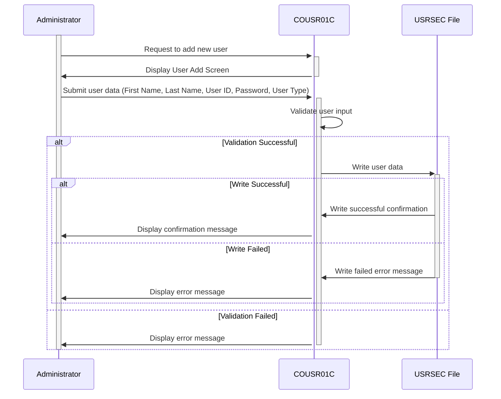

Generated at: 2nd October of 2024

**Title Document: CardDemo User Management System - Add New User Specification**

**Summary Description:**
The CardDemo User Management System - Add New User program is a COBOL program that allows administrators to add new users to the USRSEC file. The program validates user inputs to ensure data integrity, including checks for mandatory fields and unique user IDs. Upon successful validation, the new user information is written to the USRSEC file, and a confirmation message is displayed.

**User Stories:**
As a system administrator, I need to be able to add new users to the system so that they can access CardDemo applications and perform their assigned tasks.

**Related Epic:**
6 - User Management and Security

**Technical Requirements:**

- **Display User Add Screen:** This method sends the initial "Add User" screen to the terminal.
  - Input: None
  - Output: Displays the `COUSR1A` screen from the `COUSR01` mapset.

- **Capture User Input:** This method receives user input from the "Add User" screen.
  - Input: User enters data into the fields displayed on the `COUSR1A` screen.
  - Output: The entered data is stored in the `COUSR1AI` data structure.

- **Process User Input:** This method processes the data entered by the user on the "Add User" screen.
  - Input: User input data from the `COUSR1AI` data structure.
  - Validation: 
    - Check if all mandatory fields (`FNAMEI`, `LNAMEI`, `USERIDI`, `PASSWDI`, `USRTYPEI`) are filled.
    - If any mandatory field is missing, set `WS-ERR-FLG` to `'Y'`, move an appropriate error message to `WS-MESSAGE`, move `-1` to the corresponding field length variable in `COUSR1AI` to position the cursor, and call the `SEND-USRADD-SCREEN` method to redisplay the screen with the error message.
    - If all mandatory fields are filled, proceed to the next validation.
  - Output: If all validations pass, the user data is moved to the `SEC-USER-DATA` record, and the `WRITE-USER-SEC-FILE` method is called. If any validation fails, the `SEND-USRADD-SCREEN` method is called to redisplay the screen with an error message.

- **Write User Data to File:** This method writes the new user data to the `USRSEC` file.
  - Input: User data from the `SEC-USER-DATA` record.
  - Process: 
    - Write the `SEC-USER-DATA` record to the `USRSEC` file using `SEC-USR-ID` as the key.
    - Check the response code (`WS-RESP-CD`) from the file write operation.
  - Output:
    - If the write is successful (`DFHRESP(NORMAL)`), call the `INITIALIZE-ALL-FIELDS` method to clear the input fields, set `WS-MESSAGE` to a success message, set `ERRMSGC` of `COUSR1AO` to `DFHGREEN`, and call the `SEND-USRADD-SCREEN` method to display the confirmation message.
    - If a duplicate key error occurs (`DFHRESP(DUPKEY)` or `DFHRESP(DUPREC)`), set `WS-ERR-FLG` to `'Y'`, set `WS-MESSAGE` to an error message indicating the duplicate User ID, move `-1` to `USERIDL` of `COUSR1AI` to position the cursor, and call the `SEND-USRADD-SCREEN` method.
    - For any other error, set `WS-ERR-FLG` to `'Y'`, set `WS-MESSAGE` to a generic error message, move `-1` to `FNAMEL` of `COUSR1AI` to position the cursor, and call the `SEND-USRADD-SCREEN` method.

- **Clear Current Screen:** This method clears all input fields on the current screen.
  - Input: None.
  - Process: Calls the `INITIALIZE-ALL-FIELDS` method to clear the input fields and then calls the `SEND-USRADD-SCREEN` method to redisplay the screen with cleared fields.
  - Output: The "Add User" screen is redisplayed with all input fields cleared.

- **Populate Header Information:** This method populates the header information on the "Add User" screen, including the current date, time, transaction ID, and program name.
  - Input: None.
  - Process: Retrieves the current date and time using the `CURRENT-DATE` function. Formats the date and time values and moves them to the corresponding fields in the `COUSR1AO` data structure.
  - Output: The header section of the `COUSR1AO` screen data structure is populated with the current date, time, transaction ID, and program name.

- **Initialize All Fields:** This method initializes all data fields to their default values.
  - Input: None.
  - Process: Sets the length variables of input fields in `COUSR1AI` to `-1` and clears the content of input fields and `WS-MESSAGE`.
  - Output: All input fields and the message area are cleared.

- **Return to Previous Screen:** This method handles the logic for returning to the previous screen in the application.
  - Input: None
  - Process: 
    - If `CDEMO-TO-PROGRAM` is not set, it defaults to `'COSGN00C'`.
    - Sets `CDEMO-FROM-TRANID` to the current transaction ID (`WS-TRANID`).
    - Sets `CDEMO-FROM-PROGRAM` to the current program name (`WS-PGMNAME`).
    - Sets `CDEMO-PGM-CONTEXT` to zeros.
    - Transfers control to the program specified in `CDEMO-TO-PROGRAM` using an `XCTL` command.
  - Output: Transfers control to the previous screen.

**Related Models**

- `SEC-USER-DATA`
  - `SEC-USR-ID` `X(08)`: User ID
  - `SEC-USR-FNAME` `X(20)`: User's first name
  - `SEC-USR-LNAME` `X(20)`: User's last name
  - `SEC-USR-PWD` `X(08)`: User's password
  - `SEC-USR-TYPE` `X(01)`: User type ('R' for Regular, 'A' for Admin)

**Configurations:**

- Constant Values
  - `WS-USRSEC-FILE`: `"USRSEC  "`
	- Description: Name of the user security file.
  - `WS-TRANID`: `"CU01"`
	- Description: Transaction ID for the program.
- `COUSR01.cpy`
  - `PGMSIZE`: `"512K"`
	- Description: Program size configuration.

**Code Improvements:**

- Error Handling: Implement a more robust error handling mechanism, including logging errors to a file or database for debugging and auditing purposes.
- Password Security: Do not store passwords in plain text. Use a strong hashing algorithm to store password hashes instead.
- Input Validation: Implement additional input validation checks, such as:
    - Enforce password complexity rules (e.g., minimum length, combination of uppercase/lowercase/numbers/special characters).
    - Validate user type input to ensure it's either 'R' or 'A'.
- Code Documentation: Add more comments to explain the logic and purpose of different sections of the code.
- Modularity: Break down the code into smaller, more manageable modules or subroutines for better organization and maintainability.
- Use of Copybooks: Utilize copybooks effectively to define data structures and common variables, reducing code duplication and improving consistency.

**Security Improvements:**

- Secure Password Storage: Use a strong, one-way hashing algorithm to store passwords instead of plain text. Consider using a salt to further enhance password security.
- Access Control: Implement role-based access control to restrict access to the "Add New User" functionality to authorized personnel only.
- Input Sanitization: Sanitize user inputs to prevent injection attacks, such as SQL injection or cross-site scripting (XSS).
- Audit Logging: Log all user creation events, including the user who performed the action, the timestamp, and the details of the new user account.
- Secure Communication: If the application communicates with other systems, ensure secure communication channels using protocols like HTTPS or TLS.

**Conceptual Diagram:**

--Made by "Smart Engineering" (by Compass.UOL)--