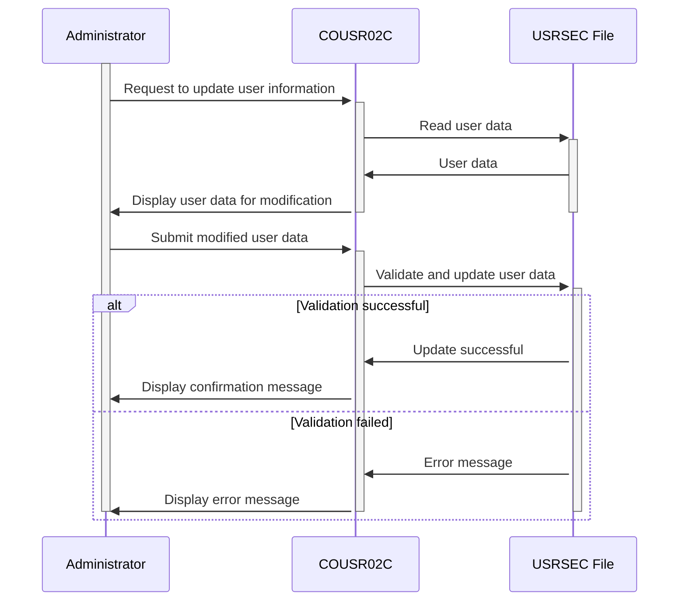

Generated at: 2nd October of 2024

**Title Document: CardDemo User Update Program Specification**

**Summary Description:**
The COUSR02C program in the CardDemo application is responsible for updating user information. It retrieves user data from the `USRSEC` file, allows authorized administrators to modify specific fields, validates the input, and updates the file with the changes.

**User Stories:**
As a system administrator, I need to be able to update existing user information, such as their name, password, or user type, to ensure the system reflects accurate and current user data.

**Related Epic:**
6 - User Management and Security: Manage user access, roles, and permissions to ensure system security and data confidentiality.

**Technical Requirements:**

- **User ID Input and Validation:** This method handles user ID input and validation.
  - Input: User ID from the screen input field `USRIDINI`.
  - Validation: Checks if the User ID is empty. If empty, sets `WS-ERR-FLG` to `Y`, sets `WS-MESSAGE` to `User ID can NOT be empty...`, and sets the cursor position to the `USRIDINI` field (`USRIDINL`).
  - Result `Boolean`: Returns `TRUE` if the User ID is valid, `FALSE` otherwise.

- **User Data Retrieval:** This method retrieves user data from the `USRSEC` file based on the provided User ID.
  - Input: User ID from `SEC-USR-ID`.
  - File Access: Reads the `USRSEC` file using the User ID as the key.
  - Result `SEC-USER-DATA`: Returns the user data record if found.

- **User Data Update:** This method updates user information in the `USRSEC` file.
  - Input: Updated user data from the screen input fields (`FNAMEI`, `LNAMEI`, `PASSWDI`, `USRTYPEI`).
  - Validation: Checks if any of the input fields are empty. If empty, sets `WS-ERR-FLG` to `Y`, sets `WS-MESSAGE` with the corresponding error message, and sets the cursor position to the corresponding field. Also, checks if any data has been modified. If not, sets `WS-MESSAGE` to `Please modify to update ...` and displays it in red.
  - Comparison: Compares the input data with the existing data in `SEC-USER-DATA`. If any differences are found, sets `USR-MODIFIED-YES` to `TRUE`.
  - File Access: Updates the `USRSEC` file with the modified user data.
  - Result `Boolean`: Returns `TRUE` if the update is successful, `FALSE` otherwise.

- **Screen Display Management:** This method manages screen display and interaction.
  - Input: Data to be displayed on the screen, including header information, messages, and user data.
  - Screen Handling: Sends the `COUSR2A` screen to the user's terminal using the `COUSR02` mapset.
  - Result `None`: Displays the screen with the provided data.

- **Screen Input Handling:** This method handles user input from the screen.
  - Input: User input from the `COUSR2A` screen, including function keys and data entered in the fields.
  - Event Handling: Processes user input based on the pressed key (Enter, PF3, PF4, PF5, PF12).
  - Result `None`: Executes the corresponding action based on the user's input.

- **Header Information Population:** This method populates the header information on the screen.
  - Input: Current date and time from the system.
  - Data Formatting: Formats the date and time into the required display format.
  - Result `None`: Sets the header information fields on the screen with the formatted date, time, program name, and transaction ID.

- **Screen Field Initialization:** This method initializes all input fields on the screen.
  - Input: None.
  - Field Initialization: Sets default values for all input fields, such as spaces for text fields and -1 for numeric fields.
  - Result `None`: Clears all input fields on the screen.

**Related Models**

- `SEC-USER-DATA`
  - `SEC-USR-ID` `String`: Unique identifier for each user.
  - `SEC-USR-FNAME` `String`: User's first name.
  - `SEC-USR-LNAME` `String`: User's last name.
  - `SEC-USR-PWD` `String`: User's password for system access.
  - `SEC-USR-TYPE` `String`: Defines the user's role and permissions within the application.

**Configurations:**

- `COUSR02C.cbl`
  - `WS-USRSEC-FILE`: `"USRSEC  "`
	- Description: File name for the user security file.
- `COUSR01C.cbl`
  - `USRTYPE`: `"R"`
	- Description: Default user type is set to "R" (Regular).
  - `USRTYPE`: `"A"`
	- Description: Option for setting user type to "A" (Admin).

**Code Improvements:**

- **Password Handling:** The program should implement secure password handling practices, such as:
  - Password Complexity Rules: Enforce password complexity rules to ensure strong passwords.
  - Password Confirmation: Prompt the administrator to re-enter the new password to prevent typos.
  - Password Encryption: Store passwords in an encrypted format to protect sensitive data.
- **Audit Trail:** The program should log all user updates for auditing and security purposes. The audit trail should include:
  - User ID of the administrator who made the changes.
  - Timestamp of the update.
  - Fields that were modified.
  - Old and new values of the modified fields.
- **Error Handling:** Implement more robust error handling, including:
  - Specific error messages for different error conditions.
  - Logging of errors for troubleshooting.
  - Graceful handling of unexpected errors to prevent program termination.
- **Documentation:** Improve code documentation by adding comments to explain the logic and purpose of different sections of the code.

**Security Improvements:**

- **Access Control:** Implement role-based access control to restrict user update functionality to authorized administrators only.
- **Data Validation:** Enhance data validation to prevent injection attacks and other security vulnerabilities.
- **Encryption:** Encrypt sensitive data, such as passwords, both in transit and at rest.
- **Regular Security Audits:** Conduct regular security audits to identify and address potential vulnerabilities.

**Conceptual Diagram:**

--Made by "Smart Engineering" (by Compass.UOL)--