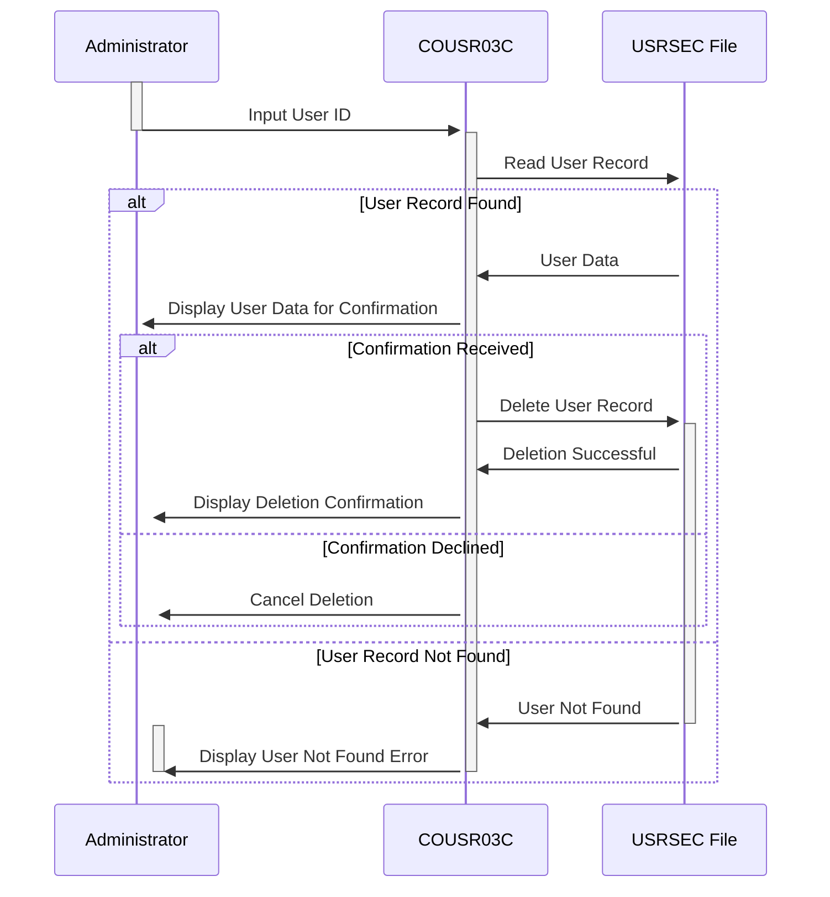

Generated at: 2nd October of 2024

**Title Document:** CardDemo User Deletion Process Specification

**Summary Description:**
This document details the process of deleting a user from the `CardDemo` application. It involves receiving a user ID, retrieving the user's information from the `USRSEC` file, displaying the information for confirmation, and deleting the user record upon confirmation.

**User Stories:**
As an administrator, I need to be able to delete users from the system to manage user access and remove inactive accounts.

**Related Epic:**
6 - User Management and Security

**Technical Requirements:**

- User ID Input: This method receives the user ID input from the administrator.
  - Input: User ID entered by the administrator.
  - Output:  `USRIDINI OF COUSR3AI` `{String}`: The entered user ID.

- Read User Data: This method reads the user record from the `USRSEC` file based on the provided user ID.
  - Input:  `USRIDINI OF COUSR3AI` `{String}`: The user ID to be deleted.
  - Output:  `SEC-USER-DATA` `{Data Structure}`: The user data read from the file.

- Confirm User Deletion: This method displays the retrieved user information to the administrator for confirmation before deletion.
  - Input:  `SEC-USER-DATA` `{Data Structure}`: The user data to be displayed.
  - Output: None. The user data is displayed on the screen.

- Delete User Record: This method deletes the user record from the `USRSEC` file.
  - Input: `SEC-USER-ID` `{String}`: The user ID to be deleted.
  - Output: None. The user record is deleted from the file.

- Display Deletion Confirmation: This method displays a success message confirming the user deletion.
  - Input:  `SEC-USER-ID` `{String}`: The deleted user ID.
  - Output: None. A success message is displayed on the screen.

- Handle Deletion Errors: This method handles errors encountered during the deletion process, such as a non-existent user ID or file access issues, and displays appropriate error messages.
  - Input: Error codes from the CICS commands.
  - Output: None. An error message is displayed on the screen.

**Related Models**

- `SEC-USER-DATA`
  - `SEC-USR-ID` `{String}`: User ID for identifying a user in the system.
  - `SEC-USR-FNAME` `{String}`: User's First Name.
  - `SEC-USR-LNAME` `{String}`: User's Last Name.
  - `SEC-USR-TYPE` `{String}`: User's Type (e.g., Administrator, User).

**Configurations:**

- `COUSR03C.cbl`
  - `WS-USRSEC-FILE`: `"USRSEC  "`
	- Description:  Name of the file containing user data.

**Code Improvements:**

- Enhanced Error Handling: Implement more specific error handling routines for different types of errors, such as file access errors, invalid user IDs, or deletion failures. This allows for more precise error messages and potential recovery mechanisms.
- Logging: Introduce logging for all user deletion attempts, including successful deletions, failed attempts, and associated error messages. This provides an audit trail for security and troubleshooting purposes.
- User Deactivation: Consider adding a "deactivation" flag to user records instead of permanently deleting them. This allows for retaining user data while preventing access to the system. 
- Input Validation: Implement data validation routines for the entered user ID to prevent unexpected input formats or values.

**Security Improvements:**

- Authentication and Authorization: Enforce strict authentication and authorization checks before granting access to the user deletion functionality. Verify that the user performing the deletion has the necessary permissions.
- Secure Logging: Ensure that logs are stored securely and are protected from unauthorized access or modification.
- Password Protection: If the `USRSEC` file contains passwords, implement robust password hashing and salting mechanisms to protect sensitive data.

**Conceptual Diagram:**

--Made by "Smart Engineering" (by Compass.UOL)--