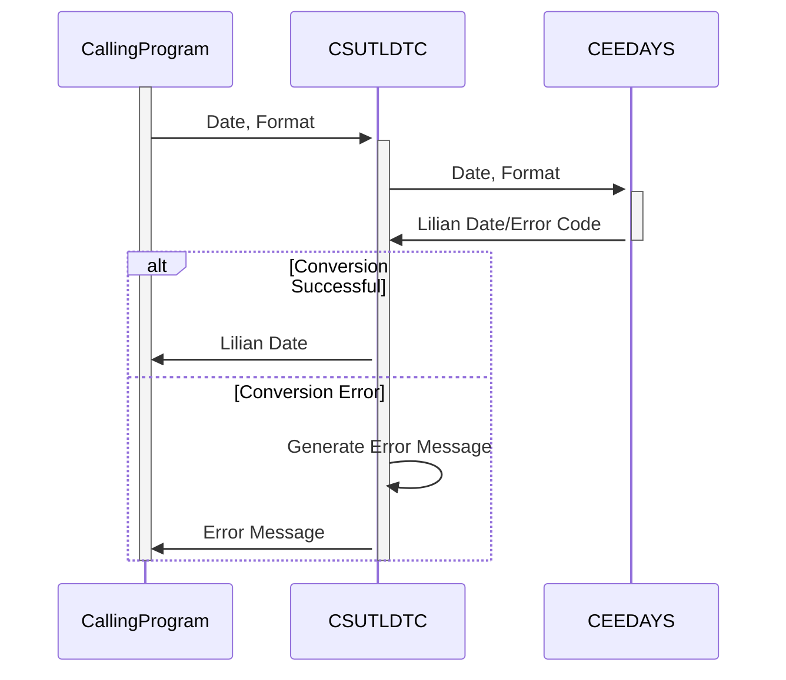

Generated at: 2nd October of 2024

**Title Document: CardDemo Application - Date Conversion Utility (CSUTLDTC) Specification**

**Summary Description:**
The Date Conversion Utility is a COBOL program that converts dates from various formats into the Lilian format. It uses the `CEEDAYS` system function to perform the conversion and provides detailed error messages in case of invalid input. This utility is crucial for ensuring accurate date calculations in the CardDemo application.

**User Stories:**
As a data analyst, I need to ensure that all dates are in a consistent and computer-readable format so that I can perform accurate calculations and analysis.

**Related Epic:**
9 - System Utilities

**Technical Requirements:**

- **Date Conversion:** This method converts a date from a given format to Lilian format.
  - Input: Date string and format string (e.g., "10-01-2024", "MM-DD-YYYY").
  - Calculation: Invokes the `CEEDAYS` system function, passing the input date and format.
  - Result `Binary Integer`: Returns the Lilian date if successful.
- **Error Handling:**  This method handles errors during date conversion.
  - Input: Return code from `CEEDAYS` function (`FEEDBACK-CODE`).
  - Validations:
    - `FC-INVALID-DATE`: Date is valid.
    - `FC-INSUFFICIENT-DATA`: Insufficient data provided.
    - `FC-BAD-DATE-VALUE`: Invalid date value.
    - `FC-INVALID-ERA`: Invalid era.
    - `FC-UNSUPP-RANGE`: Unsupported date range.
    - `FC-INVALID-MONTH`: Invalid month.
    - `FC-BAD-PIC-STRING`: Invalid format string.
    - `FC-NON-NUMERIC-DATA`: Non-numeric data in date.
    - `FC-YEAR-IN-ERA-ZERO`: Year in era is zero.
  - Output `String`:  Returns a specific error message based on the return code.

**Related Models**
No models are directly related to this utility.

**Configurations:**

- **CSUTLDTC.cbl**
  - `WS-DATE-RETURN-CODE`: `0`
	- Description: Return Code from Date Conversion (CEEDAYS).
  - `WS-DATE-IN-FORMAT`: `"YYYYMMDD"`
	- Description: Input Date Format.
  - `WS-DATE-OUT-CCYY`: `"1900"`
	- Description: Default Century for Output Date.

**Code Improvements:**

- **Centralized Error Handling:** Implement a centralized error-handling routine instead of scattered `EVALUATE` statements for better maintainability.
- **Logging:** Add logging for successful conversions and errors, including the input date, format, and result. This will aid in debugging and auditing.
- **Format Validation:**  Consider adding explicit validation for the input date format string to ensure it conforms to the expected patterns.
- **Documentation:** Add more in-line comments to explain the program logic, especially the error handling section.

**Security Improvements:**

- **Input Validation:**  Implement strict input validation for both the date and format strings to prevent potential injection vulnerabilities.
- **Error Messages:** Avoid revealing sensitive information in error messages. Generic messages are generally sufficient for users to understand the issue.

**Conceptual Diagram:**

--Made by "Smart Engineering" (by Compass.UOL)--