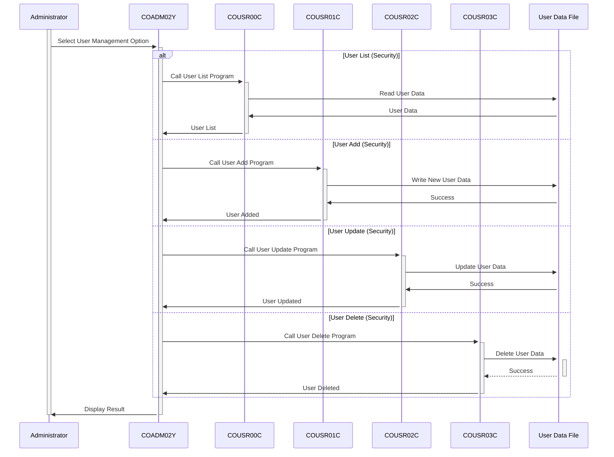

Generated at: 2nd October of 2024

**Title Document:** CardDemo Application - Administrative User Management Menu Specification

**Summary Description:**
This document outlines the specifications for the User Management administrative menu within the CardDemo application. This menu provides authorized personnel with tools to manage user accounts and their associated permissions.

**User Stories:**
As a system administrator, I need to be able to manage user accounts to control access to the CardDemo application.

**Related Epic:**
`6` - **User Management and Security:** Manage user access, roles, and permissions to ensure system security and data confidentiality.

**Technical Requirements:**

- **Display User Management Menu:** This section displays the administrative menu for managing users.
  - Input: Administrator selects the "User Management" menu option.
  - Process: The program displays the following options:
    1.  `List Users (Security)`
    2.  `User Add (Security)`
    3.  `User Update (Security)`
    4.  `User Delete (Security)`
  - Output: Display the selected user management option menu.
- **User List (Security):** This option retrieves and displays a list of all registered users, allowing administrators to review existing users.
  - Input: Administrator selects the "User List (Security)" option.
  - Process: 
    1.  The program reads user data from a file (likely VSAM).
    2.  Formats the user data for display.
  - Output: Presents a list of users, potentially including `User ID`, `Username`, and `User Type`.
- **User Add (Security):** This option enables the creation of new user accounts with necessary details and access levels.
  - Input: Administrator selects the "User Add (Security)" option.
  - Process:
    1.  Prompts the administrator to enter new user details, including `Username`, `Password`, `First Name`, `Last Name` and `User Type`.
    2.  Validates the input data, including checks for unique usernames, strong password requirements.
    3.  Adds the new user record to the user data file.
  - Output: Confirms the successful creation of the new user account.
- **User Update (Security):** This option allows modifications to existing user information, such as resetting passwords or changing access permissions.
  - Input: Administrator selects the "User Update (Security)" option.
  - Process:
    1.  Prompts for the `User ID` of the account to update.
    2.  Retrieves the user record from the user data file.
    3.  Allows modification of user details, such as `Password`, `First Name`, `Last Name` and `User Type`.
    4.  Validates the updated data.
    5.  Updates the user record in the data file.
  - Output: Confirmation of successful user information update.
- **User Delete (Security):** This option removes user accounts, revoking their access to the system, typically performed when a user is inactive or their access needs to be revoked.
  - Input: Administrator selects the "User Delete (Security)" option.
  - Process:
    1.  Prompts for the `User ID` of the account to delete.
    2.  Retrieves the user record to confirm deletion.
    3.  Upon confirmation, removes the user record from the user data file.
  - Output: Confirmation of user account deletion.

**Related Models**
- `CDEMO-ADMIN-OPT`: Represents an option in the administrative menu.
  - `CDEMO-ADMIN-OPT-NUM` `PIC 9(02)`: A unique numerical identifier for each menu option.
  - `CDEMO-ADMIN-OPT-NAME` `PIC X(35)`: A descriptive text label for each menu option.
  - `CDEMO-ADMIN-OPT-PGMNAME` `PIC X(08)`: The name of the COBOL program associated with each menu option.

**Configurations:**
- `COADM02Y.cpy`
  - `CDEMO-ADMIN-OPT-COUNT`: `4`
	- Description: Total number of options available in the User Management menu.

**Code Improvements:**
- **Error Handling:** Implement robust error handling for file operations (open, read, write, close) and data validations. Display specific error messages to the administrator.
- **Logging:**  Add a logging mechanism to record all user management actions, including who performed the action, what action was taken, and the timestamp. This log can be valuable for security audits.
- **Password Complexity:** Enforce stronger password complexity rules during user creation and password updates.
- **Input Validation:** Validate all user inputs to prevent common vulnerabilities such as SQL injection or cross-site scripting (although these are less relevant in a mainframe context, input validation is always good practice).

**Security Improvements:**
- **Authentication and Authorization:**  Implement a centralized authentication and authorization mechanism to control access to the CardDemo application and its administrative functions.
- **Secure Password Storage:** Never store user passwords in plain text. Use a strong hashing algorithm to store passwords securely.
- **Session Management:** Implement secure session management practices to protect user sessions from hijacking.

**Conceptual Diagram:**

--Made by "Smart Engineering" (by Compass.UOL)--