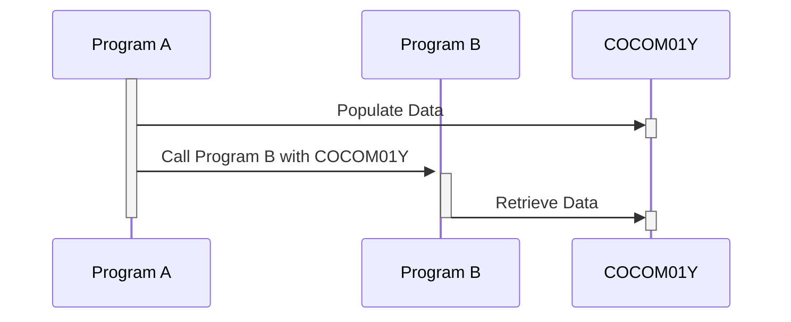

Generated at: 2nd October of 2024

**Title Document: CardDemo Application - Communication Area (COCOM01Y) Specification**

**Summary Description:**
This document outlines the structure and function of the `CARDDEMO-COMMAREA`, a standardized data structure used for communication between different programs within the CardDemo application. This communication area ensures seamless data exchange and maintains data integrity throughout the credit card management system.

**User Stories:**
As a software developer, I need a standardized way to exchange data between different programs within the CardDemo application so that I can ensure data consistency and integrity.

**Related Epic:** 9 - System Utilities

**Technical Requirements:**
- **Data Exchange Workflow**: This workflow defines the process of populating and interpreting data in the `CARDDEMO-COMMAREA`.
  - **Data Population**: The sending program populates the relevant fields of the `CARDDEMO-COMMAREA` with the necessary data.
  - **Data Transfer**: The `CARDDEMO-COMMAREA` is passed to the receiving program, either as a parameter in a CALL statement or through a shared memory mechanism.
  - **Data Interpretation**: The receiving program retrieves the data from the appropriate fields of the `CARDDEMO-COMMAREA`.
  - Result: `CARDDEMO-COMMAREA`: A populated data structure containing the information to be shared between the programs.

**Related Models:**
- `CARDDEMO-COMMAREA`
  - `CDEMO-FROM-TRANID` `PIC X(04)`: Transaction ID of the sending program.
  - `CDEMO-FROM-PROGRAM` `PIC X(08)`: Program name of the sender.
  - `CDEMO-TO-TRANID` `PIC X(04)`: Transaction ID of the receiving program.
  - `CDEMO-TO-PROGRAM` `PIC X(08)`: Program name of the receiver.
  - `CDEMO-USER-ID` `PIC X(08)`: User ID initiating the transaction.
  - `CDEMO-USER-TYPE` `PIC X(01)`: Type of user (Admin or Regular).
  - `CDEMO-PGM-CONTEXT` `PIC 9(01)`: Program entry/re-entry context.
  - `CDEMO-CUST-ID` `PIC 9(09)`: Unique customer identifier.
  - `CDEMO-CUST-FNAME` `PIC X(25)`: Customer's first name.
  - `CDEMO-CUST-MNAME` `PIC X(25)`: Customer's middle name.
  - `CDEMO-CUST-LNAME` `PIC X(25)`: Customer's last name.
  - `CDEMO-ACCT-ID` `PIC 9(11)`: Unique account identifier.
  - `CDEMO-ACCT-STATUS` `PIC X(01)`: Current status of the account.
  - `CDEMO-CARD-NUM` `PIC 9(16)`: Credit card number associated with the account.
  - `CDEMO-LAST-MAP` `PIC X(7)`: Last map name used.
  - `CDEMO-LAST-MAPSET` `PIC X(7)`: Last mapset used.

**Configurations:**
- No specific configuration values are found within the code snippet. However, it is important to note that the data types and lengths defined in the `PIC` clauses act as constraints and configurations for the data being exchanged.

**Code Improvements:**
- **Add Data Validation**: Implement checks to ensure that the data being populated into the `CARDDEMO-COMMAREA` adheres to the expected format and data types.
- **Document Field Usage**: Provide clear comments for each field, specifying its purpose, allowed values, and any dependencies on other fields.
- **Consider Versioning**: If the structure of the communication area is likely to change in the future, implement a versioning mechanism to maintain backward compatibility.

**Security Improvements:**
- **Secure Sensitive Data**: Encrypt sensitive information like `CDEMO-CARD-NUM` during transmission to prevent unauthorized access.
- **Implement Access Control**: Restrict access to fields based on user roles and permissions. For instance, regular users should not have access to `CDEMO-USER-TYPE`.
- **Log Communication Area Access**: Maintain audit trails to track which programs access and modify the `CARDDEMO-COMMAREA` for security and debugging purposes.

**Conceptual Diagram:**

--Made by "Smart Engineering" (by Compass.UOL)--