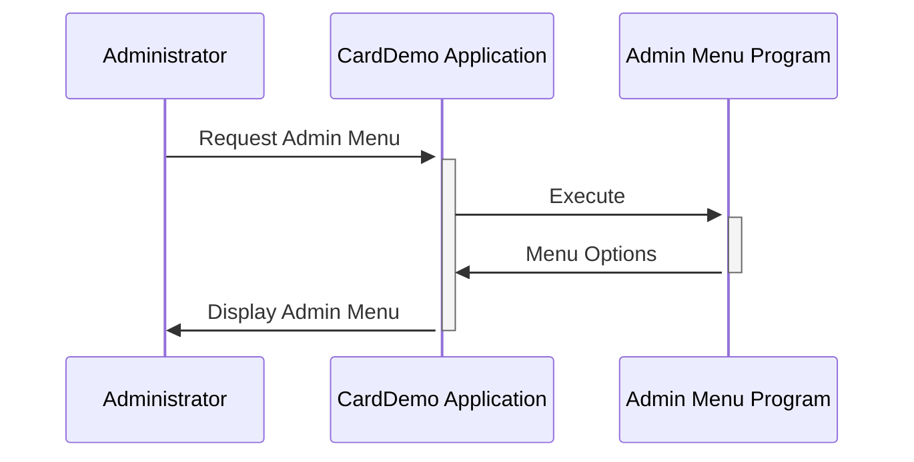

Generated at: 2nd October of 2024

**Title Document:** CardDemo Application - Admin Menu Specification

**Summary Description:**
This document outlines the functionality of the CardDemo Application's Admin Menu, specifically focusing on the options available to administrative users. This menu serves as a central hub for administrators to manage various aspects of the credit card system.

**User Stories:**
As an administrator, I need access to a dedicated menu with options to manage accounts, cards, transactions, and generate reports so that I can effectively administer the credit card system.

**Related Epic:** 6 - User Management and Security

**Technical Requirements:**
- **Admin Menu Display:**
  - Description: This functionality displays the admin menu options to authorized users.
  - Input: User role and authentication status.
  - Processing: Upon successful login as an admin user (`CDEMO-MENU-OPT-USRTYPE` = 'U'), the system presents a menu with a list of options (`CDEMO-MENU-OPT-NAME`). Each option is associated with a corresponding program (`CDEMO-MENU-OPT-PGMNAME`) to be executed upon selection. 
  - Output: Displays the admin menu options with their corresponding numbers (`CDEMO-MENU-OPT-NUM`) for user selection.

**Related Models:**
- **`CARDDEMO-MAIN-MENU-OPTIONS`:** A data structure that holds the admin menu options.
  - `CDEMO-MENU-OPT-NUM` `Numeric(9(02))`: Menu option sequence number.
  - `CDEMO-MENU-OPT-NAME` `Alphanumeric(X(35))`: Display name of the menu option.
  - `CDEMO-MENU-OPT-PGMNAME` `Alphanumeric(X(08))`: Program name associated with the menu option.
  - `CDEMO-MENU-OPT-USRTYPE` `Alphanumeric(X(01))`: User type authorized to access the option (always 'U' in this case).

**Configurations:**
- **`COMEN02Y.cpy`**
  - `CDEMO-MENU-OPT-COUNT`: `10`
	- Description: Total number of menu options available for admin users.

**Code Improvements:**
- **Dynamic Menu Generation:** Instead of hardcoding menu options, fetch them from a database table. This allows for greater flexibility in managing menu options and their visibility based on user roles.
- **Error Handling:** Implement checks for invalid menu option selections and display appropriate error messages to the user.
- **Logging:** Add logging statements to track menu access and selections for auditing and troubleshooting purposes.

**Security Improvements:**
- **Authorization:** Implement role-based access control (RBAC) to restrict menu options based on user roles. This ensures that only authorized personnel can access sensitive functionalities.
- **Session Management:**  Implement secure session management practices to prevent unauthorized access to the admin menu after the user's session has expired.

**Conceptual Diagram:**

--Made by "Smart Engineering" (by Compass.UOL)--