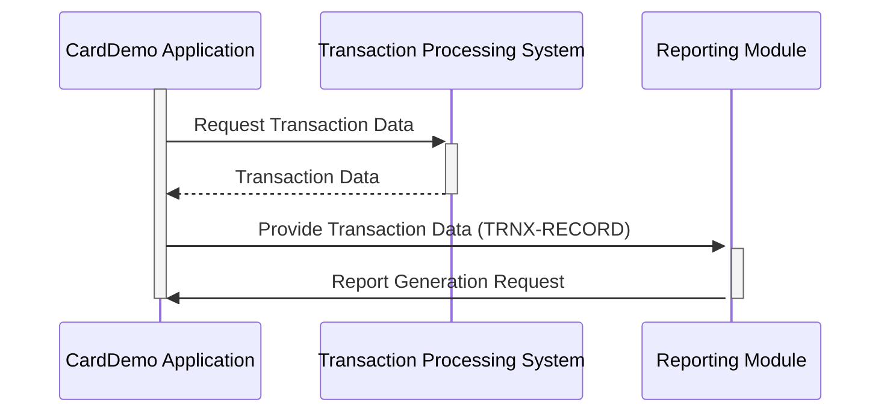

Generated at: 2nd October of 2024

**Title Document: CardDemo - Transaction Reporting Structure**

**Summary Description:**

This document outlines a COBOL data structure designed for credit/debit card transaction reporting within the CardDemo system. It ensures consistent and structured data organization for generating various reports.

**User Stories:**

As a data analyst, I need a standardized format for transaction data to generate accurate and consistent reports on card transactions. This will help in analyzing transaction trends, identifying patterns, and making informed business decisions.

**Related Epic:**
5 - Reporting and Analytics

**Technical Requirements:**

- **Transaction Data Structure:** Define a COBOL data structure named `TRNX-RECORD` to represent a single transaction record. This structure will contain fields for storing key transaction details like card number, transaction ID, type, category, amount, merchant information, and timestamps.
  - **Input:** None. The `TRNX-RECORD` structure is not populated from an input file. It serves as a template for organizing transaction data.
  - **Processing:** Applications will populate instances of this structure with data from transaction processing systems.
  - **Result** `TRNX-RECORD`: A structured data record containing all necessary information about a single transaction, ready to be used for reporting purposes.

**Related Models**

- **Transaction (`TRNX-RECORD`)**
  - `TRNX-CARD-NUM` `Alphanumeric(16)`: The credit/debit card number associated with the transaction.
  - `TRNX-ID` `Alphanumeric(16)`: A unique identifier for the transaction.
  - `TRNX-TYPE-CD` `Code(2)`: A code signifying the type of transaction (e.g., "PR" for Purchase, "RF" for Refund).
  - `TRNX-CAT-CD` `Code(4)`: A code categorizing the transaction (e.g., "FOOD" for Groceries, "TRVL" for Travel).
  - `TRNX-SOURCE` `Alphanumeric(10)`: The origin of the transaction (e.g., "ONLINE", "POS", "ATM").
  - `TRNX-DESC` `Alphanumeric(100)`: A description of the transaction.
  - `TRNX-AMT` `Numeric(9,2)`: The transaction amount with two decimal places for cents.
  - `TRNX-MERCHANT-ID` `Numeric(9)`: A unique identifier for the merchant.
  - `TRNX-MERCHANT-NAME` `Alphanumeric(50)`: The name of the merchant.
  - `TRNX-MERCHANT-CITY` `Alphanumeric(50)`: The city of the merchant's location.
  - `TRNX-MERCHANT-ZIP` `Alphanumeric(10)`: The ZIP code of the merchant's location.
  - `TRNX-ORIG-TS` `Timestamp`: The date and time when the transaction was initiated.
  - `TRNX-PROC-TS` `Timestamp`: The date and time when the transaction was processed.

**Configurations:**

- No external configuration parameters were found in the provided context.

**Code Improvements:**

- **Data Validation:** Implement data validation routines to ensure the accuracy and consistency of the data within the `TRNX-RECORD` structure. This includes checks for valid transaction types, categories, date/time formats, and data ranges.
- **Error Handling:** Incorporate error handling mechanisms to gracefully manage issues encountered during data population or processing of the `TRNX-RECORD` structure. This could involve logging errors, generating alerts, or providing informative messages to users.
- **Documentation:** Provide comprehensive documentation for the `TRNX-RECORD` structure, clearly defining each field's purpose, allowed values, and any validation rules applied.

**Security Improvements:**

- **Data Encryption:** Consider encrypting sensitive data within the `TRNX-RECORD` structure, especially when storing or transmitting information like card numbers and merchant IDs.
- **Access Control:** Implement access control mechanisms to restrict unauthorized access to transaction data stored in the `TRNX-RECORD` structure.

**Conceptual Diagram:**

--Made by "Smart Engineering" (by Compass.UOL)--