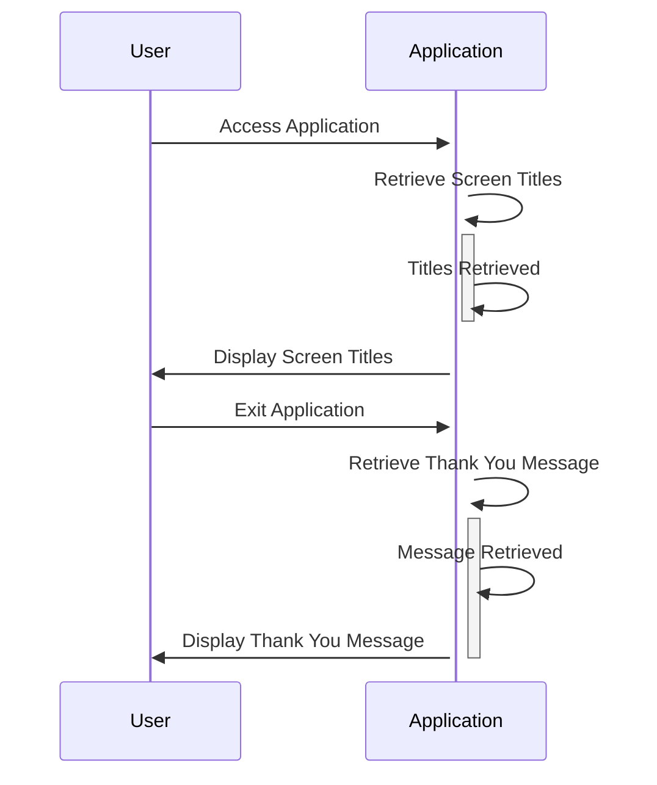

Generated at: 2nd October of 2024

**Title Document: CardDemo Application - Screen Titles and Messages Specification**

**Summary Description:**
This document outlines the specifications for displaying titles and messages within the CardDemo application, a COBOL-based credit card management system. The primary objective is to enhance the user experience by presenting clear, consistent branding and user-friendly messages throughout the application. 

**User Stories:**
As a user, I need to see clear and consistent titles and messages so that I can easily understand and navigate the application.

**Related Epic:** 9 - System Utilities

**Technical Requirements:**

- Screen Titles Display: This functionality defines and displays the titles on the application screens.
  - Definition: The titles are defined as constant values within the `COTTL01Y.cpy` copybook. Each title is associated with a specific screen or functionality within the CardDemo application.
  - Display: The application retrieves these titles and displays them in the designated areas of each screen, ensuring a unified look and feel.
  - Result `String`: Display of titles like `AWS Mainframe Modernization` and `CardDemo` on the application screens.

- Display Thank You Message: This functionality defines and displays a thank-you message to the user upon exiting the application.
  - Definition: The thank-you message is defined as a constant value within the `COTTL01Y.cpy` copybook.
  - Display Logic: The application displays this message when the user triggers an exit or logout action.
  - Result `String`: Display of the message `Thank you for using CCDA application...` upon user exit.

**Related Models**
N/A - This component does not define any specific data models. It provides text strings for display purposes.

**Configurations:**

- `COTTL01Y.cpy`
  - `CCDA-TITLE01`: `'      AWS Mainframe Modernization       '`
	- Description: First line of the application title.
  - `CCDA-TITLE02`: `'              CardDemo                  '`
	- Description: Second line of the application title.
  - `CCDA-THANK-YOU`: `'Thank you for using CCDA application... '`
	- Description: Thank you message displayed to the user upon exiting the application.

**Code Improvements:**

- Externalize Strings: Move the screen titles and messages to an external configuration file or database table. This would allow for easier modification of these elements without requiring code recompilation.
- Localization: Implement support for multiple languages by loading the appropriate set of strings based on user preferences or system settings.

**Security Improvements:**
N/A - This component focuses on user interface elements and does not directly involve sensitive data or security functions.

**Conceptual Diagram:**

--Made by "Smart Engineering" (by Compass.UOL)--