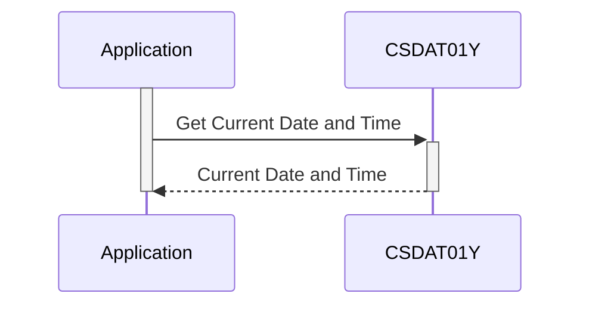

Generated at: 2nd October of 2024

**Title Document: CardDemo Application - Date and Time Standard Specification**

**Summary Description:**
This document defines the standard structure for representing date and time information within the CardDemo application. It ensures consistency and accuracy in recording, displaying, and processing dates and times across all system functionalities.

**User Stories:**
As a data analyst, I need a consistent and reliable format for date and time data in the CardDemo application to ensure accurate analysis and reporting.

**Related Epic:** 
9 - System Utilities

**Technical Requirements:**
- **Date and Time Formatting:**
  - Input: Raw date and time data from various sources.
  - Processing: Format date as `YYYYMMDD` or `MM/DD/YY` and time as `HHMMSS` or `HH:MM:SS`.
  - Result: `WS-CURDATE`, `WS-CURDATE-MM-DD-YY`, `WS-CURTIME`, and `WS-CURTIME-HH-MM-SS`.
- **Timestamp Generation:**
  - Input: Current date and time data.
  - Processing: Combine date and time components with milliseconds into a single timestamp string in `YYYY-MM-DD HH:MM:SS.SSSSSS` format.
  - Result: `WS-TIMESTAMP`.
- **Timestamp Decomposition:**
  - Input: `WS-TIMESTAMP`.
  - Processing: Extract year, month, day, hour, minute, second, and millisecond components from the timestamp string.
  - Result: `WS-TIMESTAMP-DT-YYYY`, `WS-TIMESTAMP-DT-MM`, `WS-TIMESTAMP-DT-DD`, `WS-TIMESTAMP-TM-HH`, `WS-TIMESTAMP-TM-MM`, `WS-TIMESTAMP-TM-SS`, `WS-TIMESTAMP-TM-MS6`.

**Related Models:**
- **Date and Time Structure:**
  - `WS-CURDATE` `Integer`: Current date in YYYYMMDD format.
  - `WS-CURDATE-YEAR` `Integer`: Current year (YYYY).
  - `WS-CURDATE-MONTH` `Integer`: Current month (MM).
  - `WS-CURDATE-DAY` `Integer`: Current day (DD).
  - `WS-CURTIME` `Integer`: Current time in HHMMSS format.
  - `WS-CURTIME-HOURS` `Integer`: Current hour (HH).
  - `WS-CURTIME-MINUTE` `Integer`: Current minute (MM).
  - `WS-CURTIME-SECOND` `Integer`: Current second (SS).
  - `WS-CURTIME-MILSEC` `Integer`: Current millisecond (hundreths of a second).
  - `WS-CURDATE-MM-DD-YY` `String`: Current date in MM/DD/YY format.
  - `WS-CURTIME-HH-MM-SS` `String`: Current time in HH:MM:SS format.
  - `WS-TIMESTAMP` `String`: Timestamp value combining date and time with milliseconds.
  - `WS-TIMESTAMP-DT-YYYY` `Integer`: Timestamp year (YYYY).
  - `WS-TIMESTAMP-DT-MM` `Integer`: Timestamp month (MM).
  - `WS-TIMESTAMP-DT-DD` `Integer`: Timestamp day (DD).
  - `WS-TIMESTAMP-TM-HH` `Integer`: Timestamp hour (HH).
  - `WS-TIMESTAMP-TM-MM` `Integer`: Timestamp minute (MM).
  - `WS-TIMESTAMP-TM-SS` `Integer`: Timestamp second (SS).
  - `WS-TIMESTAMP-TM-MS6` `Integer`: Timestamp milliseconds (SSSSSS).

**Configurations:**
- N/A

**Code Improvements:**
- **Error Handling:** Implement error handling routines to gracefully manage scenarios like invalid date/time inputs or system clock errors.
- **Documentation:** Enhance code comments to clearly explain the purpose and usage of each data structure and formatting function.
- **Time Zone Awareness:** Incorporate time zone information into date and time structures to support applications operating in multiple time zones.
- **DST Handling:** Include logic to automatically adjust for DST transitions, ensuring accurate timekeeping throughout the year.

**Security Improvements:**
- **Secure Time Source:** Utilize a secure and reliable time source, such as a network time protocol (NTP) server, to prevent manipulation of time-related data.
- **Input Validation:** Validate all date and time inputs to prevent injection attacks and ensure data integrity.

**Conceptual Diagram:**

--Made by "Smart Engineering" (by Compass.UOL)--