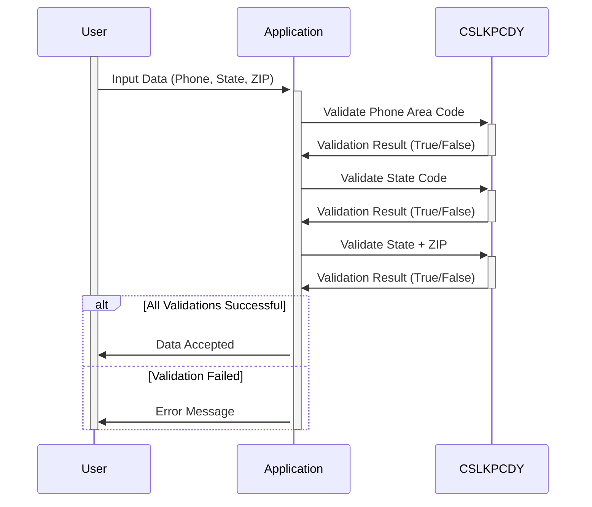

Generated at: 2nd October of 2024

**Title Document:** Data Integrity Guardian - Lookup Code Repository Specification

**Summary Description:**
This document details the specifications for a COBOL program that serves as a data integrity guardian by validating phone area codes, US state codes, and state + ZIP code combinations against predefined lists. The program ensures that only valid data is accepted, enhancing data accuracy and system reliability.

**User Stories:**
As a data analyst, I need to ensure that the phone numbers, state codes, and ZIP codes used in our analyses are accurate and standardized so that our reports and insights are reliable and comply with regulatory requirements.

**Related Epic:**
9 - System Utilities

**Technical Requirements:**

- **Validate Phone Area Code:** This method checks if a given phone area code is valid.
  - Input: `WS-US-PHONE-AREA-CODE-TO-EDIT` `{PIC XXX}`: Phone area code to be validated.
  - Validation: Checks if `WS-US-PHONE-AREA-CODE-TO-EDIT` is present in the `VALID-PHONE-AREA-CODE` list.
  - Result `Boolean`: Returns `TRUE` if valid, `FALSE` otherwise.

- **Validate US State Code:** This method verifies if a provided US state code is valid.
  - Input: `US-STATE-CODE-TO-EDIT` `{PIC X(2)}`: US state code to be validated.
  - Validation: Checks if `US-STATE-CODE-TO-EDIT` is present in the `VALID-US-STATE-CODE` list.
  - Result `Boolean`: Returns `TRUE` if valid, `FALSE` otherwise.

- **Validate US State and ZIP Code Combination:** This method ensures that the combination of a US state code and the first two digits of a ZIP code is geographically valid.
  - Input: `US-STATE-AND-FIRST-ZIP2` `{PIC X(4)}`: US state code concatenated with the first two digits of the ZIP code.
  - Validation: Checks if `US-STATE-AND-FIRST-ZIP2` is present in the `VALID-US-STATE-ZIP-CD2-COMBO` list.
  - Result `Boolean`: Returns `TRUE` if valid, `FALSE` otherwise.

**Related Models**

- **Phone Area Code:**
  - `WS-US-PHONE-AREA-CODE-TO-EDIT` `{PIC XXX}`: Represents a three-digit phone area code.

- **US State Code:**
  - `US-STATE-CODE-TO-EDIT` `{PIC X(2)}`: Represents a two-letter US state code.

- **US State and ZIP Code Combination:**
  - `US-STATE-AND-FIRST-ZIP2` `{PIC X(4)}`: Represents a four-character combination of a two-letter US state code and the first two digits of a ZIP code.
  - `LAST-3-OF-ZIP` `{PIC X(3)}`: Represents the last three digits of a ZIP code (currently unused).

**Configurations:**

- `CSLKPCDY.cpy`
  - `VALID-PHONE-AREA-CODE`: `{'201', '202', ..., '999'}`
	- Description: List of valid North American phone area codes.
  - `VALID-US-STATE-CODE`: `{'AL', 'AK', ..., 'VI'}`
	- Description: List of valid US state codes.
  - `VALID-US-STATE-ZIP-CD2-COMBO`: `{'AA34', 'AE90', ..., 'WY83'}`
	- Description: List of valid combinations of US state codes and the first two digits of ZIP codes.

**Code Improvements:**

- **Error Logging:** Implement a mechanism to log validation errors, including the invalid data and the source of the input, for auditing and troubleshooting purposes.
- **Documentation:** Enhance the code with comments explaining the purpose and logic of each validation rule and the data structures used.
- **Performance Optimization:** If the validation lists are extensive, consider using binary search or other efficient search algorithms to improve performance.
- **Externalize Validation Lists:** Store the validation lists in external files or a database to allow for easier updates and maintenance without modifying the program code.
- **Dynamic Validation List Loading:** Implement a mechanism to load the validation lists dynamically at program startup, allowing for greater flexibility and reducing the need for recompilation when the lists change.

**Security Improvements:**

- **Access Control:** Restrict access to the `CSLKPCDY.cpy` file and any external files or databases containing validation lists to authorized personnel only.
- **Data Encryption:** Encrypt sensitive data, such as customer phone numbers and addresses, when stored and transmitted to protect customer privacy.
- **Auditing:** Implement audit trails to track changes to the validation lists and any data validation failures, providing a record of system activity for security and compliance purposes.

**Conceptual Diagram:**

--Made by "Smart Engineering" (by Compass.UOL)--