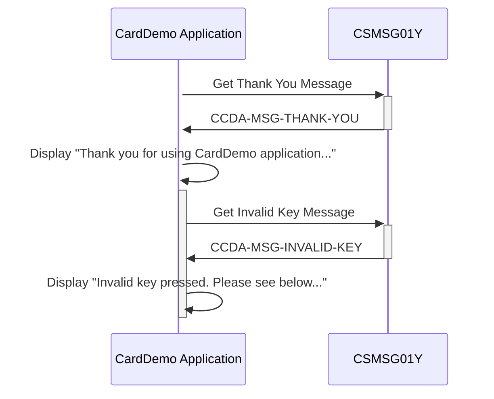

Generated at: 2nd October of 2024

**Title Document:** CardDemo Application - Common Message Repository Specification

**Summary Description:**
This document outlines the functionality of a COBOL copybook (`CSMSG01Y.cpy`) within the CardDemo application. This copybook serves as a centralized repository for common user messages, ensuring consistency in user communication throughout the application.

**User Stories:**
As a developer, I need a centralized repository for common user messages so that the application provides a consistent and user-friendly experience.

**Related Epic:**
9 - System Utilities

**Technical Requirements:**
- `Display Thank You Message`: This method displays a thank you message to the user.
  - Input: None.
  - Output: Displays the message `Thank you for using CardDemo application...` on the user's screen.
- `Display Invalid Key Message`: This method informs the user about pressing an invalid key.
  - Input: None.
  - Output: Displays the message `Invalid key pressed. Please see below...` on the user's screen.

**Related Models**
- N/A

**Configurations:**
- `CSMSG01Y.cpy`
  - `CCDA-MSG-THANK-YOU`: `'Thank you for using CardDemo application...      '`
	- Description: Thank you message displayed to the user upon successful completion of an action.
  - `CCDA-MSG-INVALID-KEY`: `'Invalid key pressed. Please see below...         '`
	- Description: Message displayed when the user presses an invalid key, prompting for correct input.

**Code Improvements:**
- **Externalize Messages:** Consider storing these messages in an external file or database table. This would allow for easier modification of the messages without requiring code recompilation.
- **Multilingual Support:** For applications intended for a global audience, explore incorporating multilingual support for messages. This would involve defining messages in different languages and dynamically displaying the appropriate message based on user preferences.

**Security Improvements:**
- N/A

**Conceptual Diagram:**

--Made by "Smart Engineering" (by Compass.UOL)--