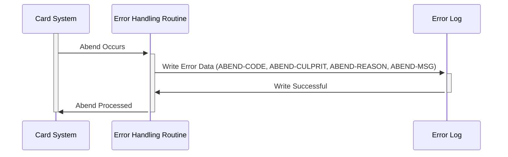

Generated at: 2nd October of 2024

**Title Document: Card System Error Logging Specification**

**Summary Description:**
This specification defines a standardized structure for logging errors within the Card System. It outlines the information captured for each error and highlights its importance for system stability, problem resolution, and error tracking.

**User Stories:**
As a System Administrator, I need a way to quickly identify and understand system errors so that I can resolve issues efficiently and minimize system downtime.

**Related Epic:** 
9 - System Utilities

**Technical Requirements:**

- **Error Logging Structure:**
  - Definition: This structure defines a standardized format for storing error information.
  - Properties:
    - `ABEND-CODE` (`String(4)`): A four-character code representing the specific error type.
    - `ABEND-CULPRIT` (`String(8)`): An eight-character field storing the program or component where the error originated.
    - `ABEND-REASON` (`String(50)`): A fifty-character field for a detailed explanation of the error's cause.
    - `ABEND-MSG` (`String(72)`): A seventy-two-character field for a general, user-friendly error message.

**Related Models**
- N/A

**Configurations:**
- `CSMSG02Y.cpy`
  - `ABEND-CODE`: `""`
	  - Description: Initialized with spaces, to be populated with the specific error code when an abend occurs.
  - `ABEND-CULPRIT`: `""`
	  - Description: Initialized with spaces, to be populated with the name of the program or module where the abend originated.
  - `ABEND-REASON`: `""`
	  - Description: Initialized with spaces, to be populated with a detailed explanation of why the abend occurred.
  - `ABEND-MSG`: `""`
	  - Description: Initialized with spaces, to be populated with a general message about the abend, suitable for display or logging.

**Code Improvements:**
- **Error Code Standardization:** Establish a comprehensive set of error codes with clear definitions to ensure consistency in error reporting.
- **Centralized Logging:** Implement a centralized logging system to aggregate error logs from various system components for easier analysis and correlation.
- **Automated Alerting:** Configure automated alerts for critical errors to notify system administrators in real time, enabling faster response and resolution.
- **Log Retention Policy:** Define a clear log retention policy based on operational and regulatory requirements to manage log storage and archival.

**Security Improvements:**
- **Access Control:** Restrict access to error logs to authorized personnel only. Implement role-based access control to manage permissions effectively.
- **Log Integrity:** Employ measures to ensure the integrity of error logs, preventing unauthorized modification or deletion. Consider using digital signatures or checksums.
- **Secure Logging Practices:** Avoid logging sensitive data, such as customer credentials or financial information, in plain text within error messages.

**Conceptual Diagram:**

--Made by "Smart Engineering" (by Compass.UOL)--