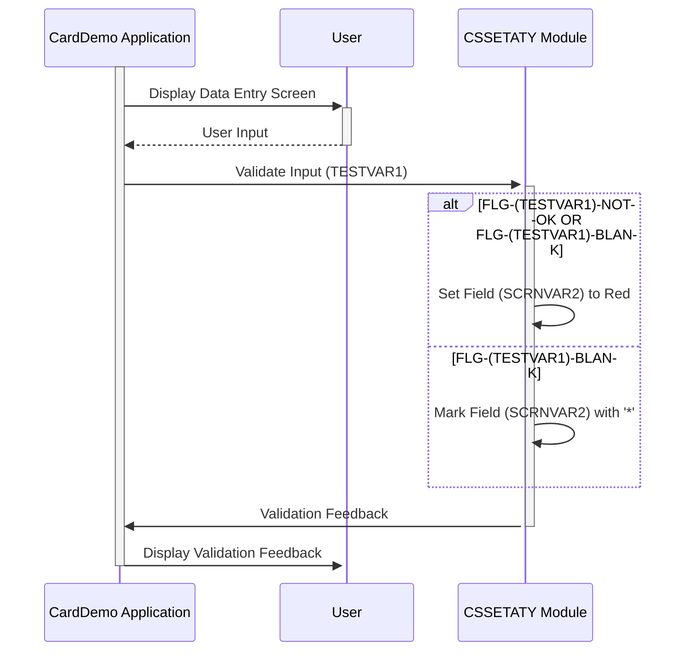

Generated at: 2nd October of 2024

**Title Document:** CardDemo Field Validation Specification

**Summary Description:**
This specification details the functionality of a code snippet within the CardDemo application. It focuses on providing visual feedback to users during data entry, specifically highlighting potential errors and guiding users to complete mandatory fields. This ensures data accuracy and enhances user experience.

**User Stories:**
As a customer service representative, I need clear visual cues on the screen to indicate errors or missing information in customer data so that I can correct them promptly and ensure data accuracy.

**Related Epic:** 9 - System Utilities

**Technical Requirements:**

- **Conditional Field Highlighting:**
  - Input: `(TESTVAR1)` value and `CDEMO-PGM-REENTER` flag status.
  - Condition: If `(FLG-(TESTVAR1)-NOT-OK OR FLG-(TESTVAR1)-BLANK) AND CDEMO-PGM-REENTER` is true.
  - Output: Change the color of the field `(SCRNVAR2)` to red (`DFHRED`) on the screen map `(MAPNAME3)O`.
- **Blank Field Marking:**
  - Input: `(TESTVAR1)` value.
  - Condition: If `FLG-(TESTVAR1)-BLANK` is true.
  - Output: Display an asterisk (`*`) in the field `(SCRNVAR2)` on the screen map `(MAPNAME3)O`.

**Related Models**
- N/A

**Configurations:**
- **CSSETATY.cpy**
  - `DFHRED`: System-defined color code for red.
	- Description: Used to highlight the field `(SCRNVAR2)` when an error is detected.

**Code Improvements:**
- **Error Message Specificity:** Instead of just highlighting the field in red, display a more informative error message near the field, explaining the reason for the error. This would provide better context to the user.
- **Accessibility:** Ensure the color contrast between the red highlight and the background color meets accessibility standards. Consider providing alternative error indicators, such as icons or borders, for users with visual impairments.
- **Error Logging:** Implement a mechanism to log the specific errors encountered during field validation. This could be useful for debugging and identifying potential areas for improvement in the validation rules.

**Security Improvements:**
- N/A 

**Conceptual Diagram:**

--Made by "Smart Engineering" (by Compass.UOL)--