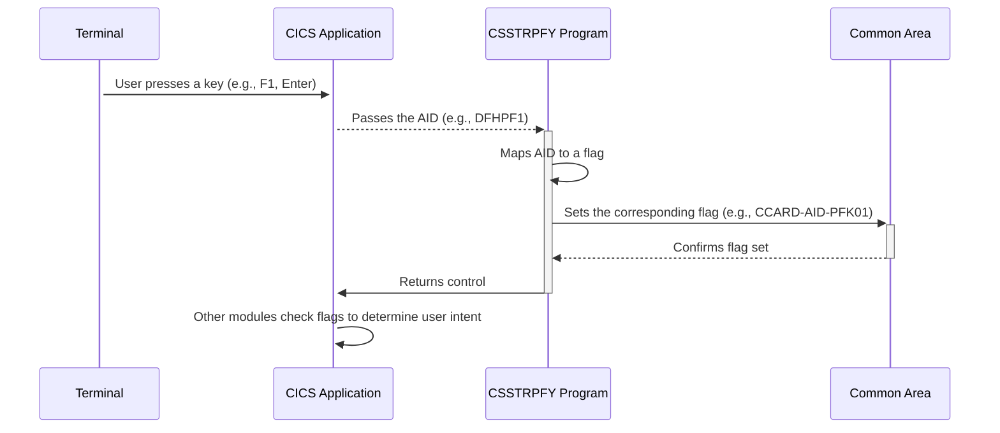

Generated at: 2nd October of 2024

**Title Document: CICS User Action Translator Specification**

**Summary Description:**
This program translates user actions, such as key presses on a terminal, into specific program functions within a CICS application. It acts as a bridge between the user interface and the application logic.

**User Stories:**
As a CICS application developer, I need a way to consistently translate user actions from different terminal types into meaningful program functions to ensure a consistent user experience and simplify application maintenance.

**Related Epic:** 9 - System Utilities

**Technical Requirements:**

- **User Action Mapping:**  This method captures the user's action (AID) and maps it to a corresponding program function flag.
  - Input: `EIBAID` - Contains the AID of the last user action.
  - Processing:  The code uses an `EVALUATE TRUE` statement to compare the `EIBAID` with a list of predefined AIDs. If a match is found, the corresponding flag is set to `TRUE`. For instance, if `EIBAID` equals `DFHPF1`, the flag `CCARD-AID-PFK01` is set to `TRUE`.
  - Output:  Sets the appropriate flag in the common area (`CCARD-AID-ENTER`, `CCARD-AID-CLEAR`, `CCARD-AID-PA1`, `CCARD-AID-PA2`, `CCARD-AID-PFK01` to `CCARD-AID-PFK12`) based on the matched `EIBAID`.

**Related Models**
There are no models directly related to this code snippet. This code focuses on handling user interface events and doesn't interact directly with data models.

**Configurations:**
- **`CSSTRPFY.cpy`**: This file contains the mapping between specific AIDs (like `DFHPF1`, `DFHCLEAR`) and their corresponding flags in the common area.  
  - `DFHENTER`:  Represents the Enter key.
  - `DFHCLEAR`: Represents the Clear key.
  - `DFHPA1`: Represents the PA1 key.
  - `DFHPA2`: Represents the PA2 key.
  - `DFHPF1` to `DFHPF12`: Represents the function keys F1 to F12.
  - `DFHPF13` to `DFHPF24`: Represents the function keys F13 to F24.

**Code Improvements:**
- **Error Handling:** Implement error handling to gracefully manage cases where an unsupported or unexpected AID is encountered. This could involve logging the error, displaying a user-friendly message, or taking other appropriate actions.
- **Logging:** Enhance the code to log user actions and their corresponding translations. This would be beneficial for debugging, auditing, and understanding user behavior.
- **Documentation:** Provide clear and comprehensive comments to explain the purpose of the code, the meaning of each AID, and the functions they trigger. This will improve the code's readability and maintainability.
- **Configuration:** Consider moving the AID-to-flag mapping to an external configuration file. This would allow for easier modification and customization of the mappings without altering the program code.
- **Structure:**  While the `EVALUATE TRUE` statement works, using a `GO TO DEPENDING ON` statement or a table-driven approach might offer better performance and readability, especially as the number of AIDs increases.

**Security Improvements:**
Security improvements are not directly applicable to this specific code snippet as it primarily deals with user interface event translation. However, it's crucial to ensure that the common area where the flags are stored is adequately protected to prevent unauthorized access or modification.

**Conceptual Diagram:**

--Made by "Smart Engineering" (by Compass.UOL)--