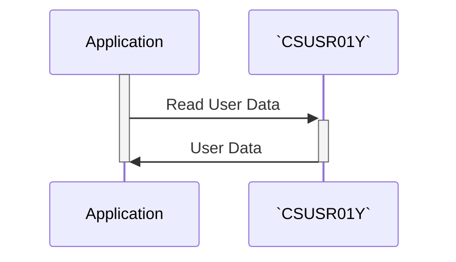

Generated at: 2nd October of 2024

**Title Document: `CSUSR01Y.cpy` - User Security Profile - Data Structure Specification**

**Summary Description:**
This document outlines the structure of the `CSUSR01Y.cpy` file, which defines how user security profiles are stored within the CardDemo application. This is not a program, but a blueprint that dictates what information is stored for each user and how it is organized. 

**User Stories:**
As a system administrator, I need to be able to define user accounts with different roles and permissions so that I can control access to sensitive data and functionality within the CardDemo application. 

**Related Epic:**
6 - User Management and Security

**Technical Requirements:**
This code defines a COBOL data structure that represents a user security profile. This structure is likely used for storing and retrieving user information from a database or file. 

- `User Security Profile Structure`: This structure defines the layout of user information.
  - `SEC-USR-ID`:  A unique 8-character code that identifies each user.
  - `SEC-USR-FNAME`:  The user's first name, stored as a 20-character string.
  - `SEC-USR-LNAME`: The user's last name, stored as a 20-character string.
  - `SEC-USR-PWD`:  The user's password, stored as an 8-character string. The method of encryption or hashing is not specified here.
  - `SEC-USR-TYPE`:  A 1-character code that signifies the user's role and access level within the system.
  - `SEC-USR-FILLER`: A 23-character reserved space for potential future expansion of the user data structure.

**Related Models**
- `SEC-USER-DATA`: Represents the user security profile.
  - `SEC-USR-ID` `X(08)`: Unique 8-character user ID.
  - `SEC-USR-FNAME` `X(20)`: User's first name (up to 20 characters).
  - `SEC-USR-LNAME` `X(20)`: User's last name (up to 20 characters).
  - `SEC-USR-PWD` `X(08)`: User's password (8 characters, encryption/hashing method not specified).
  - `SEC-USR-TYPE` `X(01)`: Single-character user type code (determines access level).
  - `SEC-USR-FILLER` `X(23)`: Reserved space for future expansion.

**Configurations:**
N/A

**Code Improvements:**
- **Password Security:** The current structure stores passwords as plain text, which is a major security vulnerability. Implement a strong password hashing algorithm (e.g., bcrypt, scrypt) to protect user credentials.
- **Data Validation:** Incorporate data validation checks for each field to prevent invalid or malicious data from being stored. 
- **Documentation:** Add comments to clarify the purpose of each field and the structure as a whole.

**Security Improvements:**
- **Secure Storage:**  Do not store sensitive user data (especially passwords) in plain text. Use encryption or hashing to protect this information.
- **Access Control:** Implement strict access control measures to restrict access to user data. Only authorized personnel and processes should be able to read, modify, or delete this information.
- **Regular Audits:** Conduct regular security audits to ensure the confidentiality, integrity, and availability of user data.

***IMPORTANT: Any name or value in the result need to be encapsulated by backticks as `sample`.***

**Conceptual Diagram:**

--Made by "Smart Engineering" (by Compass.UOL)--