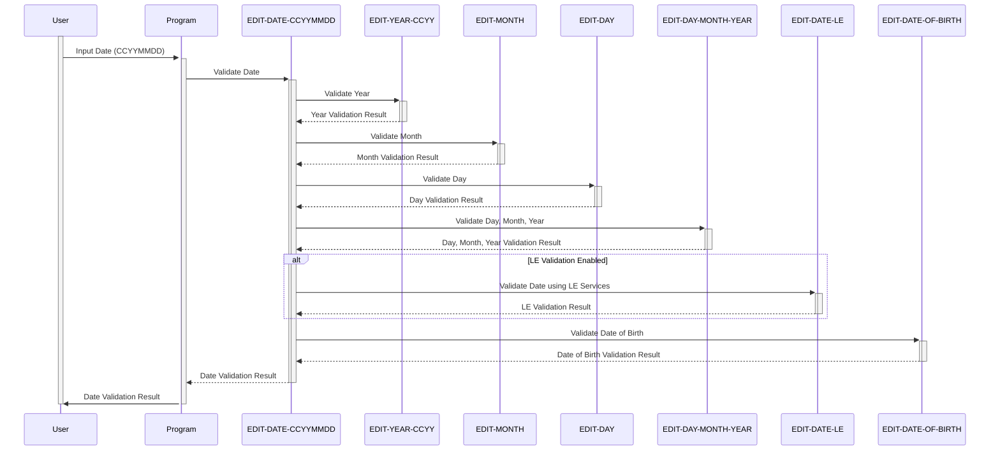

Generated at: 2nd October of 2024

**Title Document:** CardDemo Application - Date Validation Module Specification

**Summary Description:**
This document outlines the specifications for a COBOL subroutine designed to validate dates within the CardDemo application. The module functions as a critical component ensuring data integrity by preventing the entry and processing of invalid or illogical dates. This directly supports core business operations related to credit card management.

**User Stories:**
As a data analyst, I need to ensure that all dates entered into the system are valid to avoid issues with calculations, eligibility checks, and report generation.

**Related Epic:**
9 - System Utilities

**Technical Requirements:**

- Validate Date in CCYYMMDD Format: This method orchestrates the validation of a date provided in 'CCYYMMDD' format.
  - Input: `WS-EDIT-DATE-CCYYMMDD` `{String}`: Date to be validated.
  - Step 1: Set `WS-EDIT-DATE-IS-INVALID` to `TRUE`.
  - Step 2: Perform `Validate Year in CCYY Format`.
  - Step 3: Perform `Validate Month`.
  - Step 4: Perform `Validate Day`.
  - Step 5: Perform `Validate Day, Month, and Year Combination`.
  - Step 6: Optionally, perform `Validate Date using LE Services`.
  - Step 7: If all previous steps are successful, set `WS-EDIT-DATE-IS-VALID` to `TRUE`.
  - Output: `WS-EDIT-DATE-IS-VALID` `{Boolean}`: `TRUE` if the date is valid, `FALSE` otherwise. `WS-RETURN-MSG` `{String}`: Contains an error message if the validation fails.
- Validate Year in CCYY Format: This method validates the year component of a date.
  - Input: `WS-EDIT-DATE-CCYY` `{String}`: Year to be validated.
  - Step 1: Set `FLG-YEAR-NOT-OK` to `TRUE`.
  - Step 2: Check if the year is blank. If it is, set `INPUT-ERROR` to `TRUE`, `FLG-YEAR-BLANK` to `TRUE`, and optionally set `WS-RETURN-MSG`.
  - Step 3: Check if the year is numeric. If it is not, set `INPUT-ERROR` to `TRUE`, `FLG-YEAR-NOT-OK` to `TRUE`, and optionally set `WS-RETURN-MSG`.
  - Step 4: Check if the century is reasonable (19xx or 20xx). If it is not, set `INPUT-ERROR` to `TRUE`, `FLG-YEAR-NOT-OK` to `TRUE`, and optionally set `WS-RETURN-MSG`.
  - Step 5: If all previous steps are successful, set `FLG-YEAR-ISVALID` to `TRUE`.
  - Output: `FLG-YEAR-ISVALID` `{Boolean}`: `TRUE` if the year is valid, `FALSE` otherwise. `WS-RETURN-MSG` `{String}`: Contains an error message if the validation fails.
- Validate Month: This method validates the month component of a date.
  - Input: `WS-EDIT-DATE-MM` `{String}`: Month to be validated.
  - Step 1: Set `FLG-MONTH-NOT-OK` to `TRUE`.
  - Step 2: Check if the month is blank. If it is, set `INPUT-ERROR` to `TRUE`, `FLG-MONTH-BLANK` to `TRUE`, and optionally set `WS-RETURN-MSG`.
  - Step 3: Check if the month is within the valid range (1-12). If it is not, set `INPUT-ERROR` to `TRUE`, `FLG-MONTH-NOT-OK` to `TRUE`, and optionally set `WS-RETURN-MSG`.
  - Step 4: Convert the month to a numeric value using `FUNCTION NUMVAL`. If the conversion fails, set `INPUT-ERROR` to `TRUE`, `FLG-MONTH-NOT-OK` to `TRUE`, and optionally set `WS-RETURN-MSG`.
  - Step 5: If all previous steps are successful, set `FLG-MONTH-ISVALID` to `TRUE`.
  - Output: `FLG-MONTH-ISVALID` `{Boolean}`: `TRUE` if the month is valid, `FALSE` otherwise. `WS-RETURN-MSG` `{String}`: Contains an error message if the validation fails.
- Validate Day: This method validates the day component of a date.
  - Input: `WS-EDIT-DATE-DD` `{String}`: Day to be validated.
  - Step 1: Set `FLG-DAY-ISVALID` to `TRUE`.
  - Step 2: Check if the day is blank. If it is, set `INPUT-ERROR` to `TRUE`, `FLG-DAY-BLANK` to `TRUE`, and optionally set `WS-RETURN-MSG`.
  - Step 3: Convert the day to a numeric value using `FUNCTION NUMVAL`. If the conversion fails, set `INPUT-ERROR` to `TRUE`, `FLG-DAY-NOT-OK` to `TRUE`, and optionally set `WS-RETURN-MSG`.
  - Step 4: Check if the day is within the valid range (1-31). If it is not, set `INPUT-ERROR` to `TRUE`, `FLG-DAY-NOT-OK` to `TRUE`, and optionally set `WS-RETURN-MSG`.
  - Step 5: If all previous steps are successful, set `FLG-DAY-ISVALID` to `TRUE`.
  - Output: `FLG-DAY-ISVALID` `{Boolean}`: `TRUE` if the day is valid, `FALSE` otherwise. `WS-RETURN-MSG` `{String}`: Contains an error message if the validation fails.
- Validate Day, Month, and Year Combination: This method performs additional checks on the day, month, and year combination to ensure consistency.
  - Input: `WS-EDIT-DATE-DD` `{String}`: Day, `WS-EDIT-DATE-MM` `{String}`: Month, `WS-EDIT-DATE-YY` `{String}`: Year.
  - Step 1: Check if the month has 31 days. If it does not and the day is 31, set `INPUT-ERROR` to `TRUE`, `FLG-DAY-NOT-OK` to `TRUE`, `FLG-MONTH-NOT-OK` to `TRUE`, and optionally set `WS-RETURN-MSG`.
  - Step 2: Check if the month is February. If it is and the day is 30, set `INPUT-ERROR` to `TRUE`, `FLG-DAY-NOT-OK` to `TRUE`, `FLG-MONTH-NOT-OK` to `TRUE`, and optionally set `WS-RETURN-MSG`.
  - Step 3: Check if the month is February and the day is 29. If it is, check if the year is a leap year. If it is not a leap year, set `INPUT-ERROR` to `TRUE`, `FLG-DAY-NOT-OK` to `TRUE`, `FLG-MONTH-NOT-OK` to `TRUE`, `FLG-YEAR-NOT-OK` to `TRUE`, and optionally set `WS-RETURN-MSG`.
  - Step 4: If all previous steps are successful and `WS-EDIT-DATE-IS-VALID` is `TRUE`, continue. Otherwise, exit the method.
  - Output: `WS-EDIT-DATE-IS-VALID` `{Boolean}`: `TRUE` if the day, month, and year combination is valid, `FALSE` otherwise. `WS-RETURN-MSG` `{String}`: Contains an error message if the validation fails.
- Validate Date using LE Services: This method performs additional date validation using external Language Environment (LE) services.
  - Input: `WS-EDIT-DATE-CCYYMMDD` `{String}`: Date to be validated.
  - Step 1: Initialize `WS-DATE-VALIDATION-RESULT`.
  - Step 2: Set `WS-DATE-FORMAT` to `YYYYMMDD`.
  - Step 3: Call the external service `CSUTLDTC` with the date, format, and result variables.
  - Step 4: Check the severity code returned by `CSUTLDTC`. If it is not 0, set `INPUT-ERROR` to `TRUE`, `FLG-DAY-NOT-OK` to `TRUE`, `FLG-MONTH-NOT-OK` to `TRUE`, `FLG-YEAR-NOT-OK` to `TRUE`, and optionally set `WS-RETURN-MSG`.
  - Step 5: If `INPUT-ERROR` is `FALSE`, set `FLG-DAY-ISVALID` to `TRUE`.
  - Output: `FLG-DAY-ISVALID` `{Boolean}`: `TRUE` if the date is valid according to LE services, `FALSE` otherwise. `WS-RETURN-MSG` `{String}`: Contains an error message if the validation fails.
- Validate Date of Birth: This method validates if a date is a reasonable date of birth by checking if it's in the future.
  - Input: `WS-EDIT-DATE-CCYYMMDD` `{String}`: Date to be validated.
  - Step 1: Get the current date using `FUNCTION CURRENT-DATE` and store it in `WS-CURRENT-DATE-YYYYMMDD`.
  - Step 2: Convert the input date and the current date to binary format using `FUNCTION INTEGER-OF-DATE` and store them in `WS-EDIT-DATE-BINARY` and `WS-CURRENT-DATE-BINARY` respectively.
  - Step 3: Compare the binary dates. If the current date is greater than the input date, the input date is valid. Otherwise, set `INPUT-ERROR` to `TRUE`, `FLG-DAY-NOT-OK` to `TRUE`, `FLG-MONTH-NOT-OK` to `TRUE`, `FLG-YEAR-NOT-OK` to `TRUE`, and optionally set `WS-RETURN-MSG`.
  - Output: `INPUT-ERROR` `{Boolean}`: `TRUE` if the date is in the future, `FALSE` otherwise. `WS-RETURN-MSG` `{String}`: Contains an error message if the validation fails.

**Related Models:**
There are no specific models related to this execution, as it primarily focuses on date validation logic. The data being validated likely belongs to models like Customer or Account, but their details are not provided in the given code snippet.

**Configurations:**

- Constant Values
  - `WS-EDIT-LEAP-YEAR-DAYS`: `29`
	- Description: Number of days in February for a leap year.
  - `WS-EDIT-VALID-DOB-YEARS`: `110`
	- Description: Maximum age allowed for Date of Birth validation.
- CSUTLDWY.cpy
  - `WS-EDIT-CCYY-CENTURY-START`: `19`
	- Description: Starting century for credit card year validation.
  - `WS-EDIT-CCYY-CENTURY-END`: `20`
	- Description: End century for credit card year validation.

**Code Improvements:**

- **Error Handling:** The code relies heavily on `GO TO` statements for error handling, which can make the logic difficult to follow and maintain. Implementing a more structured error handling mechanism, such as using nested `IF` statements or a dedicated error handling routine, would improve the code's readability and maintainability.
- **Documentation:** The code includes some comments, but more comprehensive documentation would be beneficial. Adding detailed explanations of the validation rules, input and output variables, and potential error conditions would make the code easier to understand and modify.
- **Performance:** The code performs multiple checks on the same data, which could potentially impact performance. Consider optimizing the validation logic to reduce redundant checks and improve efficiency.
- **Modularity:** The code could benefit from further modularization. Separating the validation logic for each date component into distinct subroutines would improve code organization and reusability.

**Security Improvements:**

- **Input Validation:** While the code checks for basic data type errors, it does not implement robust input validation to prevent potential security vulnerabilities like buffer overflows or injection attacks. Sanitizing all external inputs before processing would enhance the code's security.
- **Data Masking:** The code handles sensitive data like dates of birth. Consider implementing data masking techniques to protect this information from unauthorized access during processing and display.
- **Logging:** The code does not include any logging mechanisms. Implementing logging for successful and failed validations would provide an audit trail for security analysis and troubleshooting.

**Conceptual Diagram:**

--Made by "Smart Engineering" (by Compass.UOL)--