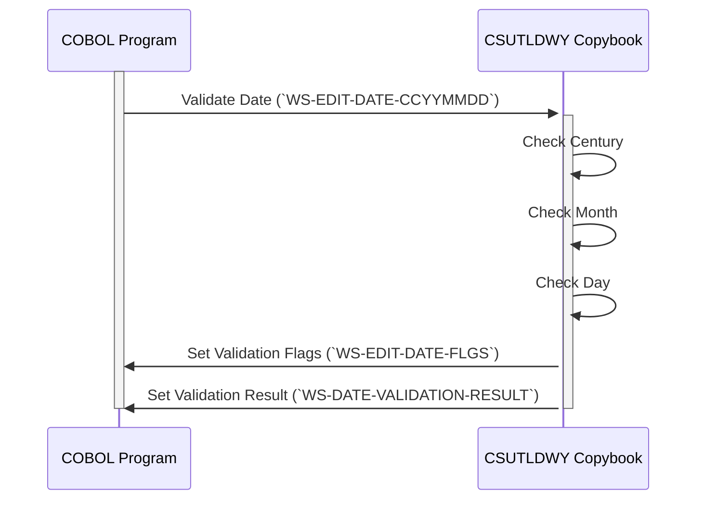

Generated at: 2nd October of 2024

**Title Document: Date Management Toolkit - COBOL Copybook Specification**

**Summary Description:**
This COBOL copybook defines data structures and variables specifically for handling and validating dates. It includes fields for storing date components (year, month, day) in various formats, flags for validation results, and fields for storing error messages. This copybook is designed to be included in other COBOL programs that require date manipulation.

**User Stories:**
As a data analyst, I want to ensure that only valid dates are used in my analysis to maintain data integrity and prevent inaccurate results.

**Related Epic:** 9 - System Utilities

**Technical Requirements:**
- **Date Validation Workflow:** Validates a given date, considering century, leap year, and date format.
  - Input: Date in `CCYYMMDD` format from `WS-EDIT-DATE-CCYYMMDD` variable.
  - Validation: 
    - Check if the century (`WS-EDIT-DATE-CC`) is within acceptable range.
    - Check if the month (`WS-EDIT-DATE-MM`) is between 1 and 12.
    - Check if the day (`WS-EDIT-DATE-DD`) is valid for the given month, considering leap years.
  - Output: 
    - Set `WS-EDIT-DATE-FLGS` to indicate the validity of each date component (year, month, day).
    - Set `WS-DATE-VALIDATION-RESULT` with a message indicating the validation result and any errors encountered.

**Related Models:**
- N/A

**Configurations:**
- **Constant Values:**
  - `THIS-CENTURY`: `20`
	- Description: Represents the current century (21st century).
  - `LAST-CENTURY`: `19`
	- Description: Represents the previous century (20th century).

**Code Improvements:**
- **Detailed Error Messages:** Enhance the `WS-DATE-VALIDATION-RESULT` to include specific error messages for each validation rule (e.g., "Invalid century," "Invalid month," "Invalid day").
- **Date Format Flexibility:** Consider adding support for validating dates in different formats beyond `CCYYMMDD`.

**Security Improvements:**
- N/A

--Made by "Smart Engineering" (by Compass.UOL)--