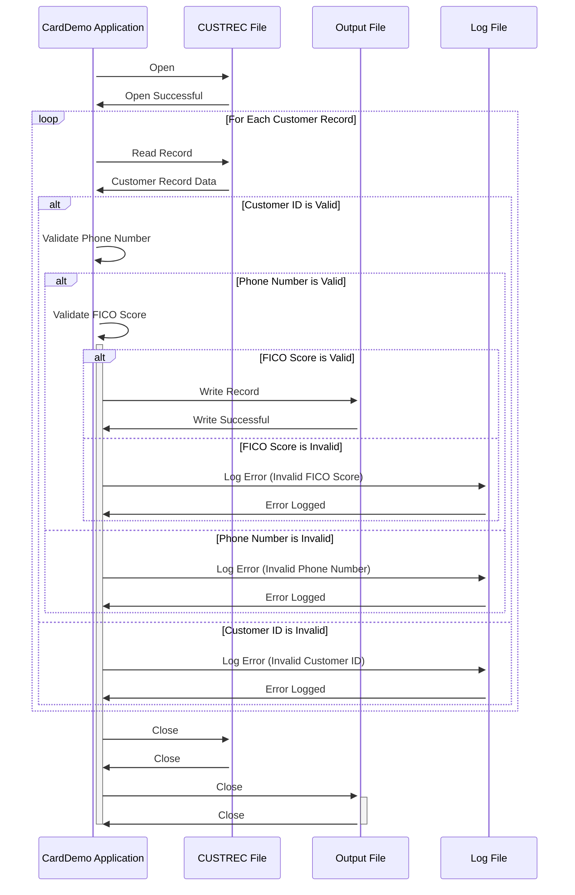

Generated at: 2nd October of 2024

**Title Document:** CardDemo - Customer Data Validation and Processing

**Summary Description:**
This document outlines the process of validating and processing customer data within the CardDemo application. The process involves reading customer records from an input file (`CUSTREC.cpy`), performing data validation, and writing valid records to an output file. 

**User Stories:**
As a data analyst, I want to ensure that only valid customer records are used for analysis and reporting. The system should validate key fields like `CUST-ID`, `CUST-PHONE-NUM-1`, and `CUST-FICO-CREDIT-SCORE` to maintain data quality.

**Related Epic:**
8 - Customer Data Management

**Technical Requirements:**

- **Read Customer Records:** This method reads customer records from the input file (`CUSTREC.cpy`).
  - Input: Customer data from `CUSTREC.cpy` file.
  - Output:  Each record from the input file.
- **Validate Customer ID:** This method validates the customer ID (`CUST-ID`) to ensure it is numeric and within a valid range.
  - Input: `CUST-ID` from the customer record.
  - Validation: 
    - Check if `CUST-ID` is numeric.
    - Check if `CUST-ID` is greater than 0.
  - Output:  `True` if valid, `False` otherwise.
- **Validate Phone Number:** This method validates the primary phone number (`CUST-PHONE-NUM-1`) to ensure it conforms to a standard format.
  - Input: `CUST-PHONE-NUM-1` from the customer record.
  - Validation:
    - Check if `CUST-PHONE-NUM-1` matches a predefined pattern (e.g., `(XXX) XXX-XXXX`).
  - Output: `True` if valid, `False` otherwise.
- **Validate FICO Score:** This method validates the FICO credit score (`CUST-FICO-CREDIT-SCORE`) to ensure it falls within the acceptable range.
  - Input:  `CUST-FICO-CREDIT-SCORE` from the customer record.
  - Validation:
    - Check if `CUST-FICO-CREDIT-SCORE` is between `FICO-SCORE-LOW` and `FICO-SCORE-HIGH`, defined in `COACTUPC.cbl`.
  - Output: `True` if valid, `False` otherwise.
- **Write Valid Record:** This method writes a validated customer record to the output file.
  - Input: Validated customer record.
  - Output: The record written to the output file. 
- **Log Invalid Record:** This method logs details of invalid customer records for error tracking and resolution.
  - Input: Invalid customer record and reason for invalidity.
  - Output: Log entry with details of the invalid record.

**Related Models**

- **Customer:** Represents a customer record.
  - `CUST-ID` `Integer`: Unique customer identifier.
  - `CUST-FIRST-NAME` `String`: Customer's first name.
  - `CUST-MIDDLE-NAME` `String`: Customer's middle name.
  - `CUST-LAST-NAME` `String`: Customer's last name.
  - `CUST-ADDR-LINE-1` `String`: Customer's address line 1.
  - `CUST-ADDR-LINE-2` `String`: Customer's address line 2.
  - `CUST-ADDR-LINE-3` `String`: Customer's address line 3.
  - `CUST-ADDR-STATE-CD` `String`: Customer's state code.
  - `CUST-ADDR-COUNTRY-CD` `String`: Customer's country code.
  - `CUST-ADDR-ZIP` `String`: Customer's ZIP code.
  - `CUST-PHONE-NUM-1` `String`: Customer's primary phone number.
  - `CUST-PHONE-NUM-2` `String`: Customer's secondary phone number.
  - `CUST-SSN` `String`: Customer's Social Security Number.
  - `CUST-GOVT-ISSUED-ID` `String`: Customer's government-issued ID.
  - `CUST-DOB-YYYYMMDD` `Date`: Customer's date of birth.
  - `CUST-EFT-ACCOUNT-ID` `String`: Customer's Electronic Funds Transfer account ID.
  - `CUST-PRI-CARD-HOLDER-IND` `Boolean`: Indicator if the customer is the primary cardholder.
  - `CUST-FICO-CREDIT-SCORE` `Integer`: Customer's FICO credit score.

**Configurations:**

- `COACTUPC.cbl`
  - `FICO-SCORE-LOW`: `{Lowest FICO score}`
	- Description: Lowest acceptable FICO score.
  - `FICO-SCORE-HIGH`: `{Highest FICO score}`
	- Description: Highest acceptable FICO score.

**Code Improvements:**

- **Error Handling:** Implement more robust error handling, including specific error codes and messages for different validation failures. This would make it easier to identify and troubleshoot data issues.
- **Logging:** Enhance logging to capture details of invalid records, including the specific validation failures. This would aid in data cleansing and quality improvement efforts.
- **Configuration:** Externalize validation rules (e.g., phone number format, valid ID ranges) to a configuration file to allow for easier modification without code changes.
- **Data Transformation:** Consider adding data transformation capabilities to standardize data formats (e.g., phone numbers, dates) for consistency.

**Security Improvements:**

- **Access Control:** Implement strict access controls to restrict access to customer data based on user roles and permissions.
- **Data Encryption:** Encrypt sensitive customer data at rest and in transit to protect it from unauthorized access.
- **Audit Trails:** Implement audit trails to track all data access and modifications for security and compliance purposes.
- **Data Masking:** Consider using data masking techniques to protect sensitive customer information during testing and development activities. 

**Conceptual Diagram:**

--Made by "Smart Engineering" (by Compass.UOL)--