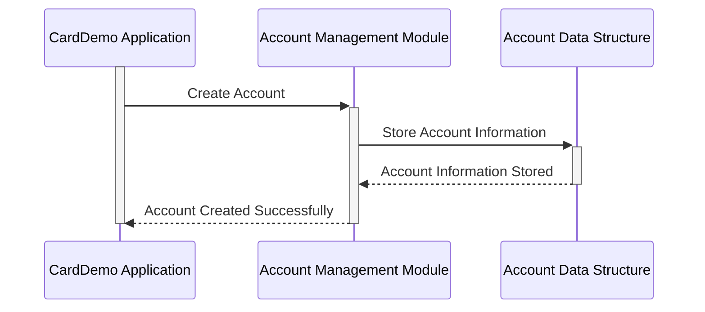

Generated at: 2nd October of 2024

**Title Document:** CardDemo Account Data Structure Specification

**Summary Description:**
This document details the structure of the `ACCOUNT-RECORD` data structure within the CardDemo application. This structure defines the layout and data types used to store information about customer accounts.

**User Stories:**
As a credit card system administrator, I need a standardized way to store and access customer account information to ensure accurate transaction processing, account management, and reporting.

**Related Epic:** 2 - Account Management

**Technical Requirements:**
- **Account Record Structure Definition:** Defines the layout of the `ACCOUNT-RECORD` structure, specifying the data fields and their corresponding data types.

**Related Models**
- **`ACCOUNT-RECORD`**
  - **`ACCT-ID`** `PIC 9(11)`: Unique identifier for each account.
  - **`ACCT-ACTIVE-STATUS`** `PIC X(01)`: Indicates if the account is active ('Y'/'N').
  - **`ACCT-CURR-BAL`** `PIC S9(10)V99`: Current account balance.
  - **`ACCT-CREDIT-LIMIT`** `PIC S9(10)V99`: Maximum credit allowed on the account.
  - **`ACCT-CASH-CREDIT-LIMIT`** `PIC S9(10)V99`: Maximum cash withdrawal limit.
  - **`ACCT-OPEN-DATE`** `PIC X(10)`: Date when the account was opened (YYYY-MM-DD).
  - **`ACCT-EXPIRAION-DATE`** `PIC X(10)`: Account expiration date (YYYY-MM-DD).
  - **`ACCT-REISSUE-DATE`** `PIC X(10)`: Date the account was last renewed (YYYY-MM-DD).
  - **`ACCT-CURR-CYC-CREDIT`** `PIC S9(10)V99`: Total credits in the current cycle.
  - **`ACCT-CURR-CYC-DEBIT`** `PIC S9(10)V99`: Total debits in the current cycle.
  - **`ACCT-ADDR-ZIP`** `PIC X(10)`: ZIP code associated with the account.
  - **`ACCT-GROUP-ID`** `PIC X(10)`: Group affiliation of the account (if any).
  - **`FILLER`** `PIC X(178)`: Space reserved for future use.

**Configurations:**
- N/A

**Code Improvements:**
- **Add data validation checks:** Implement data validation routines to ensure the accuracy and integrity of the account information stored in the `ACCOUNT-RECORD` structure. This could include checks for valid date ranges, numeric ranges for balance and credit limits, and valid values for status fields.
- **Implement logging:** Incorporate logging mechanisms to track changes made to account information. This would involve recording the date and time of the change, the user who made the change, and the specific data fields that were modified. 
- **Use more descriptive variable names:** While the existing variable names are somewhat self-explanatory, consider using more verbose and descriptive names to enhance code readability and maintainability. 

**Security Improvements:**
- **Implement access control:** Ensure that access to the `ACCOUNT-RECORD` structure and its data fields is restricted to authorized users and applications. This could involve using access control lists (ACLs) or role-based access control (RBAC) mechanisms to enforce data security policies.
- **Encrypt sensitive data:** Encrypt sensitive account information, such as account numbers, balances, and credit limits, both in transit and at rest. Encryption helps protect data confidentiality and integrity, reducing the risk of unauthorized access and data breaches.

**Conceptual Diagram:**

--Made by "Smart Engineering" (by Compass.UOL)--