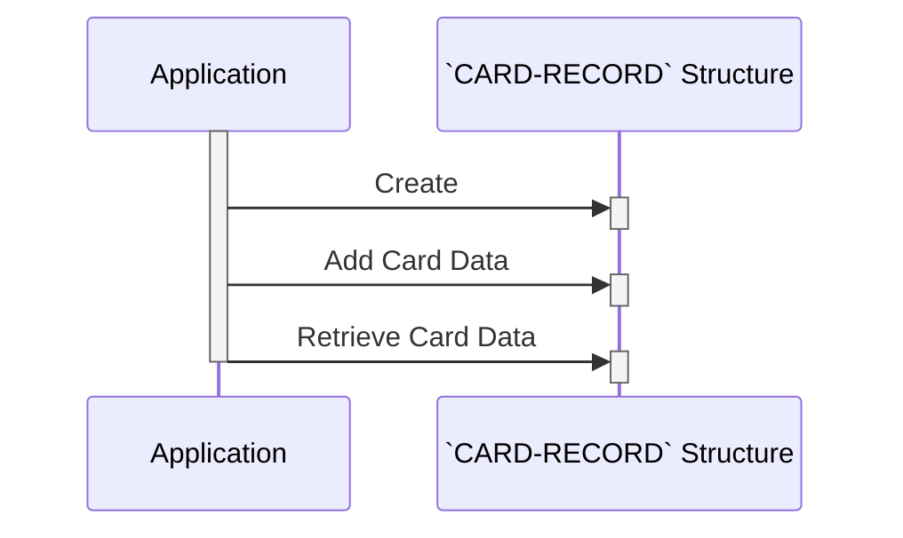

Generated at: 2nd October of 2024

**Title Document:** CardDemo Application - Credit Card Data Structure

**Summary Description:**
This document describes the structure of credit card data within the CardDemo application. It defines the layout and data types used to store credit card information, including the card number, account ID, CVV, cardholder name, expiration date, and active status. This structure ensures consistent and organized storage of sensitive card data.

**User Stories:**
As a credit card system administrator, I need a standardized way to store credit card information, so that the system can securely and reliably process transactions, manage accounts, and generate reports. 

**Related Epic:** 3 - Credit Card Management

**Technical Requirements:**
This code defines a COBOL data structure called `CARD-RECORD` to represent credit card information. Each data field within the structure has a specific length and data type, ensuring uniformity in data storage and facilitating data processing.

- **Credit Card Data Structure Definition:** This code defines the structure of a credit card record.
  - Input: None. This structure is internally defined.
  - Processing: Defines a data structure named `CARD-RECORD` with fields for `CARD-NUM`, `CARD-ACCT-ID`, `CARD-CVV-CD`, `CARD-EMBOSSED-NAME`, `CARD-EXPIRAION-DATE`, `CARD-ACTIVE-STATUS`, and `FILLER`.
  - Result: Data structure `CARD-RECORD` defining the layout of credit card information.

**Related Models**
This section lists the data models related to the `CVACT02Y.cpy` file.

- `CARD-RECORD`
  - `CARD-NUM` `PIC X(16)`: The 16-digit credit card number.
  - `CARD-ACCT-ID` `PIC 9(11)`: An 11-digit unique identifier linking the card to a specific account.
  - `CARD-CVV-CD` `PIC 9(03)`: The 3-digit Card Verification Value, a security code on the card.
  - `CARD-EMBOSSED-NAME` `PIC X(50)`: The cardholder's name as embossed on the card (up to 50 characters).
  - `CARD-EXPIRAION-DATE` `PIC X(10)`: The date when the credit card expires.
  - `CARD-ACTIVE-STATUS` `PIC X(01)`: A code indicating whether the card is currently active and usable.
  - `FILLER` `PIC X(59)`:  A placeholder to ensure consistent record length.

**Configurations:**
No configurations were found.

**Code Improvements:**
- **Add data validation:** Implement data validation checks for each field to ensure data integrity. For example:
    - Validate the length of `CARD-NUM` to be 16 digits.
    - Validate that `CARD-ACCT-ID` contains only numeric values.
    - Validate the date format of `CARD-EXPIRAION-DATE`.
- **Consider data masking or encryption:** For enhanced security, explore masking or encrypting sensitive data like `CARD-NUM` and `CARD-CVV-CD`, especially if this data is stored in a database or transmitted over a network.
- **Add comments to the `FILLER` field:** Explain the purpose of the `FILLER` field and whether it's intended for future use or simply padding.

**Security Improvements:**
- **Implement access control:** Restrict access to the credit card data structure and any programs that use it to authorized personnel only.
- **Secure data storage:** If the credit card data is persisted to a file or database, ensure that appropriate security measures are in place to protect the data at rest, such as encryption and access controls.
- **Log data access:** Implement logging mechanisms to track who accesses the credit card data and for what purpose. This can help with auditing and incident response.

**Conceptual Diagram:**

--Made by "Smart Engineering" (by Compass.UOL)--