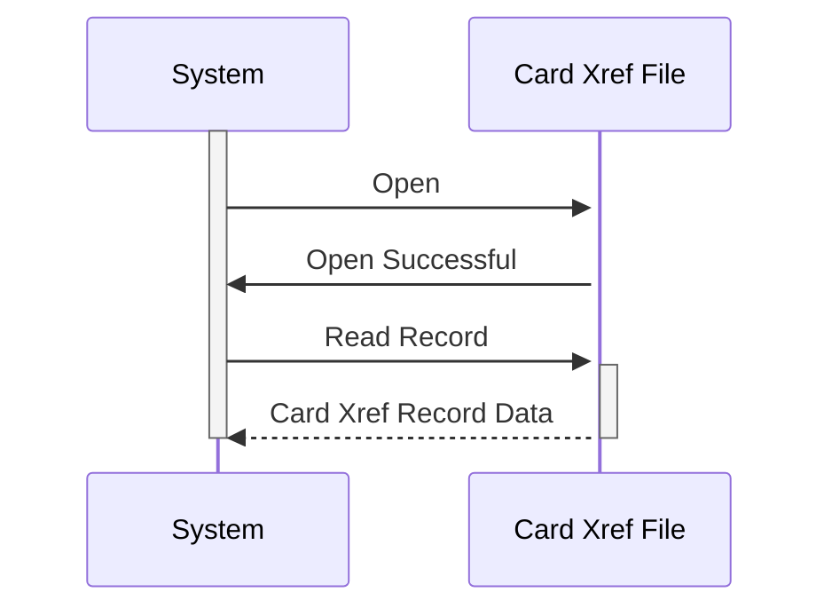

Generated at: 2nd October of 2024

**Title Document: Card Cross-Reference Data Structure Specification**

**Summary Description:** This document describes the structure of a COBOL data structure used for cross-referencing credit card numbers with customer and account information. It outlines the fields within the record and their purposes, serving as a technical specification.

**User Stories:**
As a system administrator, I need a reliable way to link credit card numbers to customer and account data so that transactions can be processed accurately.

**Related Epic:** 3 - Credit Card Management

**Technical Requirements:**

- **Data Structure Definition:**

  - `CARD-XREF-RECORD`: Defines a data structure to represent the relationship between a credit card, its associated customer, and account.
    - `XREF-CARD-NUM`: A field to store the credit card number, defined as a PIC X(16), meaning it holds 16 characters of any type.
    - `XREF-CUST-ID`: A field to store the customer ID, defined as a PIC 9(09), meaning it holds a 9-digit numeric value.
    - `XREF-ACCT-ID`: A field to store the account ID, defined as a PIC 9(11), meaning it holds an 11-digit numeric value.
    - `FILLER`: An unused field, defined as PIC X(14), potentially reserved for future use or padding.

**Related Models:**

- **`CARD-XREF-RECORD`**
  - `XREF-CARD-NUM` `PIC X(16)`: Credit card number.
  - `XREF-CUST-ID` `PIC 9(09)`: Customer identifier.
  - `XREF-ACCT-ID` `PIC 9(11)`: Account identifier.

**Configurations:**
No configurations found.

**Code Improvements:**

- **Meaningful Naming:**  While `XREF-` is a common prefix, consider using more descriptive names like `CARD-NUMBER`, `CUSTOMER-ID`, and `ACCOUNT-ID` for better readability.
- **Data Type Enforcement:** Use appropriate data types to ensure data integrity. For instance, define card numbers as strings and IDs as numeric fields to prevent invalid data entry.
- **Inline Documentation:** Add comments to explain the purpose and usage of the data structure and its fields. 

**Security Improvements:**

- **Data Encryption:** Consider encrypting sensitive data within the record, such as the card number, to protect it from unauthorized access.
- **Access Control:** Implement access control mechanisms to restrict who can view and modify the cross-reference data.
- **Logging and Auditing:** Log all access and changes made to the cross-reference data for security auditing purposes.

**Conceptual Diagram:**

--Made by "Smart Engineering" (by Compass.UOL)--