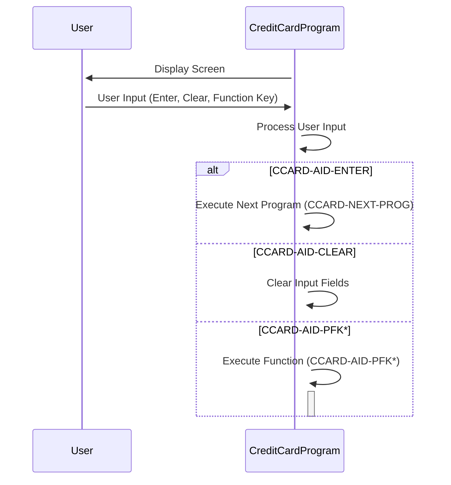

Generated at: 2nd October of 2024

**Title Document: Credit Card System - Data Structure Specification for Credit Card Operations (CVCRD01Y)**

**Summary Description:**
This document outlines the data structure used within a credit card management system, specifically focusing on the information handled by the `CVCRD01Y` copybook in COBOL. This structure defines how the system stores and accesses crucial data elements related to credit card accounts, customer information, and user interactions.

**User Stories:**
As a credit card system administrator, I need a standardized data structure to ensure consistent and reliable handling of credit card information across various system functions.

**Related Epic:** 3 - Credit Card Management

**Technical Requirements:**

- Data Structure Definition:
  - Input: The `CVCRD01Y.cpy` file is used as input to define the data structure.
  - Processing: The COBOL compiler uses the `PIC` clause to define data items and their associated lengths and data types.
  - Result: A data structure is created in memory, providing a template for storing and accessing credit card information. 
- User Input Processing:
  - Input: User actions, such as key presses (e.g., Enter, Clear, Function keys), are captured by the system.
  - Processing: The system uses condition names (88-level items) to map user actions to specific values within the data structure.
  - Result: User actions are translated into meaningful commands and data manipulations within the credit card system.
- Program Flow Control:
  - Input: Program names stored in data items like `CCARD-LAST-PROG` and `CCARD-NEXT-PROG`
  - Processing: The system uses these program names to determine the flow of execution between different modules or screens.
  - Result:  The system navigates through various functions (e.g., account view, transaction list, user management) based on user choices and predefined program logic.

**Related Models:**

- Credit Card Account: Represents a credit card account.
  - `CC-ACCT-ID` `String`: Unique identifier for a credit card account.
  - `CC-CARD-NUM` `String`: Credit card number.
  - `CC-CUST-ID` `String`: Unique identifier for the customer associated with the credit card.

**Configurations:**

- `CVCRD01Y.cpy`
  - `CCARD-AID-ENTER`: `'ENTER'`
	- Description:  Value representing the "Enter" key.
  - `CCARD-AID-CLEAR`: `'CLEAR'`
	- Description:  Value representing the "Clear" key.

**Code Improvements:**
- Add comments to clarify the purpose and usage of each data item, especially those related to program flow control.
- Implement data validation routines to ensure data integrity for sensitive fields, such as credit card numbers and customer IDs.

**Security Improvements:**
- Encrypt sensitive data items like `CC-CARD-NUM` to protect customer information.
- Implement access control mechanisms to restrict unauthorized access to credit card data.

**Conceptual Diagram:**

--Made by "Smart Engineering" (by Compass.UOL)--