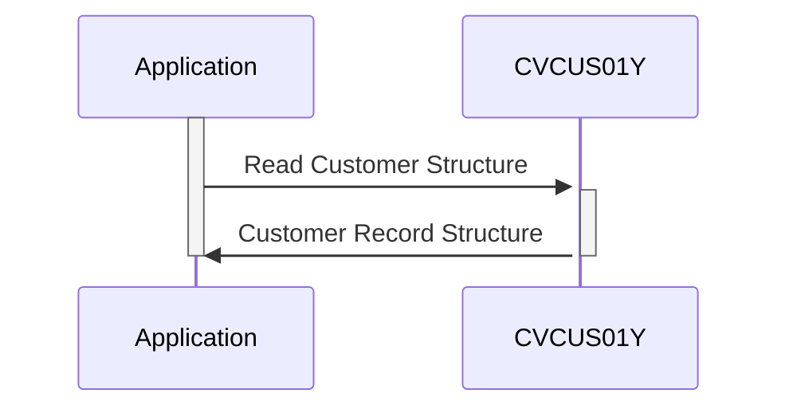

Generated at: 2nd October of 2024

**Title Document: Customer Data Structure Specification**

**Summary Description:**
This document outlines the structure of customer records within a system, likely a Customer Relationship Management (CRM) or a similar application. It defines the fields, data types, and lengths used to store customer information. This specification is crucial for maintaining data consistency and facilitating interoperability between different system components that interact with customer data.

**User Stories:**
As a data analyst, I need a standardized format for customer data so that I can perform analysis and generate reports accurately.

**Related Epic:** 8 - Customer Data Management

**Technical Requirements:**
This code defines a COBOL data structure, `CUSTOMER-RECORD`, representing a customer entity. This structure is intended for use within a larger COBOL program, likely related to customer data management. It outlines the fields and their formats for storing various customer details.

- `Customer Data Structure`: Defines the layout of a customer record.
  - Input: None (structure definition).
  - Processing: Defines fields for customer data:
    - `CUST-ID` (`Numeric(9)`): Unique customer identifier.
    - `CUST-FIRST-NAME`, `CUST-MIDDLE-NAME`, `CUST-LAST-NAME` (`Alphanumeric(25)`): Customer's name.
    - `CUST-ADDR-LINE-1`, `CUST-ADDR-LINE-2`, `CUST-ADDR-LINE-3` (`Alphanumeric(50)`): Customer's address lines.
    - `CUST-ADDR-STATE-CD` (`Alphanumeric(2)`): Customer's state code.
    - `CUST-ADDR-COUNTRY-CD` (`Alphanumeric(3)`): Customer's country code.
    - `CUST-ADDR-ZIP` (`Alphanumeric(10)`): Customer's ZIP code.
    - `CUST-PHONE-NUM-1`, `CUST-PHONE-NUM-2` (`Alphanumeric(15)`): Customer's phone numbers.
    - `CUST-SSN` (`Numeric(9)`): Customer's Social Security Number.
    - `CUST-GOVT-ISSUED-ID` (`Alphanumeric(20)`): Other government-issued ID.
    - `CUST-DOB-YYYY-MM-DD` (`Alphanumeric(10)`): Customer's date of birth.
    - `CUST-EFT-ACCOUNT-ID` (`Alphanumeric(10)`): Customer's Electronic Funds Transfer account ID.
    - `CUST-PRI-CARD-HOLDER-IND` (`Alphanumeric(1)`): Indicator for primary cardholder status.
    - `CUST-FICO-CREDIT-SCORE` (`Numeric(3)`): Customer's FICO credit score.
    - `FILLER` (`Alphanumeric(168)`: Unused space for future expansion.
  - Output: None (structure definition).

**Related Models**
- Customer: Represents a customer in the system.
  - `CUST-ID` `Integer`: Unique identifier for each customer.
  - `CUST-FIRST-NAME` `String`: Customer's first name.
  - `CUST-MIDDLE-NAME` `String`: Customer's middle name (if applicable).
  - `CUST-LAST-NAME` `String`: Customer's last name.
  - `CUST-ADDR-LINE-1` `String`: First line of the customer's address.
  - `CUST-ADDR-LINE-2` `String`: Second line of the customer's address (if applicable).
  - `CUST-ADDR-LINE-3` `String`: Third line of the customer's address (if applicable).
  - `CUST-ADDR-STATE-CD` `String`: Customer's state code (e.g., CA, NY).
  - `CUST-ADDR-COUNTRY-CD` `String`: Customer's country code (e.g., USA, CAN).
  - `CUST-ADDR-ZIP` `String`: Customer's ZIP or postal code.
  - `CUST-PHONE-NUM-1` `String`: Customer's primary phone number.
  - `CUST-PHONE-NUM-2` `String`: Customer's secondary phone number (if applicable).
  - `CUST-SSN` `String`: Customer's Social Security Number (subject to privacy regulations).
  - `CUST-GOVT-ISSUED-ID` `String`: Other government-issued identification.
  - `CUST-DOB-YYYY-MM-DD` `Date`: Customer's date of birth.
  - `CUST-EFT-ACCOUNT-ID` `String`: Identifier for the customer's electronic funds transfer account (likely linked to a banking system).
  - `CUST-PRI-CARD-HOLDER-IND` `Boolean`: Indicates if the customer is the primary holder of a card.
  - `CUST-FICO-CREDIT-SCORE` `Integer`: Customer's credit score.

**Configurations:**
- Constant Values
  - `CUSTOMER-RECORD-L`: `500`
	- Description: Total length of the customer record, indicating that each customer record occupies 500 characters of storage space.

**Code Improvements:**

- **Data Type Specificity:** Use more specific data types for improved validation and data integrity. For example, use `PIC 9(9)` for numeric fields and `PIC X(n)` for alphanumeric fields, specifying the appropriate length `n`.
- **Date Format:** Store dates in a numeric format (e.g., YYYYMMDD) instead of text to simplify date calculations and comparisons.
- **Field Size Considerations:** Review and adjust field lengths to accommodate potential variations in real-world data (e.g., longer addresses, international phone numbers).
- **Comments:** Add more descriptive comments to explain the purpose and usage of each field, enhancing code readability and maintainability.

**Security Improvements:**

- **Data Encryption:** Encrypt sensitive customer data (e.g., SSN, EFT account ID) at rest and in transit to protect against unauthorized access.
- **Access Control:** Implement strict access control measures to restrict data access to authorized personnel only.
- **Data Masking:** Consider masking or tokenizing sensitive data when displayed or used in non-critical operations to minimize exposure.
- **Regular Security Audits:** Conduct regular security audits and penetration testing to identify and address vulnerabilities.

**Conceptual Diagram:**

--Made by "Smart Engineering" (by Compass.UOL)--