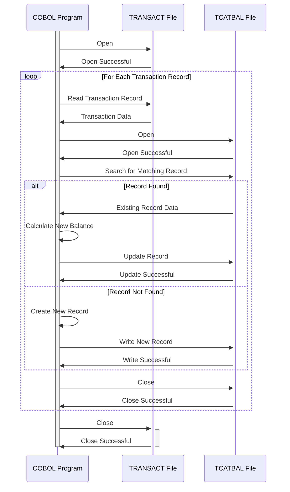

Generated at: 2nd October of 2024

**Title Document:** Transaction Category Balance Record Specification

**Summary Description:**
This document details the structure and data elements of the `TRAN-CAT-BAL-RECORD`, used in the CardDemo application. This record is crucial for storing and tracking balances for various transaction categories, essential for financial reporting and analysis.

**User Stories:**
As a financial analyst, I need to analyze transaction patterns and balances for different categories to identify trends and generate accurate financial reports.

**Related Epic:**
4 - Transaction Processing

**Technical Requirements:**

- **Transaction Category Balance Calculation:** This process calculates and updates the transaction category balance based on incoming transaction data.
  - Input: `TRANCAT-ACCT-ID` `{Numeric(11)}`, `TRANCAT-TYPE-CD` `{Text(2)}`, `TRANCAT-CD` `{Numeric(4)}`, and transaction amount `{Decimal(9,2)}` from the `TRANSACT` file.
  - Calculation: If a matching `TRAN-CAT-BAL-RECORD` exists, add the transaction amount to `TRAN-CAT-BAL`. If not, create a new `TRAN-CAT-BAL-RECORD` with the initial balance set to the transaction amount.
  - Output: Updated or newly created `TRAN-CAT-BAL-RECORD` in the `TCATBAL` file.

**Related Models**
- `TRAN-CAT-BAL-RECORD`: Structure for storing transaction category balances.
  - `TRANCAT-ACCT-ID` `{Numeric(11)}`: Account identifier.
  - `TRANCAT-TYPE-CD` `{Text(2)}`: Account type code.
  - `TRANCAT-CD` `{Numeric(4)}`: Transaction category code.
  - `TRAN-CAT-BAL` `{Decimal(9,2)}`: Balance for the specific transaction category.

**Configurations:**
- `CVTRA01Y.cpy`
  - `TCATBAL-RECORD-L`: `50`
	- Description: Total length of the transaction category balance record.

**Code Improvements:**
- Add error handling for file operations and data validation.
- Implement logging for tracking balance updates and errors.
- Consider using a database for storing and managing transaction category balances.

**Security Improvements:**
- Implement access controls to restrict unauthorized access to transaction category balance data.
- Encrypt sensitive data, such as account identifiers and balances, at rest and in transit.
- Regularly audit the system for security vulnerabilities and data breaches.

--Made by "Smart Engineering" (by Compass.UOL)--