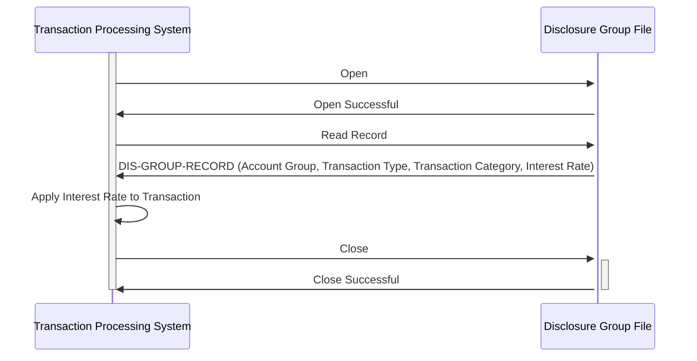

Generated at: 2nd October of 2024

**Title Document:** CardDemo - Disclosure Group Structure Specification

**Summary Description:**
This document defines the data structure for a Disclosure Group within the CardDemo application. A Disclosure Group is used to determine the appropriate interest rate for credit card transactions based on the account group, transaction type, and transaction category.

**User Stories:**
As a credit card system administrator, I need a way to define different interest rates for various types of transactions based on account and transaction characteristics to ensure accurate interest calculation and reporting.

**Related Epic:** 3 - Credit Card Management

**Technical Requirements:**

- **Structure Definition**: Defines a COBOL data structure named `DIS-GROUP-RECORD` with a length of 50 characters. This structure represents a single Disclosure Group, used for grouping transactions and applying specific interest rates.
  - Input: None
  - Result: `DIS-GROUP-RECORD` (structure) containing:
    - `DIS-GROUP-KEY` (structure)
      - `DIS-ACCT-GROUP-ID` `String`: Account Group ID (10 characters)
      - `DIS-TRAN-TYPE-CD` `String`: Transaction Type Code (2 characters)
      - `DIS-TRAN-CAT-CD` `Integer`: Transaction Category Code (4 digits)
    - `DIS-INT-RATE` `Decimal`: Interest Rate (4 digits, 2 decimal places)
    - `FILLER` `String`: Unused space (28 characters)

**Related Models**

- `DIS-GROUP-RECORD`
  - `DIS-GROUP-KEY` `{structure}`: Uniquely identifies the Disclosure Group
    - `DIS-ACCT-GROUP-ID` `String`:  Account group code (e.g., "GOLD", "PREMIER")
    - `DIS-TRAN-TYPE-CD`  `String`: Transaction type code (e.g., "01" for Purchase, "02" for Cash Advance)
    - `DIS-TRAN-CAT-CD` `Integer`: Transaction category code (e.g., "10001" for Retail, "10002" for Restaurant)
  - `DIS-INT-RATE` `{Decimal}`: Interest rate applicable to this group, fetched based on the group code, likely from `discgrp.txt`.

**Configurations:**

- `CVTRA02Y.cpy`
  - `DIS-GROUP-RECORD`: `RECLN = 50`
	- Description: Defines the record length for the `DIS-GROUP-RECORD` structure, indicating that each record in the file will be 50 characters long.
- `discgrp.txt`
  - `PREMIER 0.0750 0.0000 0.1500`:
	- Description: Defines interest rates for the "PREMIER" account group for different transaction types/categories.
  - `GOLD 0.0900 0.0000 0.1800`:
	- Description: Defines interest rates for the "GOLD" account group for different transaction types/categories.
  - `SILVER 0.1050 0.0000 0.2100`:
	- Description: Defines interest rates for the "SILVER" account group for different transaction types/categories.
  - `DEFAULT 0.1200 0.0000 0.2400`:
	- Description: Defines default interest rates for cases where no specific group match is found.

**Code Improvements:**
- Add data validation to ensure that the values in `DIS-ACCT-GROUP-ID`, `DIS-TRAN-TYPE-CD`, `DIS-TRAN-CAT-CD`, and `DIS-INT-RATE` are within acceptable ranges and follow the predefined format.
- Implement error handling to gracefully manage scenarios where the record length is not 50 characters or if the input data is invalid.
- Add comments to the code to improve readability and understanding.

**Security Improvements:**
- Implement access control measures to restrict unauthorized modification of the Disclosure Group structure and data.
- Consider encrypting sensitive information within the Disclosure Group structure, such as the interest rate, to protect it from unauthorized access.

**Conceptual Diagram:**

--Made by "Smart Engineering" (by Compass.UOL)--