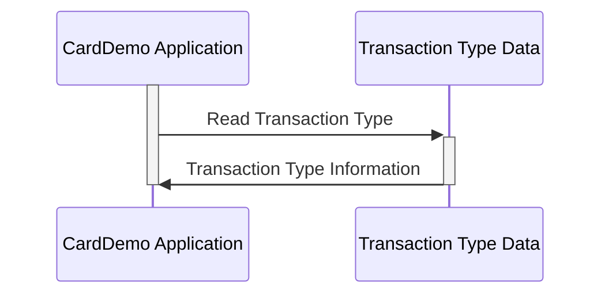

Generated at: 2nd October of 2024

**Title Document:** CardDemo Transaction Type Data Structure Specification

**Summary Description:**
This document describes the `TRAN-TYPE-RECORD` data structure used in the CardDemo application. This structure defines the format for storing information about different transaction types, including a two-character code and a fifty-character description. This structure is important for classifying and describing various credit card transactions, which is crucial for accurate processing, reporting, and analysis.

**User Stories:**
As a data analyst, I need to be able to easily identify and understand the different types of transactions in the system so that I can perform accurate analysis and reporting.

**Related Epic:** 4 - Transaction Processing

**Technical Requirements:**

- Define Transaction Type Structure: This code defines the `TRAN-TYPE-RECORD` structure to store information about a transaction type.
  - Input: None
  - Result `TRAN-TYPE-RECORD`: Structure containing `TRAN-TYPE` and `TRAN-TYPE-DESC` fields.

**Related Models**
- `TRAN-TYPE-RECORD`
  - `TRAN-TYPE` `String`: Represents the transaction type with a two-character code.
  - `TRAN-TYPE-DESC` `String`: A descriptive label for the transaction type, providing a clear explanation of its meaning.

**Configurations:**
- N/A

**Code Improvements:**
- Add inline comments to clarify the purpose and usage of the filler field.
- Consider using a data dictionary or external configuration file to store the transaction type codes and descriptions. This would allow for easier modification and maintenance of the transaction types without requiring code changes.

**Security Improvements:**
- N/A

**Conceptual Diagram:**

--Made by "Smart Engineering" (by Compass.UOL)--