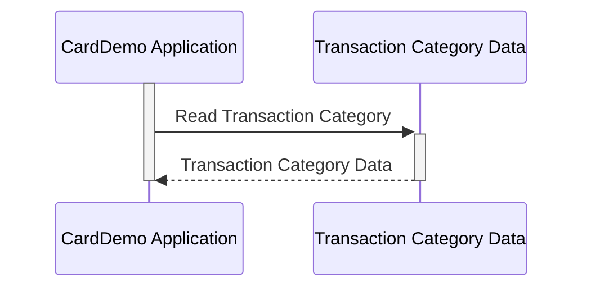

Generated at: 2nd October of 2024

**Title Document:** CardDemo Transaction Category Data Structure Specification

**Summary Description:**
This document defines the structure for storing transaction category data within the CardDemo application, specifying the layout and data types for each field in a transaction category record.

**User Stories:**
As a data analyst, I need to ensure that all transactions are consistently categorized to generate accurate reports and gain meaningful insights from the data.

**Related Epic:**
4 - Transaction Processing

**Technical Requirements:**

- **Transaction Category Data Structure**: This code defines a structure for storing transaction category information.
  - Input: None.
  - Result `TRAN-CAT-RECORD`: Data structure representing a transaction category with its unique identifier and description.

**Related Models:**

- **`TRAN-CAT-RECORD`**
  - `TRAN-TYPE-CD` `String(2)`: Represents the general type of transaction.
  - `TRAN-CAT-CD` `String(4)`: Represents a specific sub-category within the transaction type.
  - `TRAN-CAT-TYPE-DESC` `String(50)`: A descriptive name for the transaction category.

**Configurations:**

- Not available

**Code Improvements:**
- **Add data validation**: Implement checks for `TRAN-TYPE-CD` and `TRAN-CAT-CD` to ensure they conform to predefined values.
- **Error Handling**: Incorporate error handling mechanisms to gracefully manage situations like invalid data encounters.
- **Documentation**: Add more comprehensive comments explaining the purpose and usage of each field in the data structure.

**Security Improvements:**
- **Access Control**: Implement access control measures to restrict modification of transaction categories to authorized personnel only.
- **Audit Trail**: Maintain an audit trail of any changes made to transaction category data, including who made the change and when.

**Conceptual Diagram:**

--Made by "Smart Engineering" (by Compass.UOL)--