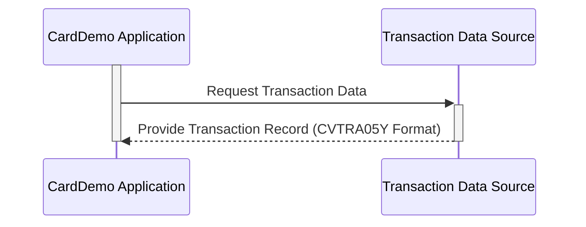

Generated at: 2nd October of 2024

**Title Document: Credit Card Transaction Record Structure Specification**

**Summary Description:**
This document details the structure of a transaction record within a COBOL credit card processing system, outlining the specific data points captured for each financial transaction.

**User Stories:**
As a financial analyst, I need a standardized way to access and analyze transaction data so I can generate accurate reports and gain insights into customer spending patterns.

**Related Epic:**
4 - Transaction Processing

**Technical Requirements:**

- **Transaction Record Definition**: This code defines the layout of a transaction record within the CardDemo application.
  - Input: None. This structure defines a data format, it doesn't receive input.
  - Processing: No processing is performed in the data structure definition itself. It acts as a blueprint for how transaction data should be organized.
  - Output:  None. The structure itself doesn't produce output; it dictates how transaction data should be stored and interpreted.

**Related Models**

- **`TRAN-RECORD`**:  Represents a single transaction within the CardDemo application.
    - `TRAN-ID` `Alphanumeric (X) 16 Characters`: Unique identifier for the transaction.
    - `TRAN-TYPE-CD` `Alphanumeric (X) 2 Characters`: Code indicating the type of transaction (e.g., "SA" for Sale).
    - `TRAN-CAT-CD` `Numeric (9) 4 Digits`:  Code categorizing the transaction (e.g., "5010" for Grocery).
    - `TRAN-SOURCE` `Alphanumeric (X) 10 Characters`:  Origin of the transaction (e.g., "POS Terminal").
    - `TRAN-DESC` `Alphanumeric (X) 100 Characters`: Brief description of the transaction.
    - `TRAN-AMT` `Numeric (S9V99) 9 Digits, 2 Decimal Places`: Monetary value of the transaction.
    - `TRAN-MERCHANT-ID` `Numeric (9) 9 Digits`: Unique identifier for the merchant.
    - `TRAN-MERCHANT-NAME` `Alphanumeric (X) 50 Characters`: Name of the merchant.
    - `TRAN-MERCHANT-CITY` `Alphanumeric (X) 50 Characters`:  City of the merchant.
    - `TRAN-MERCHANT-ZIP` `Alphanumeric (X) 10 Characters`: ZIP code of the merchant.
    - `TRAN-CARD-NUM` `Alphanumeric (X) 16 Characters`: Credit card number used.
    - `TRAN-ORIG-TS` `Alphanumeric (X) 26 Characters`: Timestamp of the original transaction.
    - `TRAN-PROC-TS` `Alphanumeric (X) 26 Characters`: Timestamp when the transaction was processed.

**Configurations:**
- N/A

**Code Improvements:**
- **Add In-Line Comments:**  While the current code has a header comment, adding more detailed in-line comments alongside each field definition would greatly improve readability and understanding of the data structure.
- **Consider a Data Dictionary:** For larger systems, maintaining a centralized data dictionary that documents each data element, its purpose, format, and usage can be beneficial for long-term maintainability.
- **Version Control:**  Utilize a version control system (like Git) to track changes made to the copybook, providing an audit trail and facilitating collaboration if multiple developers are involved.

**Security Improvements:**
- **Data Encryption:** If the transaction data includes sensitive information like credit card numbers, implement encryption mechanisms to protect this data both in transit and at rest.
- **Secure Logging:** Ensure that transaction logs, if generated, are stored securely and follow best practices for logging sensitive information (e.g., masking credit card numbers).
- **Access Control:** Implement strict access control measures to limit who can view, modify, or delete transaction data.

**Conceptual Diagram:**

--Made by "Smart Engineering" (by Compass.UOL)--