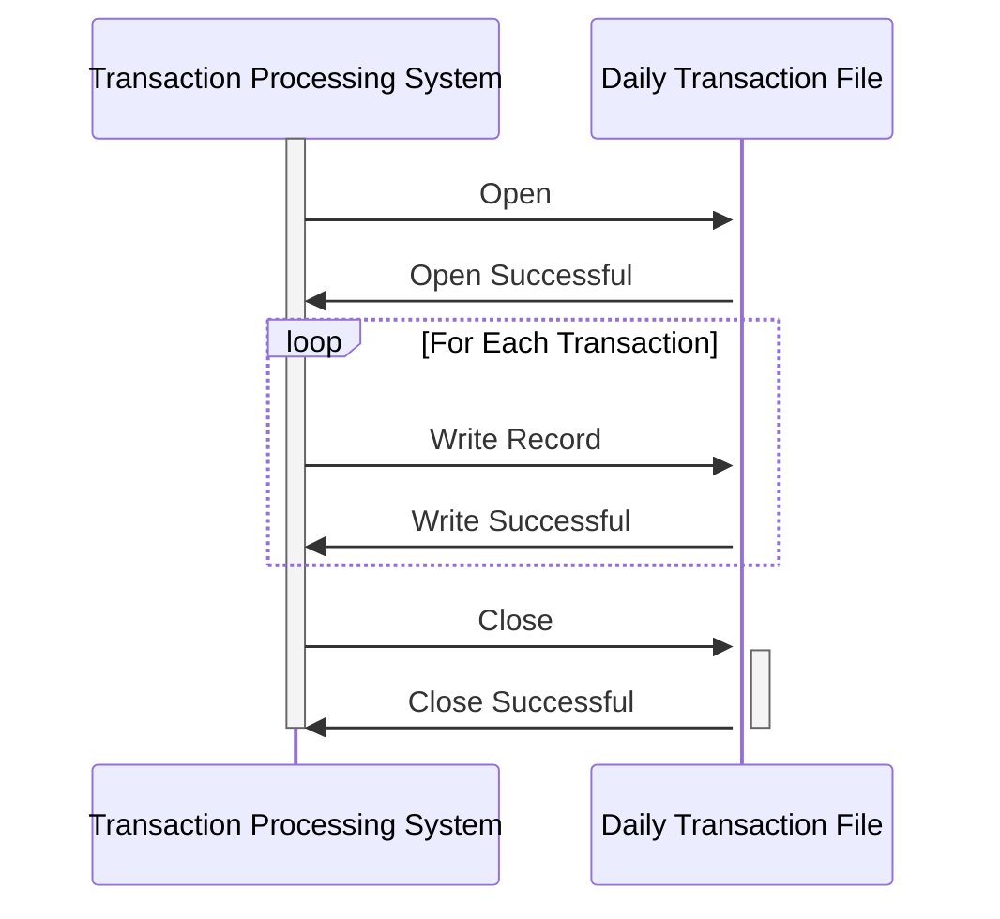

Generated at: 2nd October of 2024

**Title Document:** CardDemo Application - Daily Transaction Record Specification

**Summary Description:**
This document outlines the structure of a daily transaction record used within the CardDemo application. It defines the data fields and their formats for capturing and storing information about each credit card transaction. This information is crucial for various aspects of credit card management, including transaction processing, reporting, and analysis. 

**User Stories:**
As a data analyst, I need to have access to detailed transaction records so that I can analyze spending patterns, identify trends, and generate reports.

**Related Epic:**
4 - Transaction Processing

**Technical Requirements:**
This code defines a COBOL data structure called `DALYTRAN-RECORD` to represent a daily transaction. Each record consists of fields containing information about a specific credit card transaction.

- `Process Daily Transaction Record`: This data structure defines the layout of a daily transaction record.
  - Input: None. This is a data structure definition, not a method.
  - Result `DALYTRAN-RECORD`: A structured record containing details about a single credit card transaction.

**Related Models**
- `DALYTRAN-RECORD`
  - `DALYTRAN-ID` `PIC X(16)`: A unique identifier assigned to each transaction.
  - `DALYTRAN-TYPE-CD` `PIC X(02)`: A code signifying the type of transaction, such as a purchase or a refund.
  - `DALYTRAN-CAT-CD` `PIC 9(04)`: A numerical code that classifies the transaction into categories like groceries, fuel, or entertainment.
  - `DALYTRAN-SOURCE` `PIC X(10)`: Indicates the origin of the transaction, such as online, in-store, or ATM.
  - `DALYTRAN-DESC` `PIC X(100)`: A brief description providing additional context about the transaction.
  - `DALYTRAN-AMT` `PIC S9(09)V99`: The monetary value of the transaction.
  - `DALYTRAN-MERCHANT-ID` `PIC 9(09)`: A unique identifier for the merchant involved in the transaction.
  - `DALYTRAN-MERCHANT-NAME` `PIC X(50)`: The name of the merchant where the transaction took place.
  - `DALYTRAN-MERCHANT-CITY` `PIC X(50)`: The city where the merchant is located.
  - `DALYTRAN-MERCHANT-ZIP` `PIC X(10)`: The ZIP code of the merchant's location.
  - `DALYTRAN-CARD-NUM` `PIC X(16)`: The credit card number used for the transaction.
  - `DALYTRAN-ORIG-TS` `PIC X(26)`: A timestamp indicating when the transaction was initiated.
  - `DALYTRAN-PROC-TS` `PIC X(26)`: A timestamp recording when the transaction was processed.

**Configurations:**
- N/A

**Code Improvements:**
- **Field Validation:** Implement data validation checks for each field in the `DALYTRAN-RECORD` to ensure data integrity. For instance:
    - Validate the transaction type code against a list of valid codes.
    - Check if the transaction amount is a positive number.
    - Verify the format of timestamps.
- **Error Handling:** Include error handling routines to gracefully manage issues encountered during record processing. This could involve:
    - Logging errors to a file for debugging.
    - Generating appropriate error messages.
- **Documentation:** Add comprehensive comments to the code to explain the purpose of the data structure and each field, as well as any validation rules or processing logic. 

**Security Improvements:**
- **Data Encryption:** Encrypt sensitive data within the `DALYTRAN-RECORD`, particularly the credit card number (`DALYTRAN-CARD-NUM`), to protect it from unauthorized access. Encryption should be applied both during data storage and transmission.
- **Access Control:** Implement strict access control measures to restrict access to transaction records and ensure that only authorized personnel can view or modify this sensitive information.

**Conceptual Diagram:**

--Made by "Smart Engineering" (by Compass.UOL)--