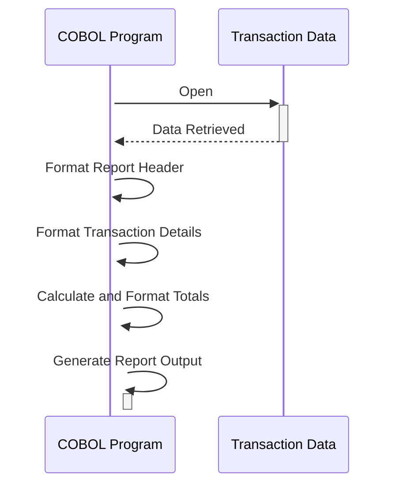

Generated at: 2nd October of 2024

**Title Document: Card Transaction Report Data Structure Specification**

**Summary Description:**
This document defines the data structure for a transaction report in a COBOL program, outlining the layout and formatting of information presented in a daily transaction summary.

**User Stories:**
As a data analyst, I need a standardized transaction report to analyze daily transaction patterns, identify trends, and generate insights for business decisions.

**Related Epic:** 5 - Reporting and Analytics

**Technical Requirements:**

- **Transaction Report Generation:** This process defines the layout for a report containing transaction details within a specified date range.
  - Input: Transaction data from `dailytran.txt`.
  - Processing:  Organizes transaction data into a structured report format with headers, details, and totals.
  - Output: Generates a formatted report suitable for printing or display, adhering to the defined structure.

**Related Models**

- `REPORT-NAME-HEADER`
  - `REPT-SHORT-NAME` `String`: Short name/code for the report. 
  - `REPT-LONG-NAME` `String`: Full descriptive name of the report. 
  - `REPT-DATE-HEADER` `String`:  Header for the date range section.
  - `REPT-START-DATE` `Date`: Start date for transactions included in the report. 
  - `REPT-END-DATE` `Date`: End date for transactions included in the report. 
- `TRANSACTION-DETAIL-REPORT`
  - `TRAN-REPORT-TRANS-ID` `String`: Unique identifier for each transaction. 
  - `TRAN-REPORT-ACCOUNT-ID` `String`: Identifier of the account associated with the transaction. 
  - `TRAN-REPORT-TYPE-CD` `String`: Code representing the type of transaction. 
  - `TRAN-REPORT-TYPE-DESC` `String`: Description of the transaction type. 
  - `TRAN-REPORT-CAT-CD` `String`: Code representing the category of the transaction. 
  - `TRAN-REPORT-CAT-DESC` `String`: Description of the transaction category. 
  - `TRAN-REPORT-SOURCE` `String`: Source or channel of the transaction. 
  - `TRAN-REPORT-AMT` `Decimal`: Amount of the transaction. 
- `REPORT-PAGE-TOTALS`
  - `REPT-PAGE-TOTAL` `Decimal`: Total amount of transactions on a page. 
- `REPORT-ACCOUNT-TOTALS`
  - `REPT-ACCOUNT-TOTAL` `Decimal`: Total amount of transactions for an account. 
- `REPORT-GRAND-TOTALS`
  - `REPT-GRAND-TOTAL` `Decimal`: Grand total amount of all transactions. 

**Configurations:**

- Constant Values
  - `REPORT-NAME-HEADER`
    - `REPT-SHORT-NAME`: `"DALYREPT"`
	    - Description: Short name for the daily transaction report.
    - `REPT-LONG-NAME`: `"Daily Transaction Report"`
	    - Description: Descriptive name for the report.
    - `REPT-DATE-HEADER`: `"Date Range: "`
	    - Description: Header text for the date range section.
- `dailytran.txt`
  - {Transaction ID}: {Transaction Details}
    - Description: Contains details for each transaction, including transaction type, location, and timestamp.

**Code Improvements:**
- Implement a more robust date validation routine to ensure the accuracy of the report's date range.
- Consider adding a summary section that provides key statistics, such as the total number of transactions, average transaction amount, and transaction count by type or category.
- Explore using a report generation tool or library to simplify formatting and potentially offer more advanced reporting features.

**Security Improvements:**
- Implement access controls to restrict report generation and viewing to authorized personnel only.
- If the report contains sensitive data, consider incorporating data masking or redaction techniques to protect customer privacy.

**Conceptual Diagram:**

--Made by "Smart Engineering" (by Compass.UOL)--