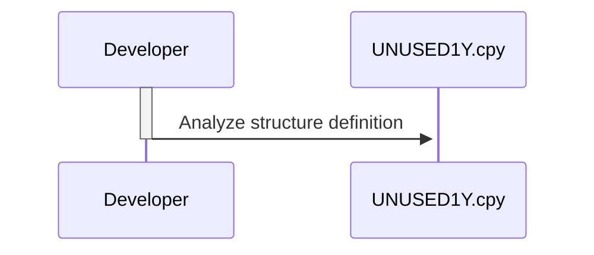

Generated at: 2nd October of 2024

**Title Document: UNUSED-DATA Structure Specification**

**Summary Description:**
This document describes the `UNUSED-DATA` structure, which appears to be a remnant from a previous version of the system and is not currently in use. It outlines the structure's fields and their intended purposes based on their naming conventions. However, due to the lack of active usage and context, the exact purpose and functionality of this structure remain unclear.

**User Stories:**
As a developer, I need to understand the purpose and structure of the `UNUSED-DATA` data structure to determine if it can be safely removed or repurposed, ensuring codebase clarity and maintainability.

**Related Epic:**
9 - System Utilities: Provide a set of utility functions to support system maintenance, data management, and other operational tasks.

**Technical Requirements:**
This code defines a COBOL data structure named `UNUSED-DATA`. The structure is defined within a copybook, as indicated by the `.cpy` file extension.
This data structure is not referenced in the provided documentation, suggesting it is not actively used in the current system.

**Related Models**
- `UNUSED-DATA`
  - `UNUSED-ID` `PIC X(08)`: Identification number, potentially related to a user or entity.
  - `UNUSED-FNAME` `PIC X(20)`: Potentially a first name.
  - `UNUSED-LNAME` `PIC X(20)`: Potentially a last name.
  - `UNUSED-PWD` `PIC X(08)`: Potentially a password.
  - `UNUSED-TYPE` `PIC X(01)`: Might have been used to indicate a type or category.
  - `UNUSED-FILLER` `PIC X(23)`: Placeholder field for potential future data.

**Configurations:**
N/A - No configurations found.

**Code Improvements:**
- **Investigate and Remove:** If the structure is confirmed as unused after thorough investigation, it is recommended to remove it from the codebase to reduce clutter and improve maintainability.
- **Documentation:** If the structure is kept for any reason, add clear and detailed documentation explaining its history, the reason for being marked as unused, and any potential future use cases. This will help future developers understand its purpose and prevent confusion.

**Security Improvements:**
- **Remove Sensitive Information:** If the `UNUSED-DATA` structure contains any sensitive information, such as passwords or personal data, ensure that it is properly handled or removed from the codebase to prevent potential security risks.

**Conceptual Diagram:**

--Made by "Smart Engineering" (by Compass.UOL)--