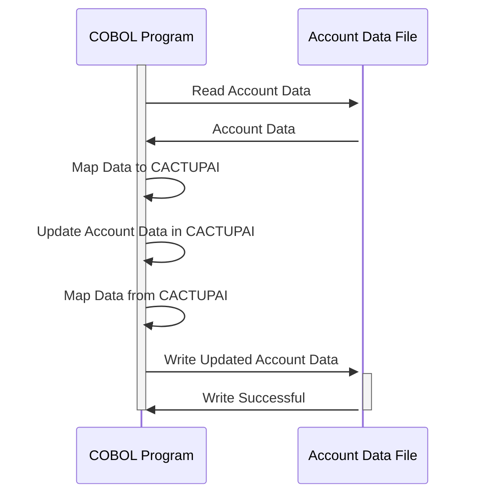

Generated at: 2nd October of 2024

**Title Document:** Account Update Data Structure Specification

**Summary Description:**
This document defines the data structure for updating credit card account information in a COBOL-based system. The `COACTUP.CPY` copybook serves as a template, outlining the required fields and format for account updates, ensuring data consistency and integrity across different programs.

**User Stories:**
As a system administrator, I need a standardized data structure for updating customer account information to ensure data consistency and accuracy across different programs.

**Related Epic:**
2 - Account Management

**Technical Requirements:**
- **Account Update Data Structure:** This structure defines the layout for updating credit card account information. It includes fields for various account attributes and customer details.
  - Input: Data for updating a credit card account.
  - Output: The updated credit card account data.

**Related Models**
- `CACTUPAI`: Defines the input area for account update data.
  - `ACCTSIDI` `Alphanumeric (11)`: Unique Account Identifier.
  - `ACSTTUSI` `Alphanumeric (1)`: Account Status Code.
  - `ACRDLIMI` `Numeric (15)`: Credit Limit.
  - `ACURBALI` `Numeric (15)`: Current Balance.
  - `ACSFNAMI` `Alphanumeric (25)`: First Name.
  - `ACSMNAMI` `Alphanumeric (25)`: Middle Name.
  - `ACSLNAMI` `Alphanumeric (25)`: Last Name.
  - `ACSADL1I` `Alphanumeric (50)`: Address Line 1.
  - `ACSSTTEI` `Alphanumeric (2)`: State Code.
  - `ACSADL2I` `Alphanumeric (50)`: Address Line 2.
  - `ACSZIPCI` `Alphanumeric (5)`: Zip Code.
  - `ACSCITYI` `Alphanumeric (50)`: City.
  - `ACSCTRYI` `Alphanumeric (3)`: Country Code.
  - `ACSPH1AI` `Alphanumeric (3)`: Phone Area Code.
  - `ACSPH1BI` `Alphanumeric (3)`: Phone Prefix.
  - `ACSPH1CI` `Alphanumeric (4)`: Phone Line Number.
  - `OPNYEARI` `Numeric (4)`: Account Open Year.
  - `OPNMONI` `Numeric (2)`: Account Open Month.
  - `OPNDAYI` `Numeric (2)`: Account Open Day.
  - `EXPYEARI` `Numeric (4)`: Card Expiration Year.
  - `EXPMONI` `Numeric (2)`: Card Expiration Month.
  - `EXPDAYI` `Numeric (2)`: Card Expiration Day.
- `CACTUPAO`: Redefines `CACTUPAI` to provide a different view of the data, potentially for output or mapping purposes.
  - `ACCTSIDI` `Alphanumeric (11)`: Unique Account Identifier.
  - `ACSTTUSI` `Alphanumeric (1)`: Account Status Code.
  - `ACRDLIMI` `Numeric (15)`: Credit Limit.
  - `ACURBALI` `Numeric (15)`: Current Balance.
  - `ACSFNAMI` `Alphanumeric (25)`: First Name.
  - `ACSMNAMI` `Alphanumeric (25)`: Middle Name.
  - `ACSLNAMI` `Alphanumeric (25)`: Last Name.
  - `ACSADL1I` `Alphanumeric (50)`: Address Line 1.
  - `ACSSTTEI` `Alphanumeric (2)`: State Code.
  - `ACSADL2I` `Alphanumeric (50)`: Address Line 2.
  - `ACSZIPCI` `Alphanumeric (5)`: Zip Code.
  - `ACSCITYI` `Alphanumeric (50)`: City.
  - `ACSCTRYI` `Alphanumeric (3)`: Country Code.
  - `ACSPH1AI` `Alphanumeric (3)`: Phone Area Code.
  - `ACSPH1BI` `Alphanumeric (3)`: Phone Prefix.
  - `ACSPH1CI` `Alphanumeric (4)`: Phone Line Number.
  - `OPNYEARI` `Numeric (4)`: Account Open Year.
  - `OPNMONI` `Numeric (2)`: Account Open Month.
  - `OPNDAYI` `Numeric (2)`: Account Open Day.
  - `EXPYEARI` `Numeric (4)`: Card Expiration Year.
  - `EXPMONI` `Numeric (2)`: Card Expiration Month.
  - `EXPDAYI` `Numeric (2)`: Card Expiration Day.

**Configurations:**
- `COACTUP.CPY`
  - `ACCTSIDI`: `""`
	- Description: Account identifier.
  - `ACSTTUSI`: `""`
	- Description: Account status (e.g., 'A' for Active, 'C' for Closed).
  - `ACRDLIMI`: `""`
	- Description: Credit Limit.
  - `ACURBALI`: `""`
	- Description: Current Account Balance.
  - `ACSFNAMI`: `""`
	- Description: Account holder's First Name.
  - `ACSMNAMI`: `""`
	- Description: Account holder's Middle Name.
  - `ACSLNAMI`: `""`
	- Description: Account holder's Last Name.
  - `ACSADL1I`: `""`
	- Description: Account holder's Address Line 1.
  - `ACSSTTEI`: `""`
	- Description: Account holder's State Code.
  - `ACSADL2I`: `""`
	- Description: Account holder's Address Line 2.
  - `ACSZIPCI`: `""`
	- Description: Account holder's Zip Code.
  - `ACSCITYI`: `""`
	- Description: Account holder's City.
  - `ACSCTRYI`: `""`
	- Description: Account holder's Country Code.
  - `ACSPH1AI`: `""`
	- Description: Account holder's Phone Number (Area Code).
  - `ACSPH1BI`: `""`
	- Description: Account holder's Phone Number (Prefix).
  - `ACSPH1CI`: `""`
	- Description: Account holder's Phone Number (Line).
  - `OPNYEARI`: `""`
	- Description: Account Opening Year.
  - `OPNMONI`: `""`
	- Description: Account Opening Month.
  - `OPNDAYI`: `""`
	- Description: Account Opening Day.
  - `EXPYEARI`: `""`
	- Description: Card Expiry Year.
  - `EXPMONI`: `""`
	- Description: Card Expiry Month.
  - `EXPDAYI`: `""`
	- Description: Card Expiry Day.

**Code Improvements:**
- Add comments to explain the purpose and usage of each data field in the copybook.
- Implement data validation checks for each field to ensure data integrity.
- Consider using a data dictionary to manage the data elements and their definitions.

**Security Improvements:**
- Encrypt sensitive data fields like account numbers and social security numbers.
- Implement access control measures to restrict unauthorized access to the copybook and its data.
- Log all account update transactions for auditing purposes.

**Conceptual Diagram:**

--Made by "Smart Engineering" (by Compass.UOL)--