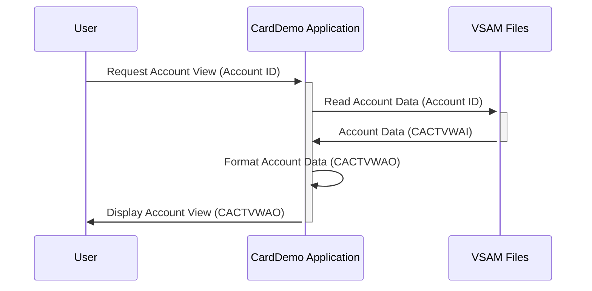

Generated at: 2nd October of 2024

**Title Document:** Card Account View Data Structure Specification

**Summary Description:**
This document outlines the data structure used for viewing account details in the CardDemo application. The `COACTVW.CPY` copybook defines two data structures, `CACTVWAI` and `CACTVWAO`, which represent an "Account View" containing comprehensive information about a customer's account. `CACTVWAI` is designed for data retrieval from storage, while `CACTVWAO` focuses on presenting the same information in a user-friendly format for display or output purposes.

**User Stories:**
As a system user, I need to view comprehensive account information, including balances, limits, customer details, and system messages, in a clear and consistent format.

**Related Epic:** 2 - Account Management

**Technical Requirements:**

- Account Information Retrieval: This method retrieves account information from VSAM files based on the provided account ID.
  - Input: `ACCTSIDI` `Alphanumeric`.
  - Result `CACTVWAI`: A data structure containing all the raw account information.

- Account Information Formatting: This method formats the retrieved account information into a user-friendly layout using the `CACTVWAO` structure.
  - Input: `CACTVWAI`.
  - Result `CACTVWAO`: A data structure with formatted account information for display.

**Related Models**

- `CACTVWAI`
  - `ACCTSIDI` `Alphanumeric`: Unique Account ID.
  - `ACSTTUSI` `Alphanumeric`: Account Status (e.g., 'A' for Active, 'C' for Closed).
  - `ACRDLIMI` `Alphanumeric`: Credit Limit (formatted as text).
  - `ACURBALI` `Alphanumeric`: Current Account Balance (formatted as text).
  - `ACSFNAMI` `Alphanumeric`: Customer First Name.
  - `ACSMNAMI` `Alphanumeric`: Customer Middle Name.
  - `ACSLNAMI` `Alphanumeric`: Customer Last Name.
  - `ACSADL1I` `Alphanumeric`: Customer Address Line 1.
  - `ACSSTTEI` `Alphanumeric`: Customer Address State Code.
  - `ACSADL2I` `Alphanumeric`: Customer Address Line 2.
  - `ACSZIPCI` `Alphanumeric`: Customer Address ZIP Code.
  - `ACSCITYI` `Alphanumeric`: Customer City.
  - `ACSCTRYI` `Alphanumeric`: Customer Country Code.
  - `ACSPHN1I` `Alphanumeric`: Customer Phone Number 1.
  - `ACSGOVTI` `Alphanumeric`: Customer Government Identification Number (e.g., Social Security Number).
  - `ACSPHN2I` `Alphanumeric`: Customer Phone Number 2.
  - `ACSEFTCI` `Alphanumeric`: Customer Effective Date (date the customer information became effective).
  - `ACSPFLGI` `Alphanumeric`: Customer Profile Flag (indicates specific customer attributes or flags).
  - `INFOMSGI` `Alphanumeric`: Informational Messages related to the account.
  - `ERRMSGI` `Alphanumeric`: Error Messages related to the account.
  - `ADTOPENI` `Alphanumeric`: Account Date Open.
  - `AEXPDTI` `Alphanumeric`: Account Expiration Date.
  - `ACSHLIMI` `Alphanumeric`: Account Cash Limit.
  - `AREISDTI` `Alphanumeric`: Account Reissue Date.
  - `ACRCYCRI` `Alphanumeric`: Account Currency.
  - `AADDGRPI` `Alphanumeric`: Account Address Group.
  - `ACRCYDBI` `Alphanumeric`: Account Currency Debit.
  - `ACSTNUMI` `Alphanumeric`: Account Statement Number.
  - `ACSTSSNI` `Alphanumeric`: Account Statement Season.
  - `ACSTDOBI` `Alphanumeric`: Account Statement Date Open.
  - `ACSTFCOI` `Alphanumeric`: Account Statement First Contact.
  - `TRNNAMEI` `Alphanumeric`: Transaction Name.
  - `TITLE01I` `Alphanumeric`: Title 01.
  - `CURDATEI` `Alphanumeric`: Current Date.
  - `PGMNAMEI` `Alphanumeric`: Program Name.
  - `TITLE02I` `Alphanumeric`: Title 02.
  - `CURTIMEI` `Alphanumeric`: Current Time.

- `CACTVWAO`
  - `ACCTSIDO` `Alphanumeric`: Unique Account ID.
  - `ACSTTUSO` `Alphanumeric`: Account Status (e.g., 'A' for Active, 'C' for Closed).
  - `ACRDLIMO` `Alphanumeric`: Credit Limit (formatted with commas and decimal points).
  - `ACURBALO` `Alphanumeric`: Current Account Balance (formatted with commas and decimal points).
  - `ACSFNAMO` `Alphanumeric`: Customer First Name.
  - `ACSMNAMO` `Alphanumeric`: Customer Middle Name.
  - `ACSLNAMO` `Alphanumeric`: Customer Last Name.
  - `ACSADL1O` `Alphanumeric`: Customer Address Line 1.
  - `ACSSTTEO` `Alphanumeric`: Customer Address State Code.
  - `ACSADL2O` `Alphanumeric`: Customer Address Line 2.
  - `ACSZIPCO` `Alphanumeric`: Customer Address ZIP Code.
  - `ACSCITYO` `Alphanumeric`: Customer City.
  - `ACSCTRYO` `Alphanumeric`: Customer Country Code.
  - `ACSPHN1O` `Alphanumeric`: Customer Phone Number 1.
  - `ACSGOVTO` `Alphanumeric`: Customer Government Identification Number (e.g., Social Security Number).
  - `ACSPHN2O` `Alphanumeric`: Customer Phone Number 2.
  - `ACSEFTCO` `Alphanumeric`: Customer Effective Date (date the customer information became effective).
  - `ACSPFLGO` `Alphanumeric`: Customer Profile Flag (indicates specific customer attributes or flags).
  - `INFOMSGO` `Alphanumeric`: Informational Messages related to the account.
  - `ERRMSGO` `Alphanumeric`: Error Messages related to the account.
  - `ADTOPENO` `Alphanumeric`: Account Date Open.
  - `AEXPDTO` `Alphanumeric`: Account Expiration Date.
  - `ACSHLIMO` `Alphanumeric`: Account Cash Limit.
  - `AREISDTO` `Alphanumeric`: Account Reissue Date.
  - `ACRCYCRO` `Alphanumeric`: Account Currency.
  - `AADDGRPO` `Alphanumeric`: Account Address Group.
  - `ACRCYDBO` `Alphanumeric`: Account Currency Debit.
  - `ACSTNUMO` `Alphanumeric`: Account Statement Number.
  - `ACSTSSNO` `Alphanumeric`: Account Statement Season.
  - `ACSTDOBO` `Alphanumeric`: Account Statement Date Open.
  - `ACSTFCOO` `Alphanumeric`: Account Statement First Contact.
  - `TRNNAMEO` `Alphanumeric`: Transaction Name.
  - `TITLE01O` `Alphanumeric`: Title 01.
  - `CURDATEO` `Alphanumeric`: Current Date.
  - `PGMNAMEO` `Alphanumeric`: Program Name.
  - `TITLE02O` `Alphanumeric`: Title 02.
  - `CURTIMEO` `Alphanumeric`: Current Time.

**Configurations:**
No specific configurations or constants were found in the provided code.

**Code Improvements:**
- **Documentation:** Add detailed comments to explain the purpose and usage of each data field within the `CACTVWAI` and `CACTVWAO` structures.
- **Data Validation:** Implement data validation checks within the module to ensure the integrity of the retrieved account information.
- **Error Handling:** Incorporate robust error handling mechanisms to gracefully handle any issues encountered during data retrieval or formatting.

**Security Improvements:**
- **Access Control:** Implement access control measures to restrict unauthorized access to sensitive account information.
- **Data Encryption:** Consider encrypting sensitive data fields, such as customer government identification numbers, to enhance data security.
- **Audit Logging:** Implement audit logging to track all access and modifications to account information for security and compliance purposes.

**Conceptual Diagram:**

--Made by "Smart Engineering" (by Compass.UOL)--