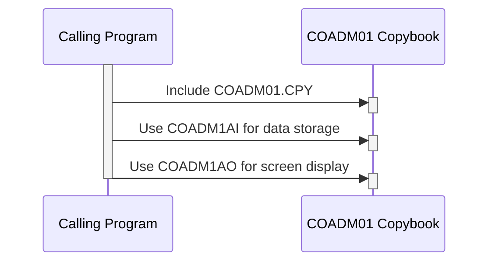

Generated at: 2nd October of 2024

**Title Document: COADM01.CPY - Administrative Data Structure**

**Summary Description:**
The `COADM01.CPY` COBOL copybook defines a standardized structure for holding and presenting administrative data within the CardDemo application. This data includes elements like screen titles, transaction names, current date/time, program names, menu options, user selections, and error messages. It ensures consistency in the display of this information across various screens and reports, enhancing user experience and system maintainability.

**User Stories:**
As a developer, I need a standardized way to store and display administrative information on screens and reports so that the user interface is consistent and user-friendly.

**Related Epic:**
6 - User Management and Security

**Technical Requirements:**

- **Administrative Data Management**: This copybook defines two data structures: `COADM1AI` for internal storage in a compact numeric format and `COADM1AO` for display purposes using character-based fields.
  - Define Data Structure `COADM1AI`:
    - Store administrative data in a compact numeric format (`COMP`).
    - Fields:
      - `TRNNAMEL`: Transaction name.
      - `TITLE01L`: First screen title.
      - `CURDATEL`: Current date.
      - `PGMNAMEL`: Program name.
      - `TITLE02L`: Second screen title.
      - `CURTIMEL`: Current time.
      - `OPTN001L` to `OPTN012L`: Menu options.
      - `OPTIONL`: Selected option.
      - `ERRMSGL`: Error message.
  - Define Data Structure `COADM1AO`:
    - Redefine `COADM1AI` to map numeric data to character-based fields.
    - Fields:
      - `TRNNAMEI`, `TRNNAMEA`: Transaction name.
      - `TITLE01I`, `TITLE01A`: First screen title.
      - `CURDATEI`, `CURDATEA`: Current date.
      - `PGMNAMEI`, `PGMNAMEA`: Program name.
      - `TITLE02I`, `TITLE02A`: Second screen title.
      - `CURTIMEI`, `CURTIMEA`: Current time.
      - `OPTN001I` to `OPTN012I`, `OPTN001A` to `OPTN012A`: Menu options.
      - `OPTIONI`, `OPTIONA`: Selected option.
      - `ERRMSGI`, `ERRMSGA`: Error message.
      - Fields ending with `C`, `P`, `H`, `V`, `O`: Control visual attributes of data on the screen.
  - Result:
    - `COADM1AI`: Provides a compact structure for efficient data storage.
    - `COADM1AO`: Offers a user-friendly representation of administrative data for display.

**Related Models:**

- `COADM1AI`:
  - `TRNNAMEL` `COMP`: Transaction name in internal format.
  - `TITLE01L` `COMP`: First screen title in internal format.
  - `CURDATEL` `COMP`: Current date in internal format.
  - `PGMNAMEL` `COMP`: Program name in internal format.
  - `TITLE02L` `COMP`: Second screen title in internal format.
  - `CURTIMEL` `COMP`: Current time in internal format.
  - `OPTN001L` to `OPTN012L` `COMP`: Menu options in internal format.
  - `OPTIONL` `COMP`: Selected option in internal format.
  - `ERRMSGL` `COMP`: Error message in internal format.
- `COADM1AO`:
  - `TRNNAMEI` `Alphanumeric`: Transaction name in display format.
  - `TRNNAMEA` `Alphanumeric`: Transaction name in display format.
  - `TITLE01I` `Alphanumeric`: First screen title in display format.
  - `TITLE01A` `Alphanumeric`: First screen title in display format.
  - `CURDATEI` `Alphanumeric`: Current date in display format (YYYYMMDD).
  - `CURDATEA` `Alphanumeric`: Current date in display format (YYYYMMDD).
  - `PGMNAMEI` `Alphanumeric`: Program name in display format.
  - `PGMNAMEA` `Alphanumeric`: Program name in display format.
  - `TITLE02I` `Alphanumeric`: Second screen title in display format.
  - `TITLE02A` `Alphanumeric`: Second screen title in display format.
  - `CURTIMEI` `Alphanumeric`: Current time in display format (HHMMSS).
  - `CURTIMEA` `Alphanumeric`: Current time in display format (HHMMSS).
  - `OPTN001I` to `OPTN012I` `Alphanumeric`: Menu options in display format.
  - `OPTN001A` to `OPTN012A` `Alphanumeric`: Menu options in display format.
  - `OPTIONI` `Alphanumeric`: Selected option in display format.
  - `OPTIONA` `Alphanumeric`: Selected option in display format.
  - `ERRMSGI` `Alphanumeric`: Error message in display format.
  - `ERRMSGA` `Alphanumeric`: Error message in display format.
  - Fields ending with `C`, `P`, `H`, `V`, `O` `Alphanumeric`: Control visual attributes of data on the screen.

**Configurations:**
No specific configurations were found in the provided code snippet. However, the visual attributes of data on the screen are likely controlled by fields ending with `C`, `P`, `H`, `V`, `O` in the `COADM1AO` data structure. The specific values for these attributes would need to be determined from the context of the program using this copybook.

**Code Improvements:**
- **Documentation:** Add comments to clarify the purpose and usage of the data structures and fields.
- **Naming Conventions:**  Consider using more descriptive names for fields to improve readability.
- **Data Validation:** Implement data validation checks on fields like `OPTIONI` to ensure valid user input.

**Security Improvements:**
- **Sensitive Data:** If any administrative data could be considered sensitive (e.g., transaction names related to specific financial operations), consider adding security measures like encryption or access control.
- **Audit Logging:** Implement audit logging to track changes made to administrative data for security and accountability purposes.

**Conceptual Diagram:**

--Made by "Smart Engineering" (by Compass.UOL)--