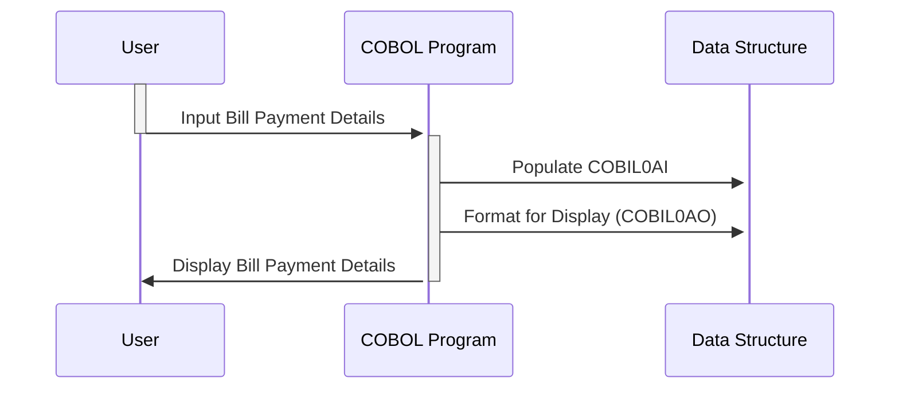

Generated at: 2nd October of 2024

**Title Document:** Bill Payment Data Structure Specification

**Summary Description:**
This document outlines the data structure used in a COBOL program for managing bill payment transactions. It encompasses the layout of information exchanged between the program and a user interface, focusing on aspects like display formatting, user input, and presentation logic. Notably, the structure accommodates both internal processing and user-friendly display formats.

**User Stories:**
As a bank teller, I need to input and view bill payment details accurately on the system's interface to process customer payments efficiently.

**Related Epic:** 4 - Transaction Processing

**Technical Requirements:**
This code defines a data structure for bill payment operations, focusing on its representation for both internal processing and user interface display.

- **Bill Payment Data Structure:** Defines the layout for bill payment information.
  - Input: None (Structure definition, not a process).
  - Result `COBOL Data Structure`: A structured format containing transaction details, account information, confirmation status, and potential error messages.

**Related Models**

- **COBIL0AI:** Internal representation of the bill payment data.
  - `TRNNAMEL` `Alphanumeric`:  Transaction name (e.g., "BILLPAY").
  - `CURDATEL` `Numeric`:  Transaction date (e.g., 20241002 for October 2nd, 2024).
  - `CURTIMEL` `Numeric`:  Transaction time (e.g., 143015 for 2:30:15 PM).
  - `PGMNAMEL` `Alphanumeric`:  Name of the program processing the transaction.
  - `ACTIDINL` `Numeric`:  Account ID being debited for the bill payment.
  - `CURBALL` `Numeric`: Current balance of the account.
  - `CONFIRML` `Numeric`:  Flag (typically 0 or 1) indicating successful processing (1) or failure (0).
  - `ERRMSGL` `Alphanumeric`:  Message describing any errors during processing.

- **COBIL0AO:** UI-focused view of the bill payment data.
  - `TRNNAME[C,P,H,V,O]` `Character`:  Transaction name, potentially with display attributes (color, protection, etc.).
  - `CURDATE[C,P,H,V,O]` `Character`:  Formatted transaction date for display (e.g., "10/02/2024").
  - `CURTIME[C,P,H,V,O]` `Character`:  Formatted transaction time for display (e.g., "02:30:15 PM").
  - `PGMNAME[C,P,H,V,O]` `Character`:  Program name, potentially formatted for display.
  - `ACTIDIN[C,P,H,V,O]` `Character`:  Account ID, potentially formatted for display.
  - `CURBAL[C,P,H,V,O]` `Character`:  Formatted current balance for display (e.g., with currency symbols, commas).
  - `CONFIRM[C,P,H,V,O]` `Character`: Confirmation status, potentially displayed as "Y" (successful) or "N" (failed).
  - `ERRMSG[C,P,H,V,O]` `Character`: Error message formatted for user readability.

**Configurations:**
- No external configuration file found.

**Code Improvements:**

1. **Error Handling:** Implement standardized error codes and logging mechanisms within `ERRMSGL` for easier troubleshooting.
2. **Data Validation:**  Add checks for data validity (e.g., valid date ranges, account number formats) beyond basic type checks.
3. **Documentation:**  Include comments to clarify the purpose and usage of each field, especially the display attributes in `COBIL0AO`.
4. **User Interface Considerations:**  If possible, use a more modern UI framework than character-based displays for better user experience.

**Security Improvements:**

1. **Data Masking:** Mask sensitive information like account numbers partially on the UI (`ACTIDIN[C,P,H,V,O]`) to enhance security.
2. **Input Validation:**  Sanitize user input to prevent vulnerabilities like SQL injection or cross-site scripting (XSS), especially for `ACTIDINL`.
3. **Secure Logging:**  Log bill payment activities securely, including user IDs and timestamps, for auditing and tracking purposes.

**Conceptual Diagram:**

--Made by "Smart Engineering" (by Compass.UOL)--