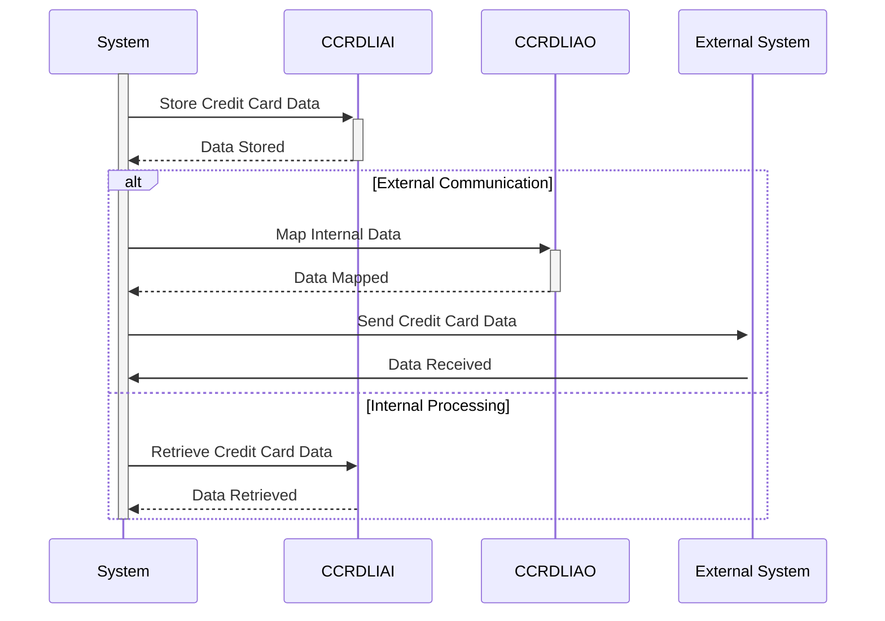

Generated at: 2nd October of 2024

**Title Document:** Credit Card Data Layout Specification

**Summary Description:**
This document outlines the structure of credit card information (CCRDL) used within the CardDemo system. It defines two layouts - `CCRDLIAI` (internal) and `CCRDLIAO` (external) - to handle data consistently and securely across different parts of the system and during communication with external entities.

**User Stories:**
As a credit card system administrator, I need a standardized way to store and manage credit card information to ensure data consistency, security, and efficient processing.

**Related Epic:**
3 - Credit Card Management

**Technical Requirements:**

- Credit Card Data Structure Definition: This code defines two data structures, `CCRDLIAI` for internal representation and `CCRDLIAO` for external communication. Both structures contain various fields related to credit card information.
  - Input: N/A
  - Calculation: N/A
  - Output: Defines the structure for credit card information, including `TRNNAME`, `TITLE01`, `CURDATE`, `PGMNAME`, `TITLE02`, `CURTIME`, `PAGENO`, `ACCTSID`, `CARDSID`, `CRDSEL[1-7]`, `CRDSTP[1-7]`, `ACCTNO[1-7]`, `CRDNUM[1-7]`, `CRDSTS[1-7]`, `INFOMSG`, and `ERRMSG`.

**Related Models**

- `CCRDLIAI`
  - `TRNNAME` `Alphanumeric`: Transaction name or identifier
  - `TITLE01` `Alphanumeric`: Descriptive title or header for the credit card information
  - `CURDATE` `Date`: Current date
  - `PGMNAME` `Alphanumeric`: Program name
  - `TITLE02` `Alphanumeric`: Second descriptive title or header
  - `CURTIME` `Time`: Current time
  - `PAGENO` `Numeric`: Page number
  - `ACCTSID` `Alphanumeric`: Account identifier
  - `CARDSID` `Alphanumeric`: Card identifier
  - `CRDSEL` `Alphanumeric`: Credit card selection flag
  - `CRDSTP` `Alphanumeric`: Credit card status or type flag
  - `ACCTNO` `Alphanumeric`: Account number
  - `CRDNUM` `Alphanumeric`: Credit card number
  - `CRDSTS` `Alphanumeric`: Credit card status
  - `INFOMSG` `Alphanumeric`: Informational message
  - `ERRMSG` `Alphanumeric`: Error message

- `CCRDLIAO`
  - `TRNNAME` `Alphanumeric`: Transaction name or identifier
  - `TITLE01` `Alphanumeric`: Descriptive title or header for the credit card information
  - `CURDATE` `Date`: Current date
  - `PGMNAME` `Alphanumeric`: Program name
  - `TITLE02` `Alphanumeric`: Second descriptive title or header
  - `CURTIME` `Time`: Current time
  - `PAGENO` `Numeric`: Page number
  - `ACCTSID` `Alphanumeric`: Account identifier
  - `CARDSID` `Alphanumeric`: Card identifier
  - `CRDSEL` `Alphanumeric`: Credit card selection flag
  - `CRDSTP` `Alphanumeric`: Credit card status or type flag
  - `ACCTNO` `Alphanumeric`: Account number
  - `CRDNUM` `Alphanumeric`: Credit card number
  - `CRDSTS` `Alphanumeric`: Credit card status
  - `INFOMSG` `Alphanumeric`: Informational message
  - `ERRMSG` `Alphanumeric`: Error message

**Configurations:**
N/A

**Code Improvements:**
- Add comments explaining the purpose of each field and data structure.
- Consider using a data dictionary to document the data elements and their definitions.
- Implement data validation rules to ensure data integrity.
- Use meaningful names for variables and data structures.

**Security Improvements:**
- Encrypt sensitive credit card information during storage and transmission.
- Implement access control measures to restrict unauthorized access to credit card data.
- Conduct regular security audits to identify and mitigate potential vulnerabilities.
- Adhere to industry best practices for secure coding and data handling.

**Conceptual Diagram:**

--Made by "Smart Engineering" (by Compass.UOL)--