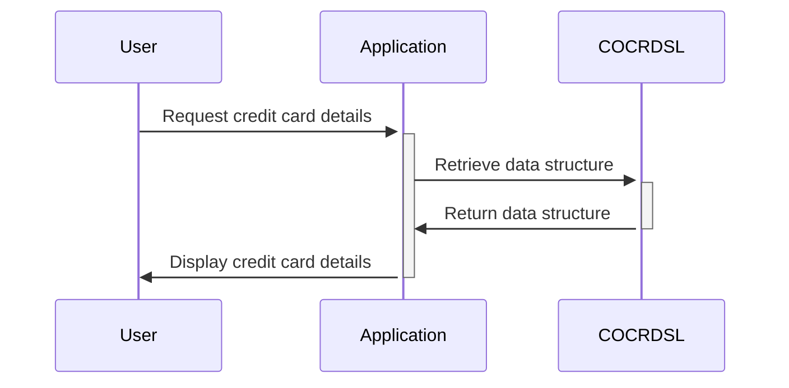

Generated at: 2nd October of 2024

# **Title Document:** Credit Card Display Data Structure

**Summary Description:**
This specification defines a standardized structure for storing and displaying credit card information within a COBOL-based system. It outlines two data structures, `CCRDSLAI` and `CCRDSLAO`, for handling raw credit card data and its visual presentation on a user interface.

**User Stories:**
As a system developer, I need a standardized way to store and display credit card information to ensure data consistency and a user-friendly interface.

**Related Epic:** 
3 - Credit Card Management

**Technical Requirements:**

- Credit Card Data Structure: Defines the structure for storing raw credit card information.
  - Input: None
  - Processing: Defines fields for `TRNNAME`, `TITLE01`, `TITLE02`, `CURDATE`, `CURTIME`, `PGMNAME`, `ACCTSID`, `CARDSID`, `CRDNAME`, `CRDSTCD`, `EXPMON`, `EXPYEAR`, `INFOMSG`, `ERRMSG`, and `FKEYS`.
  - Output: None

- Credit Card Display Structure: Extends the credit card data structure by adding display attributes for each field.
  - Input: `CCRDSLAI`
  - Processing: Defines display attributes (`C`, `P`, `H`, `V`, `O`) for each field in `CCRDSLAI`, likely representing color, protection, hidden status, validation, and output position.
  - Output: None

**Related Models:**

- `CCRDSLAI`
  - `TRNNAME` `String`: Transaction name.
  - `TITLE01` `String`: First title or heading.
  - `TITLE02` `String`: Second title or heading.
  - `CURDATE` `String`: Current date.
  - `CURTIME` `String`: Current time.
  - `PGMNAME` `String`: Program name.
  - `ACCTSID` `String`: Account identifier.
  - `CARDSID` `String`: Credit card number.
  - `CRDNAME` `String`: Cardholder's name.
  - `CRDSTCD` `String`: Credit card type code.
  - `EXPMON` `String`: Expiry month.
  - `EXPYEAR` `String`: Expiry year.
  - `INFOMSG` `String`: Information message.
  - `ERRMSG` `String`: Error message.
  - `FKEYS` `String`: Function keys.

- `CCRDSLAO`
  - `TRNNAME` `String`: Transaction name with display attributes.
  - `TITLE01` `String`: First title or heading with display attributes.
  - `TITLE02` `String`: Second title or heading with display attributes.
  - `CURDATE` `String`: Current date with display attributes.
  - `CURTIME` `String`: Current time with display attributes.
  - `PGMNAME` `String`: Program name with display attributes.
  - `ACCTSID` `String`: Account identifier with display attributes.
  - `CARDSID` `String`: Credit card number with display attributes.
  - `CRDNAME` `String`: Cardholder's name with display attributes.
  - `CRDSTCD` `String`: Credit card type code with display attributes.
  - `EXPMON` `String`: Expiry month with display attributes.
  - `EXPYEAR` `String`: Expiry year with display attributes.
  - `INFOMSG` `String`: Information message with display attributes.
  - `ERRMSG` `String`: Error message with display attributes.
  - `FKEYS` `String`: Function keys with display attributes.

**Configurations:**
No configurations found.

**Code Improvements:**

- Add comments to clarify the purpose and usage of each data field and display attribute.
- Implement data validation checks for credit card numbers, expiry dates, and other relevant fields to ensure data integrity.
- Consider using a data masking technique to hide sensitive credit card information, such as the middle digits of the credit card number, during display.

**Security Improvements:**

- Encrypt sensitive credit card information during storage and transmission.
- Implement access control measures to restrict unauthorized access to credit card data.
- Log all access to credit card information for auditing purposes.

**Conceptual Diagram:**

--Made by "Smart Engineering" (by Compass.UOL)--