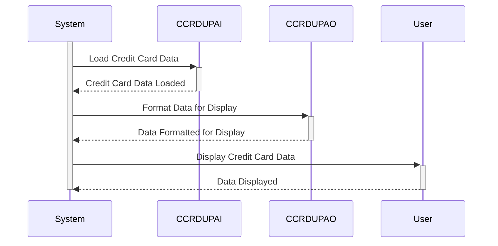

Generated at: 2nd October of 2024

**Title Document: Credit Card Duplicate Check Data Structure Specification**

**Summary Description:**
This specification defines the data structures used for credit card duplicate checks in a COBOL system. It outlines the organization of credit card information for both internal processing and user display, ensuring data integrity and facilitating the detection of duplicate records. The specification includes details about data fields, their formats, and the purpose of each structure, aiming to provide a clear understanding of how credit card data is handled for duplicate checks.

**User Stories:**
As a data analyst, I need to ensure that only valid and unique credit card records are used for analysis to maintain data accuracy and prevent issues arising from duplicate entries.

**Related Epic:**
3 - Credit Card Management

**Technical Requirements:**

- Credit Card Duplicate Check: This method defines two data structures, `CCRDUPAI` and `CCRDUPAO`, to organize credit card information for duplicate checks. 
  - `CCRDUPAI`: Designed for internal processing, this structure uses a combination of `COMP PIC S9(n)` for packed decimal numeric data and `PICTURE X(n)` for alphanumeric data. `REDEFINES` is used to provide alternative data interpretations.
  - `CCRDUPAO`: Designed for user display, this structure uses `PICTURE X` for single alphanumeric characters and suffixes like `C` (Color), `P` (Protected), `H` (Hidden), `V` (Validated), and `O` (Output) to denote presentation attributes.

**Related Models**

- `CCRDUPAI`
  - `TRNNAME` `String`: Transaction name.
  - `TITLE01` `String`: Title or header for the first section of information.
  - `CURDATE` `Date`: Current date.
  - `PGMNAME` `String`: Program name.
  - `TITLE02` `String`: Title or header for the second section of information.
  - `CURTIME` `Time`: Current time.
  - `ACCTSID` `String`: Account ID.
  - `CARDSID` `String`: Credit card number.
  - `CRDNAME` `String`: Cardholder's name.
  - `CRDSTCD` `String`: Card status code.
  - `EXPMON` `Integer`: Expiration month.
  - `EXPYEAR` `Integer`: Expiration year.
  - `EXPDAY` `Integer`: Expiration day.
  - `INFOMSG` `String`: Informational messages.
  - `ERRMSG` `String`: Error messages.
  - `FKEYS` `String`: Function keys.
  - `FKEYSC` `String`: Function key descriptions.
- `CCRDUPAO`
  - `TRNNAMEO` `String`: Transaction name.
  - `TITLE01O` `String`: Title or header for the first section of information.
  - `CURDATEO` `Date`: Current date.
  - `PGMNAMEO` `String`: Program name.
  - `TITLE02O` `String`: Title or header for the second section of information.
  - `CURTIMEO` `Time`: Current time.
  - `ACCTSIDO` `String`: Account ID.
  - `CARDSIDO` `String`: Credit card number.
  - `CRDNAMEO` `String`: Cardholder's name.
  - `CRDSTCDO` `String`: Card status code.
  - `EXPMONO` `Integer`: Expiration month.
  - `EXPYEARO` `Integer`: Expiration year.
  - `EXPDAYO` `Integer`: Expiration day.
  - `INFOMSGO` `String`: Informational messages.
  - `ERRMSGO` `String`: Error messages.
  - `FKEYSO` `String`: Function keys.
  - `FKEYSCO` `String`: Function key descriptions.

**Configurations:**
- `COCRDUP.CPY`
  - `TRNNAMEA`: `"Account Update   "`
	- Description: Screen title for Account Update function.
  - `TITLE01A`: `"Credit Card Detail Update"`
	- Description: Title of the Credit Card Detail Update screen.
  - `PGMNAMEA`: `"COCRDUPC"`
	- Description: Program name for Credit Card Detail Update.
  - `TITLE02A`: `"Enter All Fields"`
	- Description: Instruction for the user to enter all fields.
  - `INFOMSGA`: `"Enter all data and press ENTER"`
	- Description: Message displayed to the user, prompting them to enter data and press Enter.
  - `ERRMSGA`: `"Invalid Input, please re-enter"`
	- Description: Error message displayed to the user in case of invalid input.

**Code Improvements:**
- **Add Comments:** Include comments within the data structures to explain the purpose of each field and its format.
- **Data Validation:** Implement data validation checks within the program logic to ensure that credit card numbers, expiration dates, and other fields adhere to expected formats and ranges.
- **Error Handling:** Enhance error handling to provide more specific error messages and potentially allow for error recovery or user intervention.
- **Logging:** Implement logging to track duplicate checks, including the credit card numbers checked, the outcome of the check, and any errors encountered.

**Security Improvements:**
- **Encryption:** Encrypt sensitive credit card information both in storage and during transmission to protect it from unauthorized access.
- **Access Control:** Implement access control mechanisms to restrict access to credit card data based on user roles and permissions.
- **Regular Security Audits:** Conduct regular security audits to identify and address potential vulnerabilities in the system.
- **Secure Coding Practices:** Adhere to secure coding practices to minimize the risk of security breaches.

**Conceptual Diagram:**

--Made by "Smart Engineering" (by Compass.UOL)--