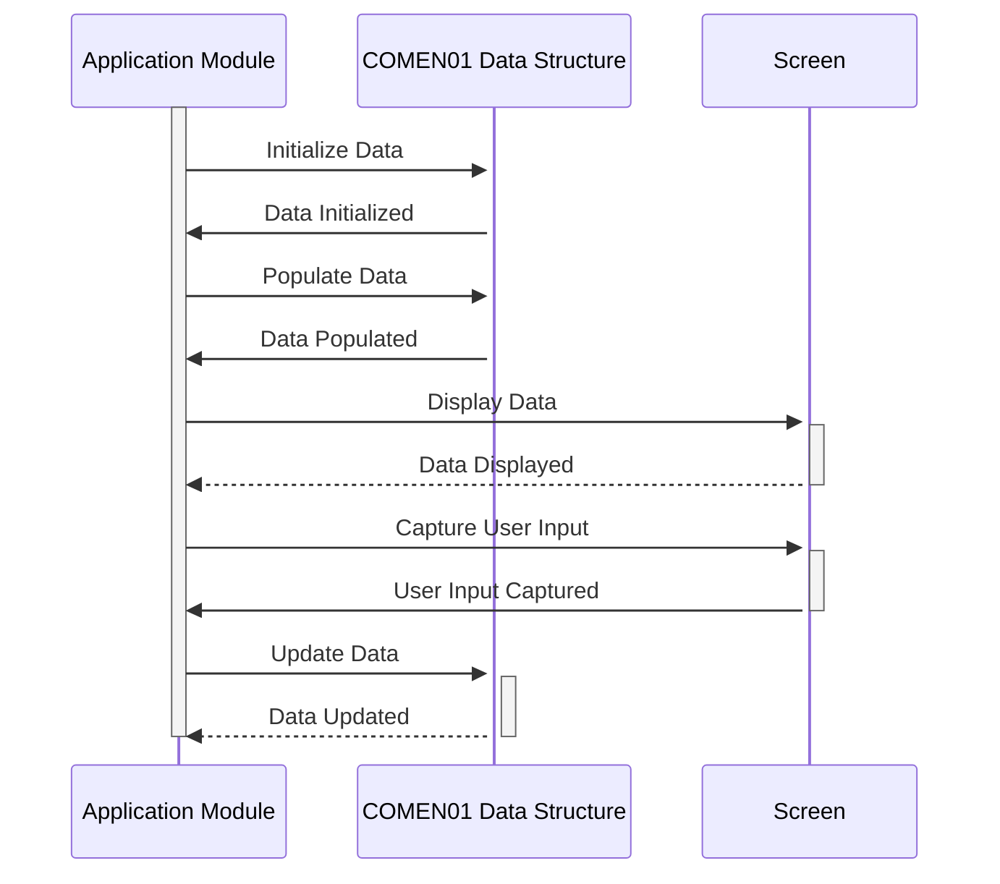

Generated at: 2nd October of 2024

**Title Document: COMEN01.CPY - Common Data Structure Specification**

**Summary Description:**
The `COMEN01.CPY` COBOL copybook defines a common data structure for a menu-driven application. It acts as a standardized container for information such as transaction names, screen titles, system variables (current date and time), menu options, user selections, and error messages, ensuring consistency across various modules and user interactions.

**User Stories:**
As an application developer, I need a standardized way to handle common data elements across different modules of the application so that data exchange and screen displays are consistent and maintainable.

**Related Epic:** 9 - System Utilities

**Technical Requirements:**

-  Data Structure Initialization: This method initializes the data structure with default values.
  - Input: None
  - Output: `COMEN1AI` initialized with blank values for alphanumeric fields and zeros for numeric fields.

- Screen Data Mapping: This method maps the data structure fields to corresponding screen fields, facilitating data display and user input.
  - Input: `COMEN1AO`
  - Output: Screen fields populated with data from `COMEN1AO`.

**Related Models**

- `COMEN1AI`: Represents the input format for common data elements.
  - `TRNNAMEI` `String`: Transaction name.
  - `TITLE01I` `String`: Primary screen title or heading.
  - `CURDATEI` `String`: Current date.
  - `PGMNAMEI` `String`: Name of the program or module.
  - `TITLE02I` `String`: Secondary screen title or heading.
  - `CURTIMEI` `String`: Current time.
  - `OPTN001I` - `OPTN012I` `String`: Menu options.
  - `OPTIONI` `String`: User's selected option.
  - `ERRMSGI` `String`: Error message.

- `COMEN1AO`: Represents the output format for common data elements, including screen display attributes.
  - `TRNNAMEC` `String`: Color attribute for transaction name.
  - `TRNNAMEP` `String`: Protection attribute for transaction name.
  - `TRNNAMEH` `String`: Hidden attribute for transaction name.
  - `TRNNAMEV` `String`: Validation attribute for transaction name.
  - `TRNNAMEO` `String`: Output position for transaction name.
  - `TITLE01C` `String`: Color attribute for primary title.
  - `TITLE01P` `String`: Protection attribute for primary title.
  - `TITLE01H` `String`: Hidden attribute for primary title.
  - `TITLE01V` `String`: Validation attribute for primary title.
  - `TITLE01O` `String`: Output position for primary title.
  - `CURDATEC` `String`: Color attribute for current date.
  - `CURDATEP` `String`: Protection attribute for current date.
  - `CURDATEH` `String`: Hidden attribute for current date.
  - `CURDATEV` `String`: Validation attribute for current date.
  - `CURDATEO` `String`: Output position for current date.
  - `PGMNAMEC` `String`: Color attribute for program name.
  - `PGMNAMEP` `String`: Protection attribute for program name.
  - `PGMNAMEH` `String`: Hidden attribute for program name.
  - `PGMNAMEV` `String`: Validation attribute for program name.
  - `PGMNAMEO` `String`: Output position for program name.
  - `TITLE02C` `String`: Color attribute for secondary title.
  - `TITLE02P` `String`: Protection attribute for secondary title.
  - `TITLE02H` `String`: Hidden attribute for secondary title.
  - `TITLE02V` `String`: Validation attribute for secondary title.
  - `TITLE02O` `String`: Output position for secondary title.
  - `CURTIMEC` `String`: Color attribute for current time.
  - `CURTIMEP` `String`: Protection attribute for current time.
  - `CURTIMEH` `String`: Hidden attribute for current time.
  - `CURTIMEV` `String`: Validation attribute for current time.
  - `CURTIMEO` `String`: Output position for current time.
  - `OPTN001C` - `OPTN012C` `String`: Color attributes for menu options.
  - `OPTN001P` - `OPTN012P` `String`: Protection attributes for menu options.
  - `OPTN001H` - `OPTN012H` `String`: Hidden attributes for menu options.
  - `OPTN001V` - `OPTN012V` `String`: Validation attributes for menu options.
  - `OPTN001O` - `OPTN012O` `String`: Output positions for menu options.
  - `OPTIONC` `String`: Color attribute for user selection.
  - `OPTIONP` `String`: Protection attribute for user selection.
  - `OPTIONH` `String`: Hidden attribute for user selection.
  - `OPTIONV` `String`: Validation attribute for user selection.
  - `OPTIONO` `String`: Output position for user selection.
  - `ERRMSGC` `String`: Color attribute for error message.
  - `ERRMSGP` `String`: Protection attribute for error message.
  - `ERRMSGH` `String`: Hidden attribute for error message.
  - `ERRMSGV` `String`: Validation attribute for error message.
  - `ERRMSGO` `String`: Output position for error message.

**Configurations:**
No specific configurations are found within the provided code snippet. However, the copybook assumes the existence of a screen handling mechanism (e.g., BMS maps) that uses the color, protection, hidden, and validation attributes defined in `COMEN1AO` to control the display and user interaction with the screen elements.

**Code Improvements:**

- Add comments to clarify the purpose and usage of each field within the data structure.
- Consider defining a separate copybook for screen display attributes to improve code organization.
- Implement a more robust error handling mechanism, possibly including specific error codes and logging functionalities.

**Security Improvements:**

- If the data structure is used to handle sensitive information, consider incorporating data encryption or masking techniques.
- Implement access control mechanisms to restrict unauthorized modifications to the data structure.
- Add audit trails to track changes made to the data structure for security and accountability purposes.

**Conceptual Diagram:**

--Made by "Smart Engineering" (by Compass.UOL)--