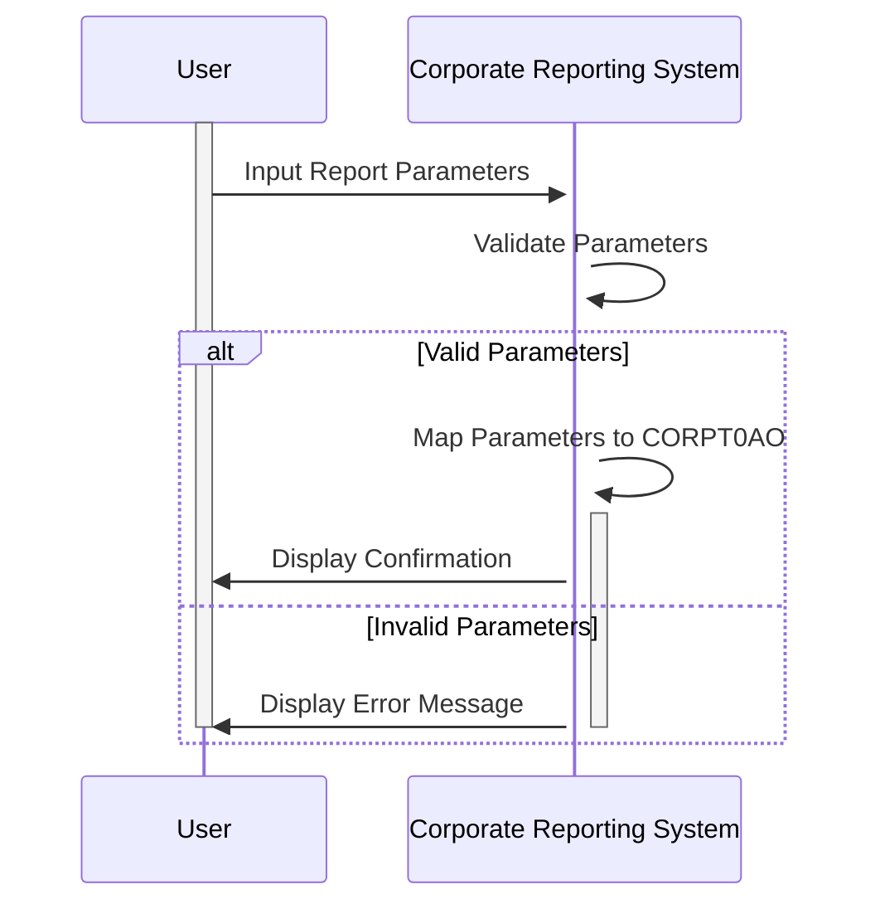

Generated at: 2nd October of 2024

**Title Document:** Corporate Report Parameter Input Specification

**Summary Description:**
This document outlines the specifications for a parameter input process within a corporate reporting system. It focuses on two key data structures, `CORPT0AI` and `CORPT0AO`, responsible for handling input parameters for generating various corporate reports.

**User Stories:**
As a report user, I need to be able to input specific parameters so that I can generate accurate and customized corporate reports.

**Related Epic:**
5 - Reporting and Analytics

**Technical Requirements:**

- Receiving Report Parameters: This method receives parameters from the user through an interface (likely a screen or a form).
  - Input: User-provided parameters such as `TRNNAMEx`, `TITLE01x`, `TITLE02x`, `MONTHLYx`, `YEARLYx`, `CUSTOMx`, `SDTMMx`, `SDTDDx`, `SDTYYYx`, `EDTMMx`, `EDTDDx`, `EDTYYYx`, and `CONFIRMx`.
  - Output: Populates `CORPT0AI` data structure with the user-provided values.

- Validating Report Parameters: This method validates the received parameters to ensure data integrity before report generation.
  - Input: Parameter values stored in the `CORPT0AI` data structure.
  - Validations:
    - Check if `TRNNAMEx` is provided (mandatory field).
    - Validate the data type of each parameter (numeric, alphanumeric, flag).
    - Ensure entered dates are logical and follow the format MMDDYYYY.
    - If `CUSTOMx` flag is 'Y', ensure start date (`SDTMMx`, `SDTDDx`, `SDTYYYx`) is earlier than the end date (`EDTMMx`, `EDTDDx`, `EDTYYYx`).
  - Output: Sets `ERRMSGx` in `CORPT0AI` if any validation fails. If all validations pass, it maps the data from `CORPT0AI` to `CORPT0AO`, potentially converting the data into a format suitable for the report generation engine.

**Related Models**

- `CORPT0AI`
  - `TRNNAMEI` `String`: Report Name or Code (e.g., "SALESREPORT," "INV001")
  - `TITLE01I` `String`: User-defined Report Title or Description 1
  - `TITLE02I` `String`: User-defined Report Title or Description 2
  - `CURDATEI` `Date`: Current Date (System Generated) (Format: MMDDYYYY)
  - `CURTIMEI` `Time`: Current Time (System Generated)
  - `MONTHLYI` `Char`: Indicates if the report is for the Monthly period ('Y' or 'N')
  - `YEARLYI` `Char`: Indicates if the report is for the Yearly period ('Y' or 'N')
  - `CUSTOMI` `Char`: Indicates if the report is for a Custom date range ('Y' or 'N')
  - `SDTMMI` `Numeric`: Starting Month (MM)
  - `SDTDDI` `Numeric`: Starting Day (DD)
  - `SDTYYYYI` `Numeric`: Starting Year (YYYY)
  - `EDTMMI` `Numeric`: Ending Month (MM)
  - `EDTDDI` `Numeric`: Ending Day (DD)
  - `EDTYYYYI` `Numeric`: Ending Year (YYYY)
  - `CONFIRMI` `Char`: User Confirmation (e.g., "Y" - Yes, proceed with report generation)
  - `ERRMSGI` `String`: Error Message Field (e.g., "Invalid Date Range," "Missing Report Name")
- `CORPT0AO`
  - `TRNNAMEO` `String`: Report Name or Code (e.g., "SALESREPORT," "INV001")
  - `TITLE01O` `String`: User-defined Report Title or Description 1
  - `TITLE02O` `String`: User-defined Report Title or Description 2
  - `CURDATEO` `Date`: Current Date (System Generated) (Format: MMDDYYYY)
  - `CURTIMEO` `Time`: Current Time (System Generated)
  - `MONTHLYO` `Char`: Indicates if the report is for the Monthly period ('Y' or 'N')
  - `YEARLYO` `Char`: Indicates if the report is for the Yearly period ('Y' or 'N')
  - `CUSTOMO` `Char`: Indicates if the report is for a Custom date range ('Y' or 'N')
  - `SDTMMO` `Numeric`: Starting Month (MM)
  - `SDTDDO` `Numeric`: Starting Day (DD)
  - `SDTYYYYO` `Numeric`: Starting Year (YYYY)
  - `EDTMMO` `Numeric`: Ending Month (MM)
  - `EDTDDO` `Numeric`: Ending Day (DD)
  - `EDTYYYYO` `Numeric`: Ending Year (YYYY)
  - `CONFIRMO` `Char`: User Confirmation (e.g., "Y" - Yes, proceed with report generation)
  - `ERRMSGO` `String`: Error Message Field (e.g., "Invalid Date Range," "Missing Report Name")

**Configurations:**
- Constant Values
  - `TRNNAMEI`: `"CORPT"`
	- Description: Constant name for the transaction name.
  - `TITLE01I`: `"CREDIT CARD DEMO APPLICATION"`
	- Description: Constant name for the title 1.
  - `TITLE02I`: `"CORPORATE PARAMETER INPUT"`
	- Description: Constant name for the title 2.
  - `PGMNAMEI`: `"CORPT00C"`
	- Description: Constant name for the program name.
  - `CONFIRMI`: `"CONFIRM (Y/N)"`
	- Description: Constant name for the confirmation message.
  - `ERRMSGI`: `"ERROR MESSAGE"`
	- Description: Constant name for the error message.

**Code Improvements:**
- Improve data validation: Implement more robust checks for date ranges, ensuring start dates are before end dates and that the dates are within acceptable bounds.
- Enhance error handling: Provide more specific error messages to users, indicating the exact nature of the error and how to correct it.
- Add logging: Log all user inputs and system actions for auditing and troubleshooting purposes.
- Parameter storage: Implement a mechanism to store user-defined report parameters for future use, allowing users to easily regenerate similar reports.

**Security Improvements:**
- Access control: Implement role-based access control to restrict access to the parameter input process based on user roles and permissions.
- Input sanitization: Sanitize all user inputs to prevent vulnerabilities like SQL injection.
- Audit logging: Log all user actions, including parameter inputs, for tracking and accountability.

**Conceptual Diagram:**

--Made by "Smart Engineering" (by Compass.UOL)--