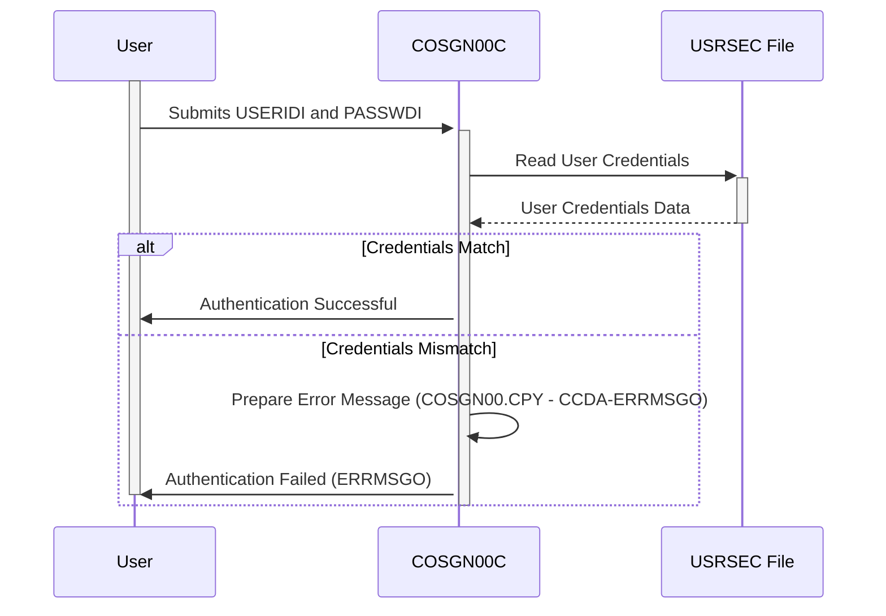

Generated at: 2nd October of 2024

# **Title Document:** CardDemo User Authentication

**Summary Description:**
This document describes the User Authentication process within the CardDemo application. It details how user credentials are received, validated, and processed for secure access to the system.

**User Stories:**
As a user, I want to be able to log in to the system securely so that I can access my account information.

**Related Epic:** 6 - User Management and Security

**Technical Requirements:**

- **Receive User Credentials:**
  - Input: User provides `USERIDI` and `PASSWDI`.
  - Result: System receives `USERIDI` - `{Alphanumeric}` and `PASSWDI` - `{Alphanumeric}`.
- **Validate User Credentials:**
  - Input: Received `USERIDI` and `PASSWDI`.
  - Process: Compare received credentials with data stored in the user security file (`USRSEC`).
  - Output: `TRUE` if credentials match, `FALSE` otherwise.
- **Authentication Response:**
  - Input: Validation result (`TRUE`/`FALSE`).
  - Process: If `TRUE`, grant access to the system. If `FALSE`, display an error message `COSGN00.CPY - CCDA-ERRMSGO` in the `ERRMSGO` field.
  - Output: User is logged in or receives an error message - `COSGN00.CPY - CCDA-ERRMSGO`.

**Related Models**
- `COSGN0AI`
  - `TRNNAMEI` `{Alphanumeric}`: Transaction name (e.g., COSGN).
  - `TITLE01I` `{Alphanumeric}`: Main screen title.
  - `CURDATEI` `{Numeric}`: Current date.
  - `PGMNAMEI` `{Alphanumeric}`: Program name.
  - `TITLE02I` `{Alphanumeric}`: Secondary screen title.
  - `CURTIMEI` `{Alphanumeric}`: Current time.
  - `USERIDI` `{Alphanumeric}`: User ID.
  - `PASSWDI` `{Alphanumeric}`: Password.
  - `ERRMSGI` `{Alphanumeric}`: Error message.
- `COSGN0AO`
  - `TRNNAMEC` `{Alphanumeric}`: Transaction name (e.g., COSGN).
  - `TITLE01O` `{Alphanumeric}`: Main screen title.
  - `CURDATEO` `{Numeric}`: Current date.
  - `PGMNAMEO` `{Alphanumeric}`: Program name.
  - `TITLE02O` `{Alphanumeric}`: Secondary screen title.
  - `CURTIMEO` `{Alphanumeric}`: Current time.
  - `USERIDO` `{Alphanumeric}`: User ID.
  - `PASSWDO` `{Alphanumeric}`: Password.
  - `ERRMSGO` `{Alphanumeric}`: Error message.

**Configurations:**
- `COSGN00.CPY`
  - `CCDA-TRNNAMEI`: `"COSGN"`
	- Description: Transaction name for the sign-on screen.
  - `CCDA-TITLE01I`: `"CREDIT CARD DEMO APPLICATION"`
	- Description: Main title displayed on the sign-on screen.
  - `CCDA-TITLE02I`: `"SIGN ON"`
	- Description: Subtitle indicating the purpose of the screen.
  - `CCDA-PGMNAMEX`: `"COSGN00C"`
	- Description: Name of the COBOL program handling the sign-on screen.
  - `CCDA-USERIDI`: `"USERID"`
	- Description: Label or prompt for the user ID input field.
  - `CCDA-PASSWDI`: `"PASSWORD"`
	- Description: Label or prompt for the password input field.
  - `CCDA-ERRMSGI`: `"ERROR MESSAGE"`
	- Description: Label or area designated for displaying error messages.
  - `CCDA-TRNNAMEO`: `"COSGN"`
	- Description:  Transaction name for the sign-on screen.
  - `CCDA-TITLE01O`: `"CREDIT CARD DEMO APPLICATION"`
	- Description: Main title displayed on the sign-on screen.
  - `CCDA-TITLE02O`: `"SIGN ON"`
	- Description: Subtitle indicating the purpose of the screen.
  - `CCDA-PGMNAMEO`: `"COSGN00C"`
	- Description: Name of the COBOL program handling the sign-on screen.
  - `CCDA-USERIDO`: `"USERID"`
	- Description: Label or prompt for the user ID input field.
  - `CCDA-PASSWDO`: `"PASSWORD"`
	- Description: Label or prompt for the password input field.
  - `CCDA-ERRMSGO`: `"ERROR MESSAGE"`
	- Description: Label or area designated for displaying error messages.

**Code Improvements:**
- Implement a more robust authentication mechanism, such as a challenge-response system or multi-factor authentication.
- Use a secure hashing algorithm to store passwords instead of plain text.
- Implement account lockout policies after a certain number of failed login attempts.

**Security Improvements:**
- Encrypt sensitive data at rest and in transit.
- Implement strong password policies.
- Regularly audit the system for security vulnerabilities.

**Conceptual Diagram:**

--Made by "Smart Engineering" (by Compass.UOL)--