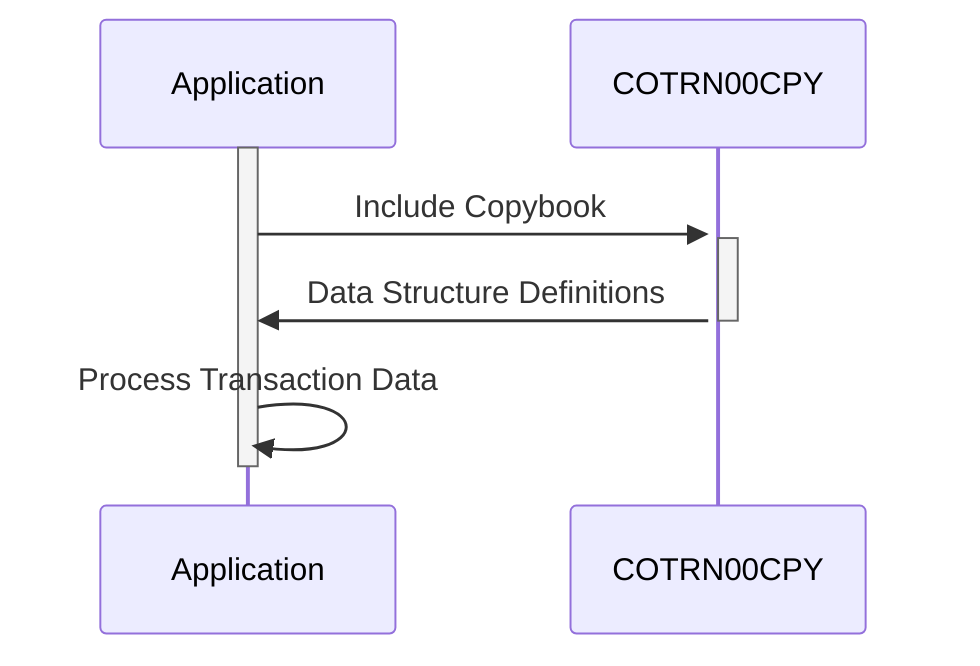

Generated at: 2nd October of 2024

**Title Document:** Transaction Data Structure Specification

**Summary Description:**
This COBOL copybook, `COTRN00.CPY`, defines a standardized data structure for representing financial transaction information. It includes two layouts: `COTRN0AI` for internal processing and `COTRN0AO` for output formatting, both containing fields like transaction ID, date, description, amount, and selection flags. This structure ensures consistency and data integrity in handling financial operations across different parts of the system.

**User Stories:**
As a data analyst, I need a standardized format for transaction data so that I can easily analyze transaction history, generate reports, and identify trends.

**Related Epic:**
4 - Transaction Processing

**Technical Requirements:**
- **Transaction Data Structure Definition:** The code defines two data structures, `COTRN0AI` and `COTRN0AO`, to represent transaction information.
- **Data Fields:** Both structures include common fields such as `TRNID`, `TDATE`, `TDESC`, `TAMT`, and `SEL####`.
- **Data Types and Lengths:** Each field is defined with a specific data type and length, ensuring data integrity and consistency.
- **Reusability:** The copybook is designed to be included in other programs, promoting code reuse and standardization.

**Related Models**
- `COTRN0AI`
  - `TRNID` `String (16)`: Unique transaction ID
  - `TDATE` `Date`: Transaction date (YYYYMMDD)
  - `TDESC` `String (26)`: Transaction description
  - `TAMT` `Decimal (12)`: Transaction amount
  - `SEL####` `Flag (1)`: Selection flag (Y/N)
- `COTRN0AO`
  - `TRNID` `String (16)`: Unique transaction ID
  - `TDATE` `Date`: Transaction date (YYYYMMDD)
  - `TDESC` `String (26)`: Transaction description
  - `TAMT` `Decimal (12)`: Transaction amount
  - `SEL####` `Flag (1)`: Selection flag (Y/N)

**Configurations:**
- Constant Values
  - `COTRN0AI`: `{Structure Name}`
	- Description: Data structure for internal processing.
  - `COTRN0AO`: `{Structure Name}`
	- Description: Data structure for output formatting.

**Code Improvements:**
- **Documentation:** Add comments to clarify the purpose and usage of each field in the data structures.
- **Error Handling:** Implement error handling routines to handle invalid data or unexpected conditions during data processing.
- **Version Control:** Use a version control system to track changes to the copybook and ensure consistency across different programs.

**Security Improvements:**
- **Access Control:** Implement access control mechanisms to restrict unauthorized access to sensitive transaction data.
- **Data Encryption:** Consider encrypting sensitive transaction data, such as account numbers and transaction amounts, to protect it from unauthorized access.
- **Auditing:** Implement auditing mechanisms to track changes made to the copybook and transaction data, ensuring accountability and traceability.

**Conceptual Diagram:**

--Made by "Smart Engineering" (by Compass.UOL)--